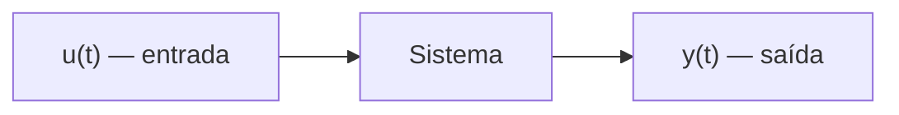
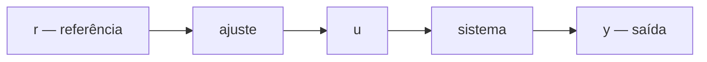
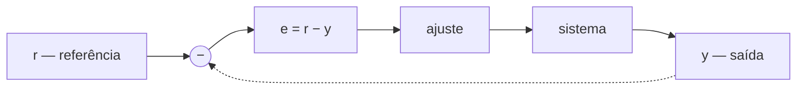
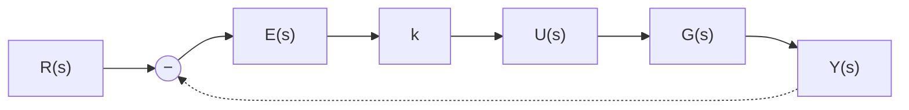
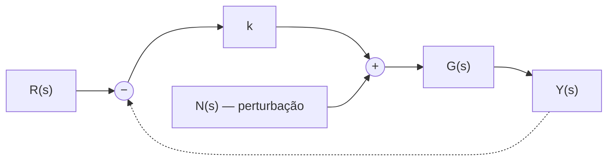

# Módulo 01 — Introdução ao Controle de Sistemas (Teoria)

> Texto teórico dos tópicos 1.1 a 1.4.
> Convenções do curso: sistemas **SISO** (uma entrada, uma saída); estabilidade = **BIBO**; derivadas em notação de pontos ($\dot y$, $\ddot y$); malha padrão com **controle proporcional e realimentação unitária**.
> Fórmulas oficiais do curso: $t_p = \pi/\omega_d$; $M_p = e^{-\zeta\pi/\sqrt{1-\zeta^2}}$; $t_r = (\pi-\beta)/\omega_d$ com $\beta = \arccos\zeta$; $t_s \approx 3/\sigma$ (critério de ±5 %).

---

## 1.1 Sistemas e Controle

### 1.1.1 O que é um sistema?

A palavra *sistema* vem do grego antigo *synistanai*, que significa **"fazer funcionar junto"**. E é na Grécia Antiga — mais precisamente em Alexandria, por volta de 270 a.C. — que encontramos um dos primeiros sistemas de controle automático com registro histórico, atribuído a **Ktesibius** (285–222 a.C.), matemático, físico e inventor.

**O problema de Ktesibius.** Ktesibius queria manter **constante o nível de água de um reservatório** com um furo na parte inferior. Esse reservatório alimentava um **relógio de água**: se a altura da água no reservatório é constante, a vazão que sai pelo furo é constante, e a altura da água no relógio é uma boa indicação da passagem do tempo. Mas, à medida que a água escoa para o relógio, o nível do reservatório cai e precisa ser reposto.

Alguém poderia ficar o tempo todo ao lado do reservatório completando o nível; ou o reservatório poderia receber um fluxo constante, com o excesso escorrendo fora — um desperdício. A solução de Ktesibius foi uma **boia ligada a uma válvula por uma gangorra**, exatamente como a caixa de descarga moderna:

- **Nível baixo** → a boia desce → a válvula sobe (abre) → entra água;
- **Nível subindo** → a boia sobe → a válvula desce (fecha progressivamente);
- **Nível desejado** → a boia está alta → a válvula fecha completamente;
- Se o nível cair (evaporação ou descarga acionada) → a boia desce e a entrada de água é liberada novamente.

Temos aqui, 300 anos antes de Cristo, todos os ingredientes que estudaremos no curso: uma **grandeza de interesse** (o nível), um **valor desejado**, uma **medição** (a boia) e uma **ação automática** (a válvula) — sem intervenção humana e sem desperdício.

### 1.1.2 Sistema, entradas, saídas e perturbações

**Sistema, para nós, é simplesmente uma parte do universo que escolhemos para estudar.** Por exemplo: um recipiente com água, um forno, o corpo de uma pessoa em queda livre, uma antena, um braço robótico, um carro, uma aeronave, um foguete, um satélite, uma estação espacial — ou sistemas mais simples do dia a dia, como um chuveiro ou um ferro de passar roupas.

Ao delimitarmos o sistema, precisamos definir as **grandezas de interesse**:

| Sistema | Grandeza de interesse (saída) | Como agimos sobre ele (entrada) |
|---|---|---|
| Recipiente com água | nível da água **ou** temperatura | fluxo de água; ajuste do aquecedor |
| Forno | temperatura | fluxo de gás para os queimadores |
| Aeronave | velocidade; orientação | superfícies móveis (flaps, ailerons, profundor, leme); propulsão |
| Carro | velocidade | ângulo do pedal do acelerador/freio |

As **saídas** são as grandezas de interesse; as **entradas** são as grandezas que entram, acionam, atuam no sistema e afetam as saídas. Representamos o sistema por um **bloco**, com uma seta entrando (entrada) e uma seta saindo (saída):

**Perturbações.** Em alguns casos, há entradas que **não podemos manipular**: a temperatura ambiente de uma cozinha afeta a temperatura do forno (se estiver frio de rachar ou calor de derreter asfalto, a saída muda); o vento afeta uma aeronave. Essas entradas não manipuláveis são chamadas de **perturbações**. Mais à frente veremos como o controle **atenua** seus efeitos (§1.3.3).

**SISO.** Neste curso tratamos apenas sistemas com **uma única entrada e uma única saída** — sistemas **SISO** (*Single Input, Single Output*). Se o sistema tiver mais de uma saída (nível **e** temperatura da água), escolhemos **apenas uma**, e uma entrada correspondente — normalmente a entrada manipulável que mais influencia a saída de interesse. A outra entrada é tratada como perturbação. Sistemas com várias entradas e saídas (MIMO) ficam para outros cursos.

**A relação entrada-saída é o que caracteriza o sistema.** Intuitivamente, a relação pode ser **direta** (mais gás no forno → mais temperatura) ou **oposta** (quanto mais forte pisamos no freio, mais rápido a velocidade diminui). É essa relação que distingue um sistema específico: não se pode esperar que um carro popular dos anos 80 — com seus freios, pneus, motor, transmissão, peso e aerodinâmica — freie ou acelere como um carro de corrida novinho em folha.

> ✏️ **Pense:** cite três sistemas do seu dia a dia. Para cada um, defina o sistema, a entrada, a saída e diga se a relação entrada-saída é direta ou oposta. Lembre-se: SISO — apenas uma entrada e uma saída por sistema.

### 1.1.3 O objetivo do controle de sistemas

**O objetivo do controle de sistemas é modificar o comportamento de sistemas de forma eficiente.**

- **Modificar o comportamento** = alterar a relação entre a entrada e a saída, de modo a atender **requisitos de desempenho**;
- **De forma eficiente** = com a menor complexidade possível, o menor custo possível e a menor intervenção humana possível.

**Requisitos de desempenho** são as características desejadas da relação entrada-saída — ou, em termos leigos, *o que você deseja que o sistema faça e como deseja que ele faça*. Normalmente estão associados a três aspectos:

1. **Velocidade de resposta** — em geral queremos que a saída se modifique rapidamente quando a entrada (o valor desejado) muda;
2. **Oscilações** — em geral não queremos oscilação; uma oscilaçãozinha pode até ser tolerada, mas não queremos que ela dure muito tempo;
3. **Quão bem a saída acompanha o valor desejado** — depois de algum tempo, a saída deve ser exatamente igual, ou ao menos bem próxima, do valor desejado (a **referência**).

**Exemplo — o elevador.** Você quer que ele se desloque rapidamente de um andar a outro (velocidade); não quer que ele fique oscilando em torno do andar desejado (seria muito desconfortável); e quer que ele pare no nível do piso — nem um degrau acima, nem um degrau abaixo (precisão).

### 1.1.4 O gráfico da saída; referência e erro

Para visualizar e interpretar o comportamento da saída, usamos o **gráfico da saída em função do tempo**: a variável de interesse, chamada de $y$, no eixo vertical (ordenadas), e o tempo $t$ no eixo horizontal (abscissas).

Quatro exemplos:

- **Altura de um drone**: fica no chão por ~1 min, sobe a ~2 m por 2 min, sobe a ~4 m por mais 2 min e desce ao chão em ~6 min. Note que o gráfico **nada diz sobre o movimento horizontal** — o drone pode ter subido sobrevoando sempre o mesmo ponto ou ter ido a outro lugar e voltado;
- **Levitador magnético** (didático ou trem maglev): a espessura da camada de ar sai de 1 cm, vai a ~2 cm e retorna a ~1 cm;
- **Velocidade de um carro**: acelera de 0 a 100 km/h em ~10 s e freia em ~5 s;
- **Direção de apontamento** (antena, navio, avião): o avião muda para 30° à esquerda, depois 30° à direita, e volta a apontar para o norte.

**Referência e erro.** Normalmente queremos que a saída acompanhe um **valor desejado**, chamado de **referência** e denotado por $r$. A partir da referência, definimos o valor da entrada do sistema. A diferença entre a referência e a saída é o **erro de rastreamento**, ou simplesmente **erro**:

$$e = r - y$$

Sendo um pouco mais rigorosos, escrevemos $e(t) = r(t) - y(t)$, pois essas grandezas variam com o tempo.

**Exemplo — forno a gás.** Saída: temperatura; entrada: fluxo de gás. Referência: 180 °C. A partir dela, ajustamos o ângulo do botão do fogão, que define o fluxo de gás queimado, que produz calor e eleva a temperatura real do forno (a saída). Num dia frio de inverno, o ajuste de 180 °C pode resultar em apenas 160 °C — **erro de 20 °C**.

**Exemplo — automóvel.** Saída: velocidade; entrada: ângulo do pedal do acelerador. Referência: 100 km/h. A força aplicada ao pedal define seu ângulo, que determina o combustível injetado, a rotação do motor e, finalmente, a velocidade real. O erro é a diferença entre a velocidade desejada e a real.

**Requisitos no gráfico.** Suponha que queremos um sistema que siga uma **referência degrau** (valor constante não nulo) com certa velocidade e **erro menor que 10 %**. No exemplo do carro: referência de 100 km/h, faixa de ±10 % em torno dela, e aceleração de 0 a 100 km/h em 8 s:

Na figura: uma saída **atende** aos requisitos; outra **não atende** (lenta demais e com erro grande demais); uma terceira atende **parcialmente** (erro menor que 10 %, mas sistema muito lento).

### 1.1.5 Análise e projeto; malha aberta e malha fechada

O controle de sistemas tem **duas facetas**:

- **Análise**: verificar se o sistema atende ou não aos requisitos de desempenho. Uma maneira de fazer isso é testar o sistema — um *test-drive*. Mas cada teste desgasta o equipamento, consome recursos e tempo. Deixemos em aberto: seria o teste a forma mais **eficiente** de análise?
- **Projeto**: se o sistema não atende aos requisitos, precisamos alterar sua relação entrada-saída. Fazemos isso com o **controle**, e o processo de definição do controle é o **projeto**.

O controle pode ser realizado de duas maneiras:

**Malha aberta.** Ajustamos a entrada **com base exclusivamente na referência**, sem verificar se a saída está realmente indo para o valor desejado — confiamos cegamente no projeto. É como planejar ir ao cinema saindo em cima da hora: se não pegarmos trânsito nenhum, tudo bem; mas um congestionamento, sinais fechados ou uma obra no caminho, e já era.

**Malha fechada.** **Realimentamos** o sinal de saída e o subtraímos da referência, gerando o **sinal de erro**, que é usado para ajustar a entrada. Por usar uma realimentação da saída, o controle em malha fechada também é chamado de **controle com realimentação** (alguns dizem "retroação" ou "retroalimentação").

Resumindo: em **malha aberta**, a entrada depende da referência, mas **não** da saída; em **malha fechada**, a entrada depende tanto da referência quanto da saída, por meio do erro.

**Exemplo prático — servomecanismo didático.** Um servomecanismo de laboratório tem como saída a **velocidade de rotação** e como entrada uma **tensão aplicada ao motor**. A referência é 2 rad/s.

- **Malha aberta, sem massas**: com o ganho bem ajustado, a saída acompanha bem os 2 rad/s desejados;
- **Malha aberta, com massas**: acrescentar pesos aumenta o momento de inércia, mas o sistema **não percebe** — continua usando o mesmo sinal de entrada, e a velocidade **cai quase pela metade**;
- **Malha fechada**: o sinal de entrada é ajustado a partir do erro. Com as massas, a tendência de perder velocidade **aumenta o erro**, o aumento do erro **aumenta o sinal de entrada** e a velocidade é corrigida — a diferença na saída é **muito pequena** (embora o erro não seja exatamente nulo: é ele que "empurra" o motor).

**A realimentação é intuitiva para os seres humanos.** Ao verificar constantemente o velocímetro e ajustar o pedal do acelerador, o motorista realiza **controle em malha fechada** da velocidade. Já o forno a gás comum opera em **malha aberta** (o fluxo de gás depende da temperatura desejada, não da real). Se alguém ficasse medindo a temperatura do forno e ajustando o gás pela diferença entre o desejado e o real, teríamos malha fechada — com o ser humano fechando a malha.

**Projetar** é definir como o sinal de entrada será gerado a partir da referência (malha aberta) ou do erro (malha fechada) — ou seja, definir como funciona o bloco de **ajuste** dos diagramas acima.

### 1.1.6 Controle proporcional e a importância dos modelos

Uma forma comum e eficiente de modificar a relação entrada-saída é o **controle proporcional**: a entrada do sistema é **proporcional ao sinal de erro**:

$$u(t) = k \cdot e(t)$$

A constante $k$ é o **ganho**. O controle proporcional nem sempre será suficiente, mas é a **base** do controle de sistemas: entendendo-o bem, os demais tipos de controle ficam fáceis.

**O ajuste do ganho.** Uma vez escolhido o controlador, precisamos ajustar seu(s) valor(es) — no caso, o ganho $k$. Poderíamos fazer isso **experimentalmente**, testando vários valores. Mas isso leva tempo, consome recursos e pode ser **perigoso**: um ganho muito inadequado pode danificar o sistema.

Imagine um sistema de **queda livre indoor** (túnel de vento vertical), no qual a posição do corpo é controlada pelo fluxo de ar — a "entrada" é a força aerodinâmica e o "controlador" é a própria pessoa, que ajusta a postura do corpo com base no erro de posição:

- **Ganho pequeno demais** → o sinal de entrada é pequeno → a saída sobe **muito devagar** em direção à referência (cada vez mais devagar);
- **Ganho grande demais** → a entrada é elevada → a saída **passa do valor desejado**; dependendo do sistema, pode até **divergir** (no túnel de vento: a pessoa sai girando);
- **Ganho adequado** → resposta rápida e sem ultrapassagem exagerada.

**A saída: modelos matemáticos.** Para analisar e projetar de forma eficiente — sem gastar recursos, sem riscos, e mesmo sem ter o sistema real disponível (ele pode estar longe ou **ainda nem ter sido construído**) — usamos **modelos matemáticos**:

1. **Análise e projeto teóricos** com o modelo (associamos características da saída a características do sistema, sem nem precisar calcular a saída);
2. **Simulações** para validar o projeto;
3. **Validação experimental** no sistema ou protótipo.

### 1.1.7 Modelos matemáticos

**Modelo** é uma **representação parcimoniosa da realidade** — parcimoniosa = econômica, que poupa. Uma figura, um diagrama, uma maquete são modelos; um **modelo matemático** é uma representação da realidade **na forma de equações matemáticas**, que serve a um propósito específico.

Para controle de sistemas, o modelo matemático é constituído de **equações diferenciais**, obtidas a partir das **leis físicas** que regem o sistema e seus componentes. Uma equação diferencial é uma equação em que aparecem **derivadas** de uma variável em relação ao tempo — e derivada em relação ao tempo nada mais é que a **taxa de variação instantânea**: se a variável é a posição, sua derivada é a velocidade; se é a velocidade, sua derivada é a aceleração.

Veremos três exemplos de obtenção da equação diferencial. **Daqui em diante, a equação diferencial do sistema será sempre fornecida** — mas é importante saber de onde ela vem.

#### Exemplo 1 — sistema massa-mola-amortecedor (mecânico translacional)

- **Saída**: deslocamento $y(t)$ da massa; **entrada**: força aplicada $u(t)$;
- **2ª Lei de Newton**: a soma das forças sobre o corpo é massa × aceleração: $u - ky - b\dot y = m\ddot y$;
  - força da **mola**: proporcional ao deslocamento, no sentido oposto → $-ky$;
  - força do **amortecedor**: proporcional à velocidade, no sentido oposto → $-b\dot y$;
  - (como uma extremidade da mola e do amortecedor está presa à parede e a outra à massa, o deslocamento da mola é o da massa, e a velocidade do amortecedor é a da massa).

**Notação de pontos:** denotamos derivadas por pontos — $\dot y$ é a primeira derivada, $\ddot y$ a segunda, e se você encontrar $u^{(4)}$ ("u quatro pontos"), é a quarta derivada de $u$.

**Forma preferida:** todos os termos da **saída à esquerda**, da **entrada à direita**, ordenados da maior para a menor derivada, e (opcional, mas comum) dividindo pelo coeficiente da maior derivada:

$$\ddot y + \frac{b}{m}\dot y + \frac{k}{m}y = \frac{1}{m}u$$

Por comodidade, definimos novas constantes e escrevemos a **forma genérica**:

$$\ddot y + a_1\dot y + a_0y = b_0u$$

#### Exemplo 2 — circuito RLC série (elétrico)

- **Entrada**: tensão da fonte $u(t)$; **saída**: tensão no capacitor $v_C(t)$;
- **Convenção de sinais**: nos componentes **passivos** (R, L, C), a corrente tem sentido contrário ao da variação de tensão; o símbolo de terra marca o referencial de 0 V; anotamos uma corrente horária e as tensões dos passivos no sentido oposto. Na **fonte** (componente ativo), o sentido da corrente acompanha o aumento da tensão;
- **Lei de Kirchhoff das malhas** (a soma das tensões na malha é nula): $u = v_R + v_L + v_C$;
- Equações dos componentes: $v_R = Ri$; $v_L = L\frac{di}{dt}$; $i = C\frac{dv_C}{dt}$ (malha única → uma só corrente);
- Substituindo a corrente nas tensões: $v_R = RC\dot v_C$ e $v_L = LC\ddot v_C$;
- Substituindo na LKM: $u = RC\dot v_C + LC\ddot v_C + v_C$;
- Dividindo por $LC$, reorganizando e chamando $v_C = y$:

$$\ddot y + \frac{R}{L}\dot y + \frac{1}{LC}y = \frac{1}{LC}u \quad\Longrightarrow\quad \ddot y + a_1\dot y + a_0y = b_0u$$

**Parece algo que você já viu?** A mesma forma genérica do sistema massa-mola-amortecedor.

#### Exemplo 3 — motor CC + carga (eletromecânico rotacional)

- **Saída**: velocidade de rotação $y(t)$; **entrada**: tensão $u(t)$. É o modelo simplificado de vários sistemas de direcionamento e apontamento: radares, câmeras, braços robóticos;
- **Parte elétrica** (LKM): $u = v_R + v_L + v_M$, com $v_R = Ri$ e $v_L = L\frac{di}{dt}$;
- **Motor** — duas equações, com **uma única constante $k$** para simplificar:
  - torque proporcional à corrente: $T = ki$;
  - tensão no motor (**força contraeletromotriz**) proporcional à velocidade: $v_M = ky$;
- **Parte mecânica**: soma dos torques = momento de inércia × aceleração angular. Neste modelo simplificado só há o torque do motor: $T = J\dot y$;
- Das duas equações do torque: $i = \dfrac{J}{k}\dot y$;
- Substituindo nas tensões: $v_R = \dfrac{RJ}{k}\dot y$ e $v_L = \dfrac{LJ}{k}\ddot y$;
- Substituindo na LKM: $u = \dfrac{RJ}{k}\dot y + \dfrac{LJ}{k}\ddot y + ky$;
- Dividindo por $LJ/k$:

$$\ddot y + \frac{R}{L}\dot y + \frac{k^2}{LJ}y = \frac{k}{LJ}u \quad\Longrightarrow\quad \ddot y + a_1\dot y + a_0y = b_0u$$

**Familiar?** Três sistemas completamente diferentes — mecânico, elétrico, eletromecânico — com **a mesma estrutura de equação diferencial**. É por isso que as ferramentas que desenvolveremos valem para todos eles.

> ✏️ **Exercício proposto:** obtenha a equação diferencial do motor considerando como saída a **posição angular** (e não a velocidade), ou seja, $T = J\ddot y$. Você deve chegar a $\dddot y + a_2\ddot y + a_1\dot y = b_0u$ — uma equação de **3ª ordem**.

**Seu conjunto de equações para quando precisar modelar um sistema novo**:

- 2ª Lei de Newton translacional: $\sum F = m\ddot y$; rotacional: $\sum T = J\ddot\theta$;
- Mola: $-ky$; amortecedor: $-b\dot y$;
- LKM: soma das tensões na malha é nula; $v_R = Ri$, $v_L = Ldi/dt$, $i = Cdv_C/dt$;
- Motor CC: $T = ki$ e $v_M = ky$ — a ponte entre o mundo elétrico e o mecânico.

> 📖 **Apoio bibliográfico:** Ogata, *Engenharia de Controle Moderno*, 5ª ed., cap. 2 (modelagem) e cap. 3 (Laplace); Nise, *Engenharia de Sistemas de Controle*, 7ª ed., caps. 1–2; Schaum, *Sinais e Sistemas* / *Controle Realimentado* (exercícios resolvidos).

---

## 1.2 Transformada de Laplace e Função de Transferência

### 1.2.1 Linearidade, invariância no tempo e a Transformada de Laplace

Antes da Transformada de Laplace, precisamos de duas propriedades que o sistema deve ter para que possamos usá-la: **linearidade** e **invariância no tempo**.

**Combinação linear** é apenas uma **soma ponderada**, com fatores de ponderação reais. Por exemplo, para três sinais $u_1$, $u_2$, $u_3$:
- $\;1\cdot u_1 + 2u_2 + 2u_3$
- $\;21u_1 - 7u_2 + \sqrt{3}u_3$
- $\;0\cdot u_1 + 0{,}4u_2 - \sqrt{2}u_3$

**Sistema linear:** se para a entrada $u_1$ temos a saída $y_1$ e para $u_2$ temos $y_2$, então para qualquer **combinação linear** de $u_1$ e $u_2$ a saída deve ser **a mesma combinação linear** de $y_1$ e $y_2$. Se isso vale sempre, o sistema é linear.

**Sistema invariante no tempo:** uma entrada atrasada no tempo gera a saída correspondente atrasada pelo mesmo tempo. Em termos leigos: se usarmos a mesma entrada hoje, amanhã ou daqui a um mês, teremos exatamente a mesma saída.

Neste curso trabalhamos apenas com sistemas **lineares e invariantes no tempo** — **LIT** (ou **LTI**, *Linear Time Invariant*). E como reconhecer um sistema LIT? Sua equação diferencial é uma **equação diferencial ordinária linear com coeficientes constantes**:

- **ordinária**: aparecem apenas derivadas em relação a uma única variável (o tempo);
- **linear**: é uma combinação linear das derivadas;
- **coeficientes constantes**: os fatores $a_2, a_1, a_0, b_2, b_1, b_0$ são todos constantes (números reais).

Se a equação não for assim, podemos aproximá-la por um modelo LIT ou usar técnicas avançadas — ambos, assuntos de outros cursos.

> ⚠️ **Aviso aos matemáticos de plantão:** este é um curso de engenharia, e na engenharia fazemos **aproximações**. O segredo é saber o quê, quando e até onde aproximar. Nossos modelos devem ser **parcimoniosos**: nem tão detalhados que fiquem complexos demais para serem úteis, nem tão grosseiros que nada do que fizermos funcione na prática.

**A Transformada de Laplace.** A Transformada de Laplace unilateral (à direita) de um sinal $f(t)$, denotada por $F(s)$, é **por definição**:

$$F(s) = \int_0^{\infty} e^{-st}f(t)dt, \qquad s \in \mathbb{C}$$

Uma integral imprópria com número complexo **Não precisa ter medo: não vamos calcular essa integral.** Se preferir, imagine que a Transformada de Laplace apenas **"empacota"** uma função. Estamos interessados nas **propriedades** desse empacotamento, não no processo:

1. **Linearidade**: a transformada de uma combinação linear é a combinação linear das transformadas;
2. **Derivada (condições iniciais nulas)**: se $f(0) = 0$, então $\mathcal{L}\lbrace\dot f \rbrace = sF(s)$.

Da propriedade da derivada obtemos as derivadas de ordem maior. Chamando $\dot f = g$: como $\ddot f = \dot g$, temos $\mathcal{L}\lbrace\ddot f \rbrace = \mathcal{L}\lbrace\dot g \rbrace = sG(s)$ (desde que $g(0) = \dot f(0) = 0$), e $G(s) = \mathcal{L}\lbrace\dot f \rbrace = sF(s)$. Substituindo:

$$\mathcal{L}\lbrace\ddot f \rbrace = s^2 F(s)$$

O mesmo raciocínio dá $\mathcal{L} \lbrace f^{(n)} \rbrace = s^n F(s)$: **com condições iniciais nulas, cada derivada vira um fator $s$ multiplicando a transformada**.

3. **Teorema do Valor Final (TVF)**: se $f(t)$ converge para um valor constante quando $t \to \infty$, então

$$\lim_{t\to\infty} f(t) = \lim_{s\to 0} sF(s)$$

Você pode apenas aceitar essas propriedades ou procurar as demonstrações em qualquer livro de controle.

### 1.2.2 Função de transferência, polos e zeros

Dada a equação diferencial do sistema — por exemplo $\ddot y + a_1\dot y + a_0y = b_0u$, que vale **para toda e qualquer entrada** — aplicamos a Transformada de Laplace aos dois lados, usamos a linearidade e a propriedade da derivada **com condições iniciais nulas** ($y(0) = \dot y(0) = 0$), e colocamos $Y(s)$ em evidência:

$$s^2Y(s) + a_1 s Y(s) + a_0 Y(s) = b_0 U(s) \;\Longrightarrow\; Y(s)(s^2 + a_1 s + a_0) = b_0U(s)$$

A relação entre a transformada da saída e a da entrada, para condições iniciais nulas, é a **Função de Transferência**:

$$G(s) = \frac{Y(s)}{U(s)} = \frac{b_0}{s^2 + a_1 s + a_0}$$

Como vale para qualquer entrada, conhecida $G(s)$ obtemos $Y(s) = G(s)U(s)$ para qualquer entrada específica.

**Exemplos** (aplicando Laplace e isolando $`G(s)`$):

1. $\ddot y + 2\dot y + 3y = u \;\Rightarrow\; G(s) = \dfrac{1}{s^2 + 2s + 3}$
2. $\dddot y + 8\ddot y + 4\dot y = 2u \;\Rightarrow\; G(s) = \dfrac{2}{s^3 + 8s^2 + 4s}$
3. $\ddot y + 3\dot y + 5y = 2\dot u + u \;\Rightarrow\; G(s) = \dfrac{2s + 1}{s^2 + 3s + 5}$

**O atalho:** dá para escrever $G(s)$ **apenas copiando os coeficientes** da equação diferencial — no **numerador**, os coeficientes das derivadas da **entrada**; no **denominador**, os das derivadas da **saída**; o número de derivadas vira o expoente de $s$. E o caminho inverso também vale: $G(s) = \dfrac{s+1}{s^2+5s+10} \Rightarrow \ddot y + 5\dot y + 10y = \dot u + u$.

A equação diferencial, difícil de tratar, virou uma simpática **razão de polinômios** — ou, se preferir a metáfora: em vez da equação, trabalhamos com os "pacotes" $Y(s)$, $U(s)$ e suas derivadas empacotadas.

**Polos e zeros.**

- **Polos** de $G(s)$: as **raízes do denominador** — os valores de $s$ que anulam o denominador;
- **Zeros** de $G(s)$: as **raízes do numerador** — os valores de $s$ que anulam o numerador.

(Por falta de nome melhor, também chamamos de polos e zeros as raízes do denominador e do numerador de transformadas de Laplace em geral.)

**Parêntese — raízes de polinômios com coeficientes reais.** Dado $P(s) = s^n + a_{n-1}s^{n-1} + \dots + a_1 s + a_0$ com coeficientes reais, suas raízes são **números reais ou pares complexos conjugados**. Relembrando a **Fórmula de Bhaskara** (achou que nunca mais ia ver, não é?):

$$\Delta = b^2 - 4ac, \qquad s = \frac{-b \pm \sqrt{\Delta}}{2a}$$

- $s^2 + 3s + 2$: $a=1$, $b=3$, $c=2$ → raízes reais $-1$ e $-2$ → forma fatorada $(s+1)(s+2)$;
- $s^2 + 2s + 2$: $\Delta = 4 - 8 = -4 < 0$. Não existe número real raiz de número negativo — mas, expandindo para os **números complexos**, com $i$ tal que $i^2 = -1$: raízes $-1 + i$ e $-1 - i$ (mesma parte real, partes imaginárias opostas → **complexos conjugados**).

Conhecidas as raízes, escrevemos o polinômio na **forma fatorada** — e o mesmo vale para a Função de Transferência:

$$G(s) = \frac{s+3}{s^2+3s+2} = \frac{s+3}{(s+1)(s+2)}$$

De forma geral, com numerador de ordem $m$ (zeros $z_1,\dots,z_m$) e denominador de ordem $n$ (polos $p_1,\dots,p_n$):

$$G(s) = b_m\frac{(s - z_1)(s - z_2)\cdots(s - z_m)}{(s - p_1)(s - p_2)\cdots(s - p_n)}$$

**Procedimento padrão do curso:** descrição do sistema (diagrama) → equação diferencial → Função de Transferência → polos → denominador fatorado. (Normalmente só o denominador precisa estar fatorado.)

### 1.2.3 Calculando a saída: tabela, frações parciais e resíduos

Como $G(s)$ vale para toda entrada, obtemos a saída para uma entrada específica por $Y(s) = G(s)U(s)$. E $U(s)$? Pela definição, $U(s) = \int_0^\infty e^{-st}u(t)dt$ — **Peraê: não se assute! Na verdade, não vamos calcular essa integral**: usamos uma **tabela de Transformadas de Laplace**.

**Principais pares:**

| $f(t)$ ($t \geq 0$) | $F(s)$ | Interpretação |
|---|---|---|
| degrau unitário $1$ | $1/s$ | valor constante a atingir (ex.: altura desejada) |
| rampa unitária $t$ | $1/s^2$ | variação com **velocidade** constante |
| parábola $t^2/2$ | $1/s^3$ | **aceleração** constante |
| exponencial $e^{at}$ | $1/(s-a)$ | $a>0$ diverge; $a<0$ decai a 0 |
| $\mathrm{sen}(\omega t)$ | $\omega/(s^2+\omega^2)$ | oscilação (seno de 0 é 0) |
| $\cos(\omega t)$ | $s/(s^2+\omega^2)$ | oscilação (cosseno de 0 é 1) |
| $e^{at}\mathrm{sen}(\omega t)$ | $\omega/((s-a)^2+\omega^2)$ | envelope exponencial × oscilação |
| $e^{at}\cos(\omega t)$ | $(s-a)/((s-a)^2+\omega^2)$ | idem |

Na figura: exponenciais positivas ($e^{t}$, $e^{1{,}5t}$, $e^{2t}$) partem de 1 e crescem indefinidamente — quanto maior o expoente, mais rápido; exponenciais negativas ($e^{-t}$, $e^{-2t}$, $e^{-4t}$, $e^{-10t}$) partem de 1 e tendem a 0 — quanto maior o módulo, mais rápido. Nos sinais oscilatórios, quanto maior $\omega$, mais rápida a oscilação; o sinal de $a$ define se a amplitude cresce ou decai.

**Exemplo 1 — frações parciais pelo MMC.** Sistema $\ddot y + 3\dot y + 2y = 2u$, entrada degrau unitário:

$$G(s) = \frac{2}{s^2+3s+2}, \quad U(s) = \frac{1}{s} \;\Longrightarrow\; Y(s) = \frac{2}{s(s+1)(s+2)}$$

Essa transformada não está na tabela. Existe uma fórmula para a transformada inversa, mas nem vamos mostrá-la: usamos um truque matemático, a **expansão em frações parciais**. Escrevemos a razão de polinômios como soma de frações cujos denominadores são os fatores:

$$\frac{2}{s(s+1)(s+2)} = \frac{A}{s} + \frac{B}{s+1} + \frac{C}{s+2}$$

Somando as frações (MMC $= s(s+1)(s+2)$) e igualando os numeradores:

$$2 = A(s+1)(s+2) + Bs(s+2) + Cs(s+1) = (A+B+C)s^2 + (3A+2B+C)s + 2A$$

$$\Rightarrow\; 2A = 2,\quad A+B+C = 0,\quad 3A+2B+C = 0 \;\Rightarrow\; A = 1,\; B = -2,\; C = 1$$

**Conferindo** (sempre confira!): $\dfrac{1}{s} - \dfrac{2}{s+1} + \dfrac{1}{s+2} = \dfrac{2}{s(s+1)(s+2)}$ ✓

Agora cada fração está na tabela — e como a transformada inversa é linear:

$$y(t) = 1 - 2e^{-t} + e^{-2t}$$

**Exemplo 2 — o truque dos resíduos.** Sistema $\ddot y + 11\dot y + 10y = 20u$, entrada degrau:

$$Y(s) = \frac{20}{s(s+1)(s+10)} = \frac{A}{s} + \frac{B}{s+1} + \frac{C}{s+10}$$

O truque para cada **resíduo**: **multiplique $Y(s)$ pelo denominador da fração e faça $s$ igual ao polo correspondente**:

$$A = \left. sY(s)\right|_{s=0} = \frac{20}{(0+1)(0+10)} = 2$$
$$B = \left. (s+1)Y(s)\right|_{s=-1} = \frac{20}{(-1)(-1+10)} = -\frac{20}{9}$$
$$C = \left. (s+10)Y(s)\right|_{s=-10} = \frac{20}{(-10)(-10+1)} = \frac{2}{9}$$

Na prática, nem precisamos reescrever: basta **"cobrir" o fator correspondente** no denominador e substituir $s$ pelo polo. Resultado:

$$Y(s) = \frac{2}{s} - \frac{20/9}{s+1} + \frac{2/9}{s+10} \;\Longrightarrow\; y(t) = 2 - \frac{20}{9}e^{-t} + \frac{2}{9}e^{-10t}$$

**Fórmula geral do resíduo** (polo simples $p_i$): $\;R_i = \left.(s - p_i)Y(s)\right|_{s = p_i}$.

**Exemplo 3 — polos repetidos.** $G(s) = \dfrac{2}{(s+1)(s+2)}$, entrada $u(t) = e^{-t}$ (exponencial decrescente, $U(s) = \frac{1}{s+1}$):

$$Y(s) = \frac{2}{(s+1)^2(s+2)}$$

O truque rápido **não resolve tudo** quando há polos múltiplos. Duas expansões possíveis; preferimos a de três frações — mais fácil de encontrar na tabela, e o truque ainda calcula 2 dos 3 resíduos:

$$Y(s) = \frac{D}{s+1} + \frac{E}{(s+1)^2} + \frac{F}{s+2}$$

$$E = \left. (s+1)^2 Y(s)\right|_{s=-1} = \frac{2}{-1+2} = 2, \qquad F = \left. (s+2)Y(s)\right|_{s=-2} = \frac{2}{(-2+1)^2} = 2$$

Para $D$, substituímos $E$ e $F$ na igualdade e comparamos os numeradores (faça as contas!): $D = -2$. Existe uma fórmula direta para $D$, mas ela envolve derivada e polos múltiplos não são tão comuns — preferimos fechar pela soma, o que ainda **verifica** os outros resíduos (se não conseguir fechar as contas, algum resíduo está errado). Portanto:

$$Y(s) = \frac{-2}{s+1} + \frac{2}{(s+1)^2} + \frac{2}{s+2} \;\Longrightarrow\; y(t) = -2e^{-t} + 2te^{-t} + 2e^{-2t}$$

(Se optássemos pela expansão em 2 frações, $\frac{A s + B}{(s+1)^2} + \frac{C}{s+2}$, o truque daria apenas $C = F = 2$; multiplicando por $(s+1)^2$ e fazendo $s = -1$ chegaríamos só a $B - A = 2$ — insuficiente. Seria preciso o MMC mesmo, chegando a $A = -2$, $B = 0$. Note a identidade: $-\frac{2}{s+1} + \frac{2}{(s+1)^2} = -\frac{2s}{(s+1)^2}$.)

**Recapitulando:** você sempre pode obter as frações parciais escrevendo numeradores literais, calculando o MMC e igualando os numeradores — o truque dos resíduos apenas acelera o processo.

> 📖 **Apoio bibliográfico:** Ogata, cap. 2–3 (Laplace, frações parciais); Nise, cap. 2; Schaum, *Controle Realimentado*, cap. 1 (tabelas de TL).

---

## 1.3 Estabilidade, Realimentação e Erro em Regime

### 1.3.1 BIBO estabilidade

Intuitivamente, "sistema estável" sugere saída limitada — mas existem diferentes definições de estabilidade, e neste curso usamos a **BIBO estabilidade** (*Bounded Input, Bounded Output* — entrada limitada, saída limitada):

> **Um sistema é BIBO estável se e somente se, para toda e qualquer entrada limitada, a saída for limitada.**

Duas consequências importantes: (i) se existir **pelo menos uma** entrada limitada para a qual a saída diverge, o sistema **não** é BIBO estável; (ii) a BIBO estabilidade é uma propriedade **do sistema**, não de uma saída nem de uma entrada específica — uma saída limitada para uma entrada particular não diz nada sobre a estabilidade.

**Quando um sinal é limitado?** Voltando à tabela de transformadas e acrescentando os pares $t\mathrm{sen}(\omega t)$, $t\cos(\omega t)$ e $te^{at}$:

| Limitados | Divergem |
|---|---|
| degrau; $e^{at}$ com $a<0$; seno; cosseno; $e^{at}\mathrm{sen}$, $e^{at}\cos$ com $a \leq 0$; $te^{at}$ com $a<0$ | rampa; parábola; $e^{at}$ com $a>0$; $e^{at}\mathrm{sen}$, $e^{at}\cos$ com $a>0$; $t\mathrm{sen}$; $t\cos$; $te^{at}$ com $a \geq 0$ |

Analisando os **polos das transformadas** desses sinais (fatorando os denominadores, com Bhaskara quando necessário), o padrão emerge:

- **polo real negativo** → sinal limitado; **polo real positivo** → diverge;
- **polo simples na origem** → limitado; **2 ou mais polos na origem** → diverge;
- **par complexo conjugado com parte real negativa** → limitado; **parte real positiva** → diverge;
- **par complexo simples com parte real nula** → limitado; **repetido** → diverge.

**E a Função de Transferência?** Escreva $G(s)$ e $U(s)$ com denominadores fatorados e expanda $Y(s) = G(s)U(s)$ em frações parciais, separando dois grupos: $y_G$ (frações dos polos de $G$) e $y_U$ (frações dos polos de $U$). Se $u(t)$ é limitada, $y_U(t)$ é limitada — então a análise recai sobre $y_G$: **todas** as frações de $y_G$ precisam corresponder a sinais limitados. Basta **uma** fração divergente para $y(t)$ divergir.

Portanto, não pode haver polo de $G$ com parte real positiva. Mas isso basta? **Polo na origem ou par complexo no eixo imaginário também não podem**:

- **Polo na origem:** $G(s) = 1/s$, entrada degrau (limitada) → $Y(s) = 1/s^2$ → $y(t) = t$, uma **rampa que diverge**. (Com o mesmo polo em $G$ e em $U$, a separação limpa das frações parciais falha — uma fração fica com denominador ao quadrado.)
- **Par $\pm i$:** $G(s) = 1/(s^2+1)$, entrada $u(t) = \cos t$ (limitada) → $y(t) = \frac{1}{2}t\mathrm{sen} t$, que **diverge**.

**Conclusão (condição necessária e suficiente):**

> Um sistema é **BIBO estável** se e somente se **todos os polos da sua Função de Transferência têm parte real estritamente negativa**.

### 1.3.2 O Critério de Routh-Hurwitz

A estabilidade é decidida pela parte real dos polos — as raízes do denominador. Calcular todas as raízes funciona, mas há um modo mais eficiente: o **Método (ou Critério) de Routh-Hurwitz**, abreviado **Routh** ou **RH**.

- **1ª ordem**: o polo já está evidente — $s+1$ → polo $-1$ (lembre: o fator é $s$ menos o polo; $s-1$ → polo $+1$);
- **2ª ordem fatorada**: basta verificar o sinal dos fatores (todos positivos);
- **2ª ordem não fatorada**: Bhaskara resolve — ou a **Tabela de Routh**.

**Construção da Tabela de Routh** (polinômio de grau $n$): a tabela tem $n+1$ linhas, rotuladas de $s^n$ a $s^0$. As **duas primeiras linhas** recebem os coeficientes **da esquerda para a direita, alternando as linhas e começando na primeira**. As demais linhas são calculadas com as duas linhas anteriores por **multiplicação cruzada dividida pelo pivô** (o primeiro elemento da linha de cima); elementos inexistentes valem 0.

**Exemplo 1:** $s^2 + 3s + 2$

| | | |
|---|---|---|
| $s^2$ | $1$ | $2$ |
| $s^1$ | $3$ | $0$ |
| $s^0$ | $\frac{3\cdot 2 - 1\cdot 0}{3} = 2$ | |

**Critério de Routh-Hurwitz:** se **todos os elementos da primeira coluna têm o mesmo sinal**, todas as raízes têm parte real negativa — o polinômio é **Hurwitz** e, se for o denominador de uma FT, o sistema é BIBO estável. Aqui: coluna $(1, 3, 2)$, todos positivos ✓.

**Exemplo 2:** $s^2 + s - 2$ → coluna $(1, 1, -2)$: **troca de sinal** → não é Hurwitz → sistema não é BIBO estável.

**Literal 2ª ordem** ($s^2 + as + b$): coluna $(1, a, b)$ → Hurwitz ⟺ $a > 0$ e $b > 0$. (Faz sentido: se todas as raízes têm parte real negativa, todos os coeficientes precisam ser positivos.)

**Exemplo 3 (3ª ordem):** $s^3 + 6s^2 + 11s + 6$ — em vez de Cardano-Tartaglia, Routh:

| | | |
|---|---|---|
| $s^3$ | $1$ | $11$ |
| $s^2$ | $6$ | $6$ |
| $s^1$ | $\frac{6\cdot 11 - 1\cdot 6}{6} = 10$ | $0$ |
| $s^0$ | $\frac{10\cdot 6 - 6\cdot 0}{10} = 6$ | |

Coluna $(1, 6, 10, 6)$, todos positivos → Hurwitz ✓.

**Exemplo 4 (3ª ordem):** mudando só o último coeficiente — $s^3 + 6s^2 + 11s + 72$: linha $s^1$: $\frac{6\cdot 11 - 72}{6} = -1$; linha $s^0$: $72$. Coluna $(1, 6, -1, 72)$ → troca de sinal → **não é Hurwitz**.

**Literal 3ª ordem** ($s^3 + as^2 + bs + c$): coluna $\left(1,\; a,\; \frac{ab - c}{a},\; c\right)$ → Hurwitz ⟺ $a > 0$, $c > 0$ e $ab > c$.

**Exemplo 5 (4ª ordem):** tabela com 5 linhas; detalhe importante — a multiplicação cruzada usa sempre os elementos da **primeira coluna** e da **coluna seguinte** ao elemento calculado, e o pivô é sempre o elemento da primeira coluna. Neste exemplo a primeira coluna resulta $(1, 2, -1, 20, 5)$ → **duas trocas de sinal** → o polinômio tem **duas raízes com parte real positiva** (calcule as raízes e confirme!).

**Generalização** (coeficientes literais, $n$ par — o raciocínio para $n$ ímpar é idêntico): renomeando as linhas $s^n \to (a_1, a_2, a_3, \dots)$ e $s^{n-1} \to (b_1, b_2, b_3, \dots)$:

$$c_1 = \frac{b_1 a_2 - a_1 b_2}{b_1}, \qquad c_2 = \frac{b_1 a_3 - a_1 b_3}{b_1}, \qquad c_3 = \frac{b_1 a_4 - a_1 b_4}{b_1}, \; \dots$$

Sempre os elementos da primeira coluna ($a_1$, $b_1$) cruzados com a coluna seguinte, dividido pelo pivô $b_1$. A linha seguinte repete o processo com as duas linhas anteriores. Propriedades úteis: de uma linha par para uma ímpar a tabela **perde uma coluna**; o **último elemento de uma linha par reaparece** na linha par seguinte; os zeros à direita são opcionais.

**Quantas raízes RHP?** O critério diz mais: **o número de raízes com parte real positiva é igual ao número de trocas de sinal na primeira coluna**. Se só interessa a estabilidade, pode **parar na primeira troca** — o sistema já não será BIBO estável.

**Zero na primeira coluna:** indica raízes sobre o eixo imaginário (raiz na origem ou par complexo com parte real nula) **ou** raízes simétricas em relação ao eixo imaginário (ex.: $+1$ e $-1$, $+5$ e $-5$) — de qualquer forma, **o sistema não é BIBO estável**. Existe um tratamento para contornar o zero e completar a tabela (descobrindo quantas raízes há em cada região), mas ele não é necessário neste curso: **apareceu zero ou troca de sinal na primeira coluna, pode parar**.

> ✏️ **Exercite:** crie alguns polinômios e monte a tabela de Routh para cada um.

### 1.3.3 Função de transferência de malha fechada e as vantagens da realimentação

*Convenção: como neste curso só tratamos da BIBO estabilidade, daqui em diante "estável" = "BIBO estável".*

**FTMF.** Considere o sistema em malha fechada com **controle proporcional** (ganho $k$) e realimentação unitária:

Das equações do diagrama: $U = kE$, $Y = GU$ e $E = R - Y$. Substituindo:

$$Y = kG(R - Y) \;\Longrightarrow\; Y + kGY = kGR \;\Longrightarrow\; Y(1 + kG) = kGR$$

$$T(s) = \frac{Y(s)}{R(s)} = \frac{kG(s)}{1 + kG(s)} = \frac{kN(s)}{D(s) + kN(s)}$$

onde $G(s) = N(s)/D(s)$. A função de transferência de malha fechada é comumente denotada por $T(s)$.

**Vantagem 1 — estabilizar (alguns) sistemas instáveis em malha aberta.** Exemplo: $G(s) = \dfrac{1}{s-1}$ (polo em $+1$, instável). Em malha fechada: $T(s) = \dfrac{k}{s - 1 + k}$ — o polo vai para $1 - k$: para **$k > 1$** (ex.: $k = 2$), o sistema de malha fechada é estável. Em malha aberta, o ganho só altera o numerador e **não** muda a estabilidade.
⚠️ Mas não vale para todos: $G(s) = \dfrac{1}{s^2 - 2s - 2}$ permanece instável para qualquer $k$ (verifique com Routh!). Controladores mais elaborados resolvem casos assim — assunto de outros cursos.

**Vantagem 2 — menor sensibilidade a erros de modelagem e de implementação.** Para facilitar as contas sem perder a representatividade, seja $G(s) = A$ (ganho puro) e suponha que o valor verdadeiro seja $A + B$ (erro de modelagem):

- Malha aberta: $Y = kAR$ (nominal) × $Y_{real} = k(A+B)R$ → erro relativo $\dfrac{B}{A+B}$;
- Malha fechada: $Y = \dfrac{kA}{1+kA}R$ × $Y_{real} = \dfrac{k(A+B)}{1+k(A+B)}R$ → erro relativo $\dfrac{B}{(1+kA)(A+B)}$.

O erro de malha fechada é o de malha aberta **multiplicado por $\dfrac{1}{1+kA}$**. **Exemplo numérico:** erro de modelagem de 20 % ($B = 0{,}2A$) com $kA = 10$: malha aberta erra **17 %** no cálculo da saída; malha fechada erra apenas **1,5 %**. Com $kA = 2$: **17 % vs. 5,6 %**. Quanto maior $k$, menor a sensibilidade — o mesmo vale para erro de implementação do ganho (você quer $k$, mas implementa $k + q$).

**Vantagem 3 — rejeição de perturbações.** A **perturbação** $N(s)$ representa as entradas não manipuladas (rajada de vento, temperatura ambiente) e entra somada à saída do controlador. Com $G(s) = A$:

- Malha aberta: a variação da saída devido à perturbação é $\Delta Y = AN$;
- Malha fechada: $\Delta Y = \dfrac{1}{1 + kA}AN$ — atenuada pelo mesmo fator, e **quanto maior o ganho, menor o efeito** da perturbação.

**E por que nem sempre usar malha fechada?** Porque ela exige um **componente a mais**: o **sensor**, para medir a saída continuamente. Sensores podem ser caros e adicionar complexidade desnecessária. Se o sistema é estável em malha aberta e os efeitos de erros e perturbações são toleráveis, malha aberta pode ser mais vantajosa. E atenção: **ganho inadequado pode inclusive desestabilizar** a malha fechada de um sistema estável em malha aberta — é o que veremos a seguir.

### 1.3.4 Faixa de estabilidade

Se o denominador tiver um **parâmetro ajustável** (um ganho, por exemplo), construímos a tabela de Routh **carregando o parâmetro literalmente** e impomos as condições para que a primeira coluna não troque de sinal — como nos exemplos literais. Saber a faixa de valores estáveis é muito útil: projetamos o controlador **longe da instabilidade** e, em testes, sabemos quais valores evitar.

**Exemplo 1:** denominador $s^3 + 6s^2 + 11s + (6 + k)$:

| | | |
|---|---|---|
| $s^3$ | $1$ | $11$ |
| $s^2$ | $6$ | $6+k$ |
| $s^1$ | $\dfrac{66 - (6+k)}{6} = \dfrac{60 - k}{6}$ | |
| $s^0$ | $6 + k$ | |

Primeira coluna positiva ⟺ $60 - k > 0$ e $6 + k > 0$ ⟺ $\boxed{-6 < k < 60}$.

Casos-limite: **$k = 60$** → polinômio $s^3 + 6s^2 + 11s + 60 = (s + 6)(s^2 + 11)$ → raízes $-6$ e $\pm\sqrt{11}i$ — par sobre o eixo imaginário → **instável** (verifique expandindo o produto!). **$k = -6$** → $s^3 + 6s^2 + 11s = s(s^2 + 6s + 11)$ → **raiz na origem** → instável. Para $k > 60$: duas trocas de sinal (duas raízes RHP); para $k < -6$: uma troca (uma raiz RHP).

**Três exemplos de (des)estabilização pelo ganho:**

1. **Instável em MA que a MF estabiliza:** $G(s) = \dfrac{1}{s^2 + 2s - 3}$ (polos $+1$ e $-3$). Malha fechada: $T(s) = \dfrac{k}{s^2 + 2s + (k - 3)}$. Routh (2ª ordem): $k - 3 > 0$ ⟺ **$k > 3$**. ($k = 3$ → polo na origem; $k < 3$ → polo positivo.)
2. **Estável em MA que a MF desestabiliza:** $G(s) = \dfrac{10}{s^3 + 8s^2 + 12s + 10}$ (MA estável — confira por Routh). Denominador da MF: $s^3 + 8s^2 + 12s + (10 + 10k)$. Condição 3ª ordem: $8 \cdot 12 > 10 + 10k$ ⟺ **$k < 8{,}6$**. Para $k \geq 8{,}6$, **o ganho inadequado desestabiliza** o sistema em malha fechada!
3. **Instável em MA, estável só numa faixa:** $G(s) = \dfrac{10}{s^3 + 11s^2 + 8s - 20}$ (o sinal negativo já entrega: há raiz RHP em MA). Denominador da MF: $s^3 + 11s^2 + 8s + (10k - 20)$. Condições: $10k - 20 > 0$ e $11 \cdot 8 > 10k - 20$ ⟺ $\boxed{2 < k < 10{,}8}$.

**Mais de um parâmetro.** O procedimento é o mesmo: monte a tabela carregando os literais e imponha mesmo sinal na primeira coluna:

- Denominador $s^2 - s - 2 + k_ts + k$: condições **$k_t > 1$ e $k > 2$** — independentes;
- $T(s) = \dfrac{as + b}{s^3 + 3s^2 + 2s - 1 + as + b}$: **$b > 1$ e $a > (b - 7)/3$** — a escolha de uma variável **afeta** a da outra;
- $T(s) = \dfrac{ks + a}{s^3 + 3s^2 + 2s + ks + a}$: **$ka > 0$ e $3k - ka > -6$** → se $a = 2$: $k > 0$; se $a = 4$: $0 < k < 6$.

E **nem sempre é possível estabilizar**: tente achar $k$ que estabilize $T(s) = \dfrac{k}{s^2 - s - 6 + ks - 1}$ (não existe — verifique!).

### 1.3.5 Erro em regime permanente — malha aberta

Um dos requisitos clássicos é o **erro em regime permanente** ($e_{ss}$, de *steady state*): queremos que a saída acompanhe a referência perfeitamente ou com erro muito pequeno. As entradas de interesse são:

- **Degrau** — valor constante a atingir: altitude de avião/drone, temperatura, direção de apontamento de radar;
- **Rampa** — perfil com velocidade constante: pouso de aeronave, radar seguindo satélite, perfil de resfriamento de material, câmera acompanhando um jogador;
- **Parábola** — aceleração constante: lançamento de foguete.

**Exemplo 1:** $G(s) = \dfrac{1}{(s+1)(s+2)}$, degrau unitário. O erro é $E(s) = U(s) - Y(s) = (1 - G)U$:

$$E(s) = \frac{s^2 + 3s + 1}{(s+1)(s+2)}\cdot\frac{1}{s} = \frac{A}{s} + \frac{B}{s+1} + \frac{C}{s+2}$$

Para $t$ grande, as exponenciais de $B$ e $C$ morrem e o erro tende a $A = \left. sE(s)\right|_{s=0} = \frac{1}{2}$: $\;e_{ss} = 0{,}5$.

**Observação-chave:** só precisamos do **resíduo da fração com denominador $s$** — multiplicar $E(s)$ por $s$ e fazer $s \to 0$ — **desde que os demais polos tenham parte real negativa** (senão não há valor final). Mas isso é exatamente o **Teorema do Valor Final**: ao calcular só esse resíduo, estamos aplicando o TVF.

**Exemplo 2:** $G(s) = \dfrac{2}{(s+1)(s+2)}$, degrau. Agora $1 - G = \dfrac{s^2 + 3s}{(s+1)(s+2)} = \dfrac{s(s+3)}{(s+1)(s+2)}$ — o $s$ do numerador **cancela** o $1/s$ do degrau: não há fração $A/s$, todas as inversas morrem → $e_{ss} = 0$. Alternativa equivalente: calcular o **valor final da saída** ($y_{ss}$) e subtrair da entrada — no exemplo 1, $y_{ss} = 0{,}5$ e $e_{ss} = 0{,}5$; no exemplo 2, $y_{ss} = 1$ e $e_{ss} = 0$.

**Exemplo 3 (o atalho definitivo):** $G(s) = \dfrac{s^2 + 6s + 9}{s^3 + 8s^2 + 17s + 10}$, degrau. Pelo TVF, o $s$ do teorema cancela o $1/s$ do degrau e basta fazer $s = 0$ em $G(s)$ — ou seja, **"apagar" todos os termos com $s$**: $y_{ss} = \frac{9}{10} = 0{,}9$ → $e_{ss} = 0{,}1$.

**Degrau não unitário?** O sistema é linear: degrau de amplitude 5 → saída 5× → erro 5×.

> ⚠️ **Pegadinha:** $G(s) = \dfrac{s^2 + 29s + 208}{s^3 + 6s^2 + 10s + 208}$, degrau de amplitude 10. "Apagando" os termos com $s$: $\frac{208}{208} = 1$ → $e_{ss} = 0$? **Não!** Verifique por Routh: o sistema é **instável** — a saída diverge e **não existe valor final**. O TVF só vale se o sinal realmente convergir. Pode isso, Arnaldo?

**Entrada rampa.** A saída não tem valor final; trabalhamos diretamente com $E(s) = (1 - G)U$, $U(s) = 1/s^2$:

- Exemplo 1 com rampa: $E(s) = \dfrac{s^2 + 3s + 1}{(s+1)(s+2)}\cdot\dfrac{1}{s^2}$. Na expansão surge fração com denominador $s^2$ — cuja inversa é uma rampa: se o resíduo $b \neq 0$, o erro **diverge**. Aqui $b = 0{,}5$: o erro cresce como $0{,}5t$ — depois de algum tempo, a saída não acompanha a entrada.
- Exemplo 2 com rampa: $1 - G = \dfrac{s(s+3)}{(s+1)(s+2)}$ → um $s$ cancela, sobra fração $1/s$ com resíduo $a = 1{,}5$ → **o erro tende a 1,5**.

**Análise literal (3ª ordem)** — numerador $\dots + b_1 s + b_0$, denominador $\dots + a_1 s + a_0$ (sem polo na origem e estável):

| Entrada | Condição para erro finito | Valor do $e_{ss}$ |
|---|---|---|
| degrau | sempre | $\dfrac{a_0 - b_0}{a_0}$ |
| rampa | $b_0 = a_0$ (erro degrau nulo) | $\dfrac{a_1 - b_1}{a_0}$ |
| parábola | $b_0 = a_0$ **e** $b_1 = a_1$ | $\dfrac{a_2 - b_2}{a_0}$ |

Em cascata: coeficientes de $s^0$ iguais ⇒ erro nulo ao degrau; coeficientes de $s^1$ também iguais ⇒ erro nulo à rampa; coeficientes de $s^2$ também iguais ⇒ erro nulo à parábola.

### 1.3.6 Erro em regime permanente — malha fechada

Malha aberta e malha fechada são conceitos relativos: se você já tem $T(s)$, sabe calcular o erro (ela é "a malha aberta" entre $R$ e $Y$). Mas dá para ir direto da **FT de malha aberta**, sem calcular $T(s)$. Com controle proporcional, defina a **Função de Transferência de Malha**:

$$L(s) = kG(s)$$

O erro $E(s) = R(s) - Y(s)$, com $Y = \dfrac{L}{1 + L}R$, fica:

$$E(s) = \frac{1}{1 + L(s)}R(s)$$

Aplicando o TVF às três entradas clássicas, nascem as **constantes de erro**:

| Entrada | $R(s)$ | Constante | $e_{ss}$ |
|---|---|---|---|
| degrau unitário | $1/s$ | **constante de erro de posição** $k_p = \lim_{s\to 0} L(s)$ | $\dfrac{1}{1 + k_p}$ |
| rampa unitária | $1/s^2$ | **constante de erro de velocidade** $k_v = \lim_{s\to 0} sL(s)$ | $\dfrac{1}{k_v}$ |
| parábola unitária | $1/s^3$ | **constante de erro de aceleração** $k_a = \lim_{s\to 0} s^2 L(s)$ | $\dfrac{1}{k_a}$ |

**O tipo numérico do sistema.** Quantos polos na origem tem $L(s)$ (ou $G(s)$)?

- **0 polos na origem** (tipo 0): $k_p = kG(0)$ (finito), $k_v = k_a = 0$;
- **1 polo na origem** (tipo 1): $k_p = \infty$, $k_v$ finito, $k_a = 0$;
- **2 polos na origem** (tipo 2): $k_p = k_v = \infty$, $k_a$ finito.

Resumindo na tabela clássica (erro em regime, malha fechada):

| Tipo | degrau | rampa | parábola |
|---|---|---|---|
| 0 | $\dfrac{1}{1+k_p}$ **(finito)** | $\infty$ | $\infty$ |
| 1 | $0$ | $\dfrac{1}{k_v}$ | $\infty$ |
| 2 | $0$ | $0$ | $\dfrac{1}{k_a}$ |
| 3 | $0$ | $0$ | $0$ |

**Obtenção rápida das constantes** (polinômios expandidos, polos na origem em evidência):

- tipo 0: $G(s) = \dfrac{\dots + b_0}{\dots + a_0} \Rightarrow k_p = k\dfrac{b_0}{a_0}$;
- tipo 1: $G(s) = \dfrac{\dots + b_0}{s(\dots + a_1)} \Rightarrow k_v = k\dfrac{b_0}{a_1}$;
- tipo 2: $G(s) = \dfrac{\dots + b_0}{s^2(\dots + a_2)} \Rightarrow k_a = k\dfrac{b_0}{a_2}$.

**Ressalvas importantes:**
1. Use a **coluna correta** — verifique quantos polos o sistema tem na origem;
2. **Certifique-se de que o sinal converge** (sistema estável): achar um valor finito pelo TVF não garante convergência — outras componentes podem divergir ou oscilar;
3. As fórmulas valem para **controle proporcional com realimentação unitária**;
4. Aumentar $k$ **diminui** o erro (o ganho está no denominador das fórmulas) e também reduz a sensibilidade a erros de modelo e perturbações (§1.3.3) — **mas** ganho elevado demais pode desestabilizar a malha fechada (§1.3.4). Nem sempre dá para resolver tudo no ganho.

> 📖 **Apoio bibliográfico:** Ogata, cap. 5 (Routh) e cap. 6 (erro em regime, tipos de sistema); Nise, cap. 6 (Routh) e cap. 7 (erro); Schaum, *Controle Realimentado*, caps. 3 e 5.

---

## 1.4 Resposta ao Degrau de Sistemas de 2ª Ordem

### 1.4.1 Por que a resposta ao degrau? Por que 2ª ordem?

**Resposta ao degrau** = saída do sistema quando a entrada é um degrau (normalmente unitário).

**Por que o degrau?** Três motivos:

1. É uma entrada **muito comum**: mudar a velocidade de um veículo, a altura de uma aeronave, a direção de apontamento de um avião/navio/carro, o ângulo de um braço robótico ou de uma antena — todos são degraus;
2. Referências **rampa** e **parábola** para a saída equivalem a referências **degrau** para as **derivadas** da saída: rampa para a posição angular da antena = degrau para sua velocidade; parábola para a altura do foguete = rampa para a velocidade = **degrau para a aceleração**;
3. Se o sistema não responde bem a um degrau — um simples valor constante —, não responderá bem a entradas mais complexas.

**Por que 2ª ordem?** Dois motivos:

1. A resposta de **1ª ordem** "não tem graça": se estável, é uma constante menos uma exponencial decrescente; se instável, diverge (rampa ou exponencial crescente);
2. A resposta ao degrau de **muitos sistemas pode ser aproximada** pela de um sistema de 2ª ordem.

**Exemplo comparativo.** Considere:

$$G_2(s) = \frac{1}{s^2 + s + 1}, \qquad G_3(s) = \frac{5}{(s^2+s+1)(s+5)}, \qquad G_4(s) = \frac{64}{(s^2+s+1)(s^2+12s+64)}$$

As respostas ao degrau, sobrepostas, são **muito próximas** (o polo extra em $-5$ e o par extra em $-6 \pm j5{,}3$ decaem muito mais rápido que o par dominante). **Mas atenção:**

- a aproximação serve para a **análise** das características da resposta — não necessariamente para o **projeto** do controlador;
- e **nem sempre é válida**: para $G(s) = \dfrac{1}{(s^2+s+1)(s+1)}$ (polo extra em $-1$, tão lento quanto o par complexo), a resposta de 3ª ordem é **consideravelmente diferente** da de 2ª ordem.

(Os critérios para decidir quando a aproximação vale — polos dominantes, efeito de zeros — serão estudados no Módulo 02.)

### 1.4.2 As diferentes respostas ao degrau de 2ª ordem

Dependendo dos polos da FT, há **3 tipos de resposta** (para nós, essa divisão basta):

| Tipo | Polos | Resposta ao degrau |
|---|---|---|
| **Instável** | complexos com parte real **positiva**, ou 1 polo real positivo, ou 2 polos reais positivos | **diverge** — oscilando (polos complexos) ou monotonicamente (polos reais) |
| **Superamortecida** | 2 polos **reais negativos** | converge **assintoticamente, sem oscilar** — parecida com a de 1ª ordem |
| **Subamortecida** | par **complexo conjugado** com parte real **negativa** | **oscila** em torno do valor final, com amplitude **decrescente** |

O caso particular de 2 polos reais **iguais** é a resposta **criticamente amortecida** — visualmente muito parecida com a superamortecida; a tratamos como caso particular dela.

Nosso interesse está na **subamortecida**: é a que vai **mais rápido** para o valor final — desde que as oscilações não sejam grandes demais nem durem muito tempo.

### 1.4.3 As características da resposta subamortecida

Considere as respostas ao degrau de três sistemas subamortecidos:

$$G_A(s) = \frac{1}{s^2+s+1}, \qquad G_B(s) = \frac{64}{s^2+12s+64}, \qquad G_C(s) = \frac{25}{s^2+4s+25}$$

Como diferenciá-las? Lembre dos requisitos de desempenho: **velocidade** e **oscilações**. Há várias candidatas (instante em que a saída atinge o valor final pela 1ª vez; instante do valor máximo; valor máximo; quanto passa × quanto volta…), mas algumas são difíceis de medir ou carregam menos informação. Para caracterizar a resposta subamortecida, foram definidas **4 grandezas** — 3 de tempo, 1 de oscilação:

1. **Instante de pico $t_p$**: o instante em que a saída atinge seu **valor máximo** (o degrau é aplicado em $t = 0$);
2. **Tempo de subida $t_r$**: o tempo decorrido entre a aplicação do degrau e o instante em que a saída atinge **pela primeira vez o seu valor final**. Usamos o tempo de subida de **0 a 100 %**, denotado $`t_r^{0-100\%}`$. **Atenção:** é definido em relação ao **valor final da saída**, não ao valor da entrada (os dois coincidem quando o erro em regime é nulo). Existem outras convenções (10–90 %, 20–80 %, 0–50 %), mas neste curso usamos apenas 0–100 %;
3. **Tempo de acomodação $t_s$**: o tempo necessário para que a saída fique **confinada a uma faixa percentual** em torno do valor final. Há convenções de 1 %, 2 %, 5 %; neste curso usamos **$`t_s`$ de 5 %**, denotado $`t_s^{5\%}`$;
4. **Overshoot $M_p$**: a **ultrapassagem relativa** — quanto a saída passou do valor final, dividido pelo valor final, normalmente em **percentual**. Com degrau unitário e erro nulo: $M_p = y_{máx} - 1$ (em %). (Traduções possíveis: sobressinal, máxima ultrapassagem percentual, sobrepasso; usaremos o termo inglês *overshoot*.)

Como todas são definidas **relativamente ao valor final**, obtemos os mesmos $t_r$, $t_s$ e $M_p$ **independentemente da amplitude do degrau e do erro em regime**.

### 1.4.4 A parametrização ζ e ωn

Os requisitos costumam ser dados — ou traduzidos da linguagem do usuário — em função dessas características ("quero uma resposta **rápida** e **confortável**" → $t_r$/$t_p$/$t_s$ máximos e $M_p$ máximo). Precisamos relacioná-las aos **coeficientes da FT de 2ª ordem**.

Considere a FT de 2ª ordem **sem zeros** e com **erro nulo em regime** para o degrau (se houver zeros — outros cursos; se o erro não for nulo, pouco muda: as características são relativas ao valor final):

$$G(s) = \frac{a_0}{s^2 + a_1 s + a_0} \;\Longrightarrow\; Y(s) = \frac{a_0}{s(s^2 + a_1 s + a_0)}$$

A transformada inversa $y(t)$ dessa forma literal é "uma coisa que eu nem vou me entreter a falar" — pouco promissora. Por isso fazemos uma **mudança de variáveis** (parametrização):

$$a_0 = \omega_n^2, \qquad a_1 = 2\zeta\omega_n \;\Longrightarrow\; G(s) = \frac{\omega_n^2}{s^2 + 2\zeta\omega_n s + \omega_n^2}$$

$$\omega_n = \sqrt{a_0}, \qquad \zeta = \frac{a_1}{2\sqrt{a_0}}$$

Com isso, a saída fica (um pouco) mais tratável:

$$y(t) = 1 - \frac{e^{-\sigma t}}{\sqrt{1-\zeta^2}}\mathrm{sen}(\omega_dt + \varphi)$$

$$\sigma = \zeta\omega_n, \qquad \omega_d = \omega_n\sqrt{1-\zeta^2}, \qquad \mathrm{tg}\varphi = \frac{\sqrt{1-\zeta^2}}{\zeta}$$

Podemos ainda escrever a FT em função de $\sigma$ e $\omega_d$:

$$G(s) = \frac{\sigma^2 + \omega_d^2}{s^2 + 2\sigma s + \sigma^2 + \omega_d^2} = \frac{\sigma^2 + \omega_d^2}{(s + \sigma - j\omega_d)(s + \sigma + j\omega_d)}$$

ou seja, **os polos são $-\sigma \pm j\omega_d$** (não acredita? Use Bhaskara ou expanda o produto dos fatores).

### 1.4.5 As fórmulas da resposta de 2ª ordem

Você pode apenas acreditar no que segue — ou derivar $y(t)$ e conferir. Das expressões acima:

**Instante de pico.** Derivando $y(t)$ e igualando a zero, o primeiro máximo ocorre em:

$$t_p = \frac{\pi}{\omega_d} = \frac{\pi}{\omega_n\sqrt{1-\zeta^2}}$$

**Overshoot.** Substituindo $t_p$ em $y(t)$, subtraindo o valor final e dividindo por ele:

$$M_p = e^{-\zeta\pi/\sqrt{1-\zeta^2}}$$

**Note: o overshoot só depende de ζ** — o **fator de amortecimento** (também chamado coeficiente ou razão de amortecimento):

| ζ | Resposta |
|---|---|
| $\zeta < 0$ | polos com parte real positiva → diverge |
| $\zeta = 0$ | **não amortecido**: polos $\pm j\omega_n$, oscilação sustentada |
| $0 < \zeta < 1$ | **subamortecido**: quanto mais perto de 0, maior o overshoot |
| $\zeta = 1$ | **criticamente amortecido**: sem overshoot |
| $\zeta > 1$ | **superamortecido**: 2 polos reais |

**Tempo de subida.** Igualando $`y(t)`$ ao valor final (1) e tomando o primeiro instante:

$$
t_r^{0-100\\\%} = \frac{\pi - \beta}{\omega_d}\, \qquad \beta = \arccos\zeta
$$

($`\beta`$ é o mesmo ângulo $`\varphi`$ da expressão de $`y(t)`$: $`\mathrm{tg}\beta = \sqrt{1-\zeta^2}/\zeta`$, $`\cos\beta = \zeta`$. **Use β em radianos!**)

**Tempo de acomodação.** Esta fórmula **não é exata** — é uma aproximação pela **envoltória** exponencial $e^{-\sigma t}$ que multiplica o seno: quando a envoltória entra na faixa de ±5 %, a oscilação está **garantidamente** confinada a ela. Por isso a fórmula é **pessimista** (o $t_s$ real costuma ser menor — ou ligeiramente diferente):

$$
t_s^{5\\\%} \approx \frac{3}{\sigma} = \frac{3}{\zeta\omega_n}
$$

**Os nomes dos parâmetros:**

- $\zeta$ — **fator de amortecimento** (0 = sem amortecimento; 1 = crítico);
- $\omega_n$ — **frequência natural não amortecida**: seria a frequência da oscilação da saída se $\zeta = 0$;
- $\omega_d$ — **frequência amortecida**: a frequência das oscilações com $\zeta > 0$;
- $\sigma$ — **decaimento exponencial**: determina o decaimento da amplitude das oscilações.

**Exemplo completo:** $G(s) = \dfrac{25}{s^2 + 4s + 25}$ → $a_0 = 25$, $a_1 = 4$:

$$
\omega_n = \sqrt{25} = 5, \qquad \zeta = \frac{4}{2 \cdot 5} = 0{,}4
$$

$$M_p = e^{-0{,}4\pi/\sqrt{1-0{,}4^2}} = 25{,}4\% \qquad t_p = \frac{\pi}{5\sqrt{1-0{,}4^2}} = 0{,}69\ \text{s}$$
$$t_r = \frac{\pi - \arccos 0{,}4}{5\sqrt{1-0{,}4^2}} = 0{,}43\ \text{s} \qquad t_s^{5\\\%} \approx \frac{3}{0{,}4 \cdot 5} = 1{,}5\ \text{s}$$

(com $\pi \approx 3{,}14$ — parcimonioso.) Simulando a resposta ao degrau, obtemos exatamente esses valores ($M_p \approx 25\%$, $t_p \approx 0{,}7$ s, $t_r \approx 0{,}45$ s; o $t_s$ medido fica em torno de 1,5–1,7 s — lembre, a fórmula é uma aproximação pessimista).

### 1.4.6 Projeto de controle proporcional para requisito de overshoot

Finalmente, o projeto! **Problema:** seja

$$G(s) = \frac{1}{s(s+1)}$$

Queremos o sistema em malha fechada com a **maior rejeição a perturbações possível** e **overshoot de no máximo 10 %**. Qual ganho $k$?

A FTMF é $T(s) = \dfrac{k}{s^2 + s + k}$. Pela parametrização de 2ª ordem:

$$\omega_n = \sqrt{k}, \qquad \zeta = \frac{1}{2\sqrt{k}}$$

Lembre: quanto **maior** o ganho, **maior** a rejeição a perturbações (§1.3.3); quanto **menor** o $\zeta$, **maior** o overshoot. Portanto, o ganho procurado é **exatamente o que produz $M_p = 10\%$**: maior que isso, estoura o overshoot; menor, desperdiça rejeição.

Duas rotas: chutar valores de $\zeta$ até acertar 10 % — ou **inverter a fórmula**. De $M_p = e^{-\zeta\pi/\sqrt{1-\zeta^2}}$, tirando o logaritmo natural dos dois lados, elevando ao quadrado para eliminar a raiz e isolando $\zeta$:

$$\ln M_p = -\frac{\zeta\pi}{\sqrt{1-\zeta^2}} \;\Longrightarrow\; \boxed{\zeta = \sqrt{\frac{\ln^2 M_p}{\pi^2 + \ln^2 M_p}}}$$

> ⚠️ **Dica importante:** o $M_p$ da fórmula é um número entre 0 e 1 — **converta a porcentagem dividindo por 100** ($M_p = 0{,}1$, não 10).

Com $M_p = 0{,}1$: $\zeta = \sqrt{\dfrac{\ln^2 0{,}1}{\pi^2 + \ln^2 0{,}1}} = 0{,}59$.

> 💡 **Sugestão:** monte uma tabelinha ζ × Mp com os valores mais úteis ($M_p$: 5, 10, 15, 20, 25 %; $\zeta$: 0,4 / 0,45 / 0,5 / 0,6 / 0,7) e consulte-a em vez de usar a fórmula. Ver exercício 1.14.

Da parametrização: $0{,}59 = \dfrac{0{,}5}{\sqrt{k}} \Rightarrow \sqrt{k} = \dfrac{0{,}5}{0{,}59}$:

$$k = \left(\frac{0{,}5}{0{,}59}\right)^2 = 0{,}718 \;\Longrightarrow\; T(s) = \frac{0{,}718}{s^2 + s + 0{,}718}$$

Simulando: overshoot de aproximadamente **10 %**, como desejado.

**Projeto literal.** Generalizando para uma planta de 2ª ordem do **tipo 1** (1 polo na origem → erro nulo ao degrau):

$$G(s) = \frac{1}{s(s+a)} \;\Longrightarrow\; T(s) = \frac{k}{s^2 + as + k} \;\Longrightarrow\; \omega_n = \sqrt{k},\quad \zeta = \frac{a}{2\sqrt{k}}$$

$$\boxed{k = \frac{a^2}{4\zeta^2}} \qquad \text{com} \qquad \zeta^2 = \frac{\ln^2 M_p}{\pi^2 + \ln^2 M_p}$$

Dado o requisito de overshoot, substituímos $\zeta^2$ diretamente (nem precisamos de $\zeta$ isolado) e obtemos $k$.

### 1.4.7 Projeto de controle proporcional para requisito de instante de pico

O procedimento é o mesmo, trocando a fórmula. **Problema:** mesma planta $G(s) = \dfrac{1}{s(s+1)}$, requisito $t_p = 3{,}14$ s.

De $t_p = \pi/\omega_d$: $\omega_d = \dfrac{\pi}{t_p} = \dfrac{3{,}14}{3{,}14} = 1$ rad/s. Com $\omega_n = \sqrt{k}$ e $\zeta = 0{,}5/\sqrt{k}$:

$$\omega_d = \omega_n\sqrt{1-\zeta^2} = \sqrt{k}\sqrt{1 - \frac{0{,}25}{k}} = \sqrt{k - 0{,}25}$$

$$\sqrt{k - 0{,}25} = 1 \;\Longrightarrow\; k = 1{,}25 \;\Longrightarrow\; T(s) = \frac{1{,}25}{s^2 + s + 1{,}25}$$

Simulando: **$t_p \approx 3{,}15$ s** ✓ — e **overshoot de 20,8 %**.

**Conflito de requisitos.** Note: com o controlador proporcional, **não é possível** atender simultaneamente $M_p = 10\%$ e $t_p = 3{,}14$ s nesta planta — o ganho que dá um não dá o outro. Requisitos conflitantes exigem **controladores mais elaborados** (Módulos 02 e 03). Aliás, com o P simples nem o $t_s$ podemos alterar aqui: $\sigma = \zeta\omega_n = 0{,}5$ **independentemente do ganho**.

**Projeto literal.** Para $G(s) = \dfrac{1}{s(s+a)}$:

$$\omega_d = \sqrt{k - \frac{a^2}{4}} = \frac{\pi}{t_p} \;\Longrightarrow\; \boxed{k = \frac{\pi^2}{t_p^2} + \frac{a^2}{4}}$$

Ficou muito simples com a parametrização e as fórmulas da resposta de 2ª ordem, não ficou?

---

## Mapa do módulo

| Tópico | O que você deve ser capaz de fazer |
|---|---|
| 1.1 | Definir sistema, entrada, saída, perturbação; distinguir MA × MF; explicar o controle proporcional; obter EDOs de sistemas simples |
| 1.2 | Reconhecer sistemas LIT; usar as propriedades da TL; obter $G(s)$ da EDO (e vice-versa); calcular polos e zeros; calcular $y(t)$ por frações parciais (incl. resíduos e polos repetidos) |
| 1.3 | Definir e testar BIBO estabilidade; montar a tabela de Routh; obter $T(s)$; explicar as 3 vantagens da realimentação; determinar faixas de estabilidade; calcular $e_{ss}$ em MA e MF (constantes $k_p$, $k_v$, $k_a$; tipo numérico) |
| 1.4 | Caracterizar a resposta subamortecida ($t_p$, $t_r$, $t_s$, $M_p$); parametrizar com $\zeta$ e $\omega_n$; aplicar as fórmulas; **projetar P para overshoot e para instante de pico** |

> 📖 **Apoio bibliográfico:** Ogata, cap. 5 (resposta transitória de 2ª ordem, especificações); Nise, cap. 4 (resposta no tempo, 2ª ordem); Schaum, *Controle Realimentado*, cap. 4.
