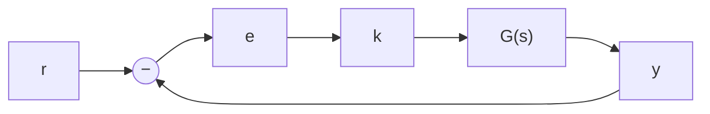

# Módulo 02 — Controle de Sistemas no Plano-s (Teoria)

> Texto teórico dos tópicos 2.1 a 2.5.
> Convenções do curso (Módulo 01): sistemas **SISO**; estabilidade = **BIBO**; malha padrão com realimentação unitária; $t_p = \pi/\omega_d$; $M_p = e^{-\zeta\pi/\sqrt{1-\zeta^2}}$; $t_s(5\,\%) = 3/\sigma$.
> **Novidades deste módulo:** o **plano-s** como palco do projeto; o **Lugar Geométrico das Raízes (LGR)**; os controladores de **avanço de fase**, **atraso de fase**, **PD**, **PI**, **PID** e **avanço-atraso**; e o **atraso de transporte** (aproximação de Padé).
> **Notação geométrica:** chamamos de **quadradinho** ($\square$) um candidato a polo de malha fechada, e de **quadradinho desejado** ($\square_d$) o polo de malha fechada que atende aos requisitos (sempre o de parte imaginária positiva — o conjugado vem de graça). Geometria do polo: $\beta = \arccos\zeta$, $\sigma = \zeta\omega_n$, $\omega_d = \omega_n\sqrt{1-\zeta^2}$, $\omega_n$ = distância do polo à origem.

---

## 2.1 Regiões de Desempenho no Plano-s e Aproximações

### 2.1.1 Revisão: a resposta subamortecida e suas fórmulas

No Módulo 01 vimos que a resposta ao degrau de um sistema de 2ª ordem **subamortecido sem zeros**,

$$G(s) = \frac{\omega_n^2}{s^2 + 2\zeta\omega_n s + \omega_n^2},$$

é completamente caracterizada por quatro grandezas, calculadas por:

$$M_p = e^{-\zeta\pi/\sqrt{1-\zeta^2}}, \qquad t_p = \frac{\pi}{\omega_d} = \frac{\pi}{\omega_n\sqrt{1-\zeta^2}}, \qquad t_r = \frac{\pi - \arccos\zeta}{\omega_n\sqrt{1-\zeta^2}}, \qquad t_s(5\,\%) \approx \frac{3}{\sigma} = \frac{3}{\zeta\omega_n}.$$

**Exemplo numérico.** Para $\zeta = 0{,}45$ e $\omega_n = 2$ rad/s: $M_p = e^{-0{,}45\pi/\sqrt{1-0{,}45^2}} = 20{,}5\,\%$; $t_p = \pi/1{,}786 = 1{,}76$ s; $t_r = (\pi - 1{,}104)/1{,}786 = 1{,}14$ s; $t_s = 3/0{,}9 = 3{,}33$ s.

> ⚠️ **Lembrete:** as três primeiras fórmulas são **exatas**; a do $t_s$ é uma **aproximação pessimista** (pela envoltória exponencial). O valor medido na simulação pode ser um pouco menor — e isso é bom: projetamos com folga.

A **inversa da fórmula do overshoot**, deduzida no Módulo 01, será usada o tempo todo neste módulo:

$$\zeta = \sqrt{\frac{\ln^2 M_p}{\pi^2 + \ln^2 M_p}} \qquad \text{(com } M_p \text{ em fração, não em porcentagem!)}$$

### 2.1.2 O plano-s e o mapa de polos e zeros

O **plano-s** é o plano cartesiano em que o eixo das abscissas é a **parte real** da variável complexa $s$ e o eixo das ordenadas é a **parte imaginária**. Cada ponto do plano corresponde a um número complexo $a + bj$.

Dada uma função de transferência, representamos seus **polos** (raízes do denominador) por um **×** e seus **zeros** (raízes do numerador) por um **○**, no que chamamos de **mapa de polos e zeros**:

Na figura: (a) $G(s) = \dfrac{2(s+10)}{(s+5)(s+4)}$ — zero em $-10$, polos em $-5$ e $-4$; (b) $G(s) = \dfrac{-5s+25}{s^2+6s+25}$ — zero em $+5$ (**semiplano direito**!) e polos em $-3 \pm 4j$ (confira com Bhaskara).

Por que o plano-s importa? Porque **a posição dos polos determina o comportamento do sistema**: polos no semiplano esquerdo → estável (Módulo 01); polos complexos → oscilação; polos afastados da origem → resposta rápida. Neste módulo vamos aprender a **colocar os polos de malha fechada onde queremos** — literalmente, a escolher pontos do plano-s.

**Parêntese: funções de transferência próprias e impróprias (causalidade).** Você notou que, em todos os nossos exemplos, o grau do numerador é **menor ou igual** ao grau do denominador? Essas são as **funções de transferência próprias**, e elas correspondem a sistemas **causais** — sistemas em que a saída de agora depende da entrada de agora e do passado, nunca do futuro.

Uma FT com grau do numerador **maior** que o do denominador seria **imprópria** e corresponderia a um sistema **não causal** — um **"sistema adivinho"**. O caso mais simples: $y(t) = \dot u(t)$. Considere três entradas possíveis: $u_1 = 1$ (degrau), $u_2 = e^{-t}$ e $u_3 = e^{t}$. Em $t = 0$, as três valem exatamente $1$ — mas suas derivadas valem $0$, $-1$ e $+1$. Como o sistema decide, **só com a informação $u(0) = 1$**, se sua saída será $0$, $-1$ ou $+1$? Só mesmo sendo vidente e já sabendo qual das três entradas está por vir. No mundo real conhecido — com exceção de alguns videntes — **não existem sistemas não causais**. (Se você encontrar um, me avise: quero usá-lo para jogar na loteria.)

É claro que razões de polinômios com grau do numerador maior podem aparecer como resultado de manipulações matemáticas — uma *pseudo* FT imprópria. No nosso curso, continuaremos usando apenas FTs próprias, na maioria das vezes com numerador de grau zero — muito comum na prática. E atenção: o **derivador puro** $C(s) = k_d s$ é impróprio — voltaremos a esse assunto quando falarmos do controlador PD (§2.3.6).

### 2.1.3 Requisito de overshoot no plano-s

Como $M_p = e^{-\zeta\pi/\sqrt{1-\zeta^2}}$ depende **apenas de $\zeta$**, um requisito de overshoot é um requisito sobre o fator de amortecimento. E $\zeta$ tem uma leitura geométrica direta no plano-s: se o polo é $-\sigma + j\omega_d$, então

$$\cos\beta = \frac{\sigma}{\omega_n} = \frac{\zeta\omega_n}{\omega_n} = \zeta \qquad\Rightarrow\qquad \boxed{\beta = \arccos\zeta}$$

onde $\beta$ é o **ângulo que o polo faz com o eixo real negativo**.

**Exemplo.** Requisito $M_p \leq 10\,\%$ → $\zeta \geq 0{,}59$ (pela inversa; vamos usar $\zeta = 0{,}6$, que dá $M_p = 9{,}48\,\%$) → $\beta \leq \arccos(0{,}6) = 53{,}13°$.

A **região de desempenho** é o **setor angular** do semiplano esquerdo delimitado pelas retas de ângulo $\pm\beta$: qualquer polo dentro do setor tem fator de amortecimento maior que o mínimo exigido. Quanto **menor** o $\beta$, **menor** o overshoot.

### 2.1.4 Requisitos de instante de pico e de tempo de acomodação no plano-s

**Instante de pico.** Como $t_p = \pi/\omega_d$ e $\omega_d$ é a **parte imaginária** do polo, o requisito $t_p \leq X$ se traduz em:

$$\omega_d \geq \frac{\pi}{X} \quad\Rightarrow\quad \text{região: semiplano esquerdo **acima** da reta horizontal } \mathrm{Im} = \pi/X \text{ (e abaixo de } -\pi/X\text{)}$$

Normalmente o requisito de instante de pico é de tempo **máximo**: picos mais cedo são aceitos; mais tarde, não.

**Tempo de acomodação.** Como $t_s$ depende só de $\sigma$ (o módulo da **parte real** do polo), o requisito $t_s \leq Y$ se traduz em valor mínimo de $\sigma$:

$$t_s(5\,\%) = \frac{3}{\sigma}, \qquad t_s(2\,\%) = \frac{4}{\sigma}, \qquad t_s(1\,\%) = \frac{4{,}6}{\sigma} \qquad\Rightarrow\qquad \sigma \geq \frac{3}{Y}\ \text{(5 %)},\ \frac{4}{Y}\ \text{(2 %)},\ \frac{4{,}6}{Y}\ \text{(1 %)}$$

Região: semiplano **à esquerda da reta vertical** $\mathrm{Re} = -3/Y$ (ou $-4/Y$, $-4{,}6/Y$).

### 2.1.5 Requisito de tempo de subida no plano-s

Aqui temos um problema prático: a fórmula exata $t_r = (\pi - \arccos\zeta)/(\omega_n\sqrt{1-\zeta^2})$ depende de $\zeta$ **e** de $\omega_n$ — a fronteira da região ficaria complicada. A saída é trabalhar com **aproximações**.

**Troca de convenção:** em vez de $t_r$ de 0–100 %, podemos usar o **tempo de subida de 10–90 %** do valor final, que admite boas aproximações polinomiais em $\zeta$ (são as minhas "aproximações aproximadas" — você pode encontrar coeficientes ligeiramente diferentes em outros textos):

$$t_r(10\text{–}90\,\%) \approx \frac{1{,}8\zeta^3 - 0{,}4\zeta^2 + \zeta + 1}{\omega_n} \approx \frac{2{,}3\zeta^2 - 0{,}08\zeta + 1{,}1}{\omega_n} \approx \frac{2\zeta + 0{,}65}{\omega_n} \approx \frac{1{,}6}{\omega_n}$$

E se o requisito for mesmo de 0–100 %:

$$t_r(0\text{–}100\,\%) \approx \frac{3\zeta + 1}{\omega_n} \approx \frac{2{,}4}{\omega_n}$$

No gráfico $t_r \cdot \omega_n \times \zeta$ (que independe de $\omega_n$, pois $\omega_n$ aparece no denominador de todas as fórmulas): as aproximações de 3º e de 2º grau são boas em toda a faixa; a de 1º grau é razoável para $\zeta \in [0{,}35;\ 0{,}65]$ (utilizável em $[0{,}25;\ 0{,}75]$); a constante só é boa para $\zeta \approx 0{,}5$ (de $0{,}45$ a $0{,}55$; utilizável de $0{,}4$ a $0{,}6$).

**Para desenhar a região no plano-s, usamos as aproximações constantes** — e fingimos que elas valem para $\zeta$ entre 0 e 1:

$$t_r(10\text{–}90\,\%) \leq X \Rightarrow \omega_n \geq \frac{1{,}6}{X}; \qquad t_r(0\text{–}100\,\%) \leq Y \Rightarrow \omega_n \geq \frac{2{,}4}{Y}$$

Como $\omega_n$ é a **distância do polo à origem**, a região é o **semiplano esquerdo fora do círculo de raio $Z$ centrado na origem**. Quanto mais afastado o polo, menor o tempo de subida.

### 2.1.6 Regiões combinadas

Requisitos simultâneos ⇒ **interseção** das regiões. **Exemplo-âncora:** $M_p \leq 20\,\%$, $t_p \leq 3{,}14$ s e $t_s(2\,\%) \leq 8$ s:

- $M_p \leq 20\,\% \Rightarrow \zeta \geq 0{,}456 \Rightarrow \beta \leq \arccos(0{,}456) = 62{,}9°$;
- $t_p \leq 3{,}14 \Rightarrow \omega_d \geq \pi/3{,}14 \approx 1$;
- $t_s(2\,\%) \leq 8 \Rightarrow \sigma \geq 4/8 = 0{,}5$.

Se o polo de malha fechada estiver na região sombreada, os três requisitos serão atendidos — **com as aproximações de sempre** (2ª ordem sem zeros, fórmula pessimista do $t_s$). Daqui a pouco aprenderemos a colocar o polo lá dentro.

> ✏️ **Pense:** um colega propõe atender $t_p \leq 3{,}14$ s colocando o polo em $-0{,}6 + 1{,}2j$. Ele está na região de $t_p$? E na de $t_s(2\,\%) \leq 8$ s? E na de $M_p \leq 20\,\%$? (Resposta: $\omega_d = 1{,}2 \geq 1$ ✓; $\sigma = 0{,}6 \geq 0{,}5$ ✓; $\beta = \arctan(1{,}2/0{,}6) = 63{,}4° > 62{,}9°$ ✗ — falha no overshoot por muito pouco!)

### 2.1.7 Aproximação de 2ª ordem por 1ª ordem

Considere $G(s) = \dfrac{10}{(s+1)(s+10)}$. Será que sua resposta ao degrau se parece com a de $\dfrac{1}{s+1}$ (note: **mantemos o ganho DC**, $10/10 = 1$)? Vamos deduzir, literalmente, para $G(s) = \dfrac{a}{(s+1)(s+a)}$:

$$Y(s) = \frac{a}{s(s+1)(s+a)} = \frac{1}{s} - \frac{a/(a-1)}{s+1} + \frac{1/(a-1)}{s+a} \;\Rightarrow\; y(t) = 1 - \frac{a}{a-1}e^{-t} + \frac{1}{a-1}e^{-at}$$

Para $a$ grande: o segundo termo tende a $-e^{-t}$ e o terceiro some (coeficiente pequeno **e** exponencial rapidíssima) → $y(t) \approx 1 - e^{-t}$, exatamente a resposta de $\dfrac{1}{s+1}$.

Com polo extra em $-10$: boa aproximação. Em $-100$: excelente. Em $-2$: ruim (o coeficiente $a/(a-1) = 2$ e a exponencial $e^{-2t}$ não são desprezíveis). **Conclusão: quanto mais afastado o polo extra, melhor a aproximação** — e sempre **mantendo o ganho DC** da FT original.

### 2.1.8 Aproximação de 3ª ordem por 2ª ordem

O mesmo espírito: $G(s) = \dfrac{20}{(s+1)(s+2)(s+10)} \approx \dfrac{2}{(s+1)(s+2)}$ (ganho DC = 2 mantido). Mas o efeito didático mais rico aparece com **par complexo + polo real**: o 3º polo deixa a resposta **mais lenta e mais suave (menos overshoot)**:

Na figura, o sistema de 2ª ordem com $\zeta = 0{,}5$ tem $M_p = 16{,}3\,\%$. Acrescentando um polo real em $-10$: $M_p$ cai para 15,9 % — aproximação ótima. Em $-3$: $M_p = 12{,}2\,\%$ — já sente. Em $-1$ ou mais perto: **o overshoot morre** — o polo real lento domina a resposta, mesmo com o par complexo de $\zeta = 0{,}5$ presente.

**Regra prática (dominância):** a aproximação por 2ª ordem é válida quando

$$|\text{polo extra}| \geq 5 \times |\mathrm{Re}(\text{par complexo})|$$

Nesse caso dizemos que o par complexo é **dominante**. É essa regra que nos permitirá projetar como se o mundo fosse de 2ª ordem — e é por isso que, ao final de todo projeto, **conferimos todos os polos de malha fechada**, não só o par desejado.

### 2.1.9 Efeito do zero: aproximação de sistema com zero por sistema sem zero

E se a FT tiver um **zero**? Considere $G_1(s) = \left(\dfrac{s}{a} + 1\right)G(s)$. Na resposta ao degrau, multiplicar por $s$ é **derivar** (condições iniciais nulas), logo:

$$\boxed{y_1(t) = y(t) + \frac{\dot y(t)}{a}}$$

A derivada é grande no início da resposta e nula no regime. Consequências:

- **Zero no semiplano esquerdo ($a > 0$):** a derivada **soma** no início → resposta **mais rápida e com mais overshoot**. Quanto mais próximo o zero da origem, maior o efeito;
- **Zero no semiplano direito ($a < 0$):** a derivada **subtrai** → a saída **primeiro vai na direção errada** — o chamado **undershoot** (sistemas de **fase não mínima**);
- **Par polo-zero próximos se cancelam:** se um zero quase coincide com um polo, o efeito residual dos dois é pequeno — é o **quase-cancelamento** (usaremos isso no controlador de atraso, §2.4).

**Conclusão:** um sistema com zero pode ser aproximado por um sistema sem zero quando o zero está **longe** dos polos dominantes ($|zero| \gg |\mathrm{Re}(\text{polos})|$). Quando está perto, o overshoot real será **maior** que o projetado pelas fórmulas de 2ª ordem — mais um motivo para sempre simular ao final do projeto.

---

## 2.2 O Lugar Geométrico das Raízes (LGR)

### 2.2.1 Motivação: para onde vão os polos de malha fechada quando k varia?

Na malha padrão do curso (ganho $k$ + realimentação unitária),

$$T(s) = \frac{kG(s)}{1 + kG(s)} = \frac{k\,N(s)}{D(s) + k\,N(s)}$$

Os polos de malha fechada são as raízes de $D(s) + k\,N(s) = 0$ — e **mudam com $k$**. Como muda o comportamento da resposta? Vamos investigar os casos simples.

**1ª ordem sem zero:** $G = \dfrac{1}{s+a} \Rightarrow T = \dfrac{k}{s + a + k}$ → polo de MF em $\boxed{-a-k}$: sai de $-a$ e caminha para $-\infty$ à medida que $k$ cresce. O sistema só fica mais rápido — nunca desestabiliza.

**1ª ordem com zero:** $G = \dfrac{s+b}{s+a} \Rightarrow T = \dfrac{k(s+b)}{(1+k)s + (a + kb)}$ → polo de MF em

$$-\frac{a + kb}{1 + k}: \quad k \to 0 \Rightarrow -a \ (\text{o polo}); \qquad k \to \infty \Rightarrow -b \ (\text{o zero!)}$$

Primeira constatação importante: **com ganho infinito, o polo de malha fechada vai parar em cima do zero**.

**2ª ordem tipo 1:** $G = \dfrac{1}{s(s+a)} \Rightarrow T = \dfrac{k}{s^2 + as + k}$ → polos reais distintos enquanto $k < a^2/4$; **encontram-se em $-a/2$ quando $k = a^2/4$**; para $k$ maior, viram par complexo conjugado que **sobe verticalmente** com parte real fixa em $-a/2$ (a parte imaginária cresce → o instante de pico diminui... mas o tempo de acomodação **não melhora nunca**, pois $\sigma = a/2$ é fixo!).

**2ª ordem tipo 0:** $G = \dfrac{1}{(s+a)(s+b)}$ → o encontro se dá em $-\dfrac{a+b}{2}$ quando $k = \dfrac{(a+b)^2 - 4ab}{4} = \dfrac{(a-b)^2}{4}$, e depois os polos sobem verticalmente.

Os desenhos acima — a trajetória dos polos de malha fechada quando $k$ varia de $0$ a $\infty$ — são o que chamamos de **Lugar Geométrico das Raízes**.

### 2.2.2 Definição do LGR

> **O Lugar Geométrico das Raízes (LGR; em inglês, *root locus*) é o lugar geométrico das raízes de $1 + kG(s) = 0$ quando $k$ varia de $0$ a $+\infty$** — ou seja, a trajetória dos polos de malha fechada no plano-s em função do ganho.

Note que o LGR depende **apenas de $G(s)$** — dos polos e zeros de malha aberta. Conhecendo-os, podemos esboçar o LGR **sem calcular as raízes para cada valor de $k$**, usando as regras que veremos adiante.

### 2.2.3 A condição de ângulo: quem pertence ao LGR?

Um ponto $\square$ do plano-s é polo de malha fechada para algum $k > 0$ se e somente se $1 + kG(\square) = 0$, ou seja, $kG(\square) = -1$ — um número **real negativo**. O argumento de um real negativo é $-180°$ (mais múltiplos de $360°$), logo:

$$\boxed{\angle G(\square) = -180° + l\cdot360°} \qquad \textbf{(condição de ângulo)}$$

A fase de $G$ num ponto é a **soma dos ângulos dos vetores que saem dos zeros** até $\square$ **menos** a soma dos ângulos dos vetores que saem dos **polos** até $\square$ (use `atan2` — cuidado com o quadrante!).

**Exemplo.** $G = \dfrac{1}{s(s+6)}$, ponto $\square = -3+3j$:

- Vetor do polo $0$ até $\square$: ângulo $180° - 45° = 135°$;
- Vetor do polo $-6$ até $\square$: ângulo $45°$;
- $\angle G(\square) = -(135° + 45°) = -180°$ ✓ — **o ponto pertence ao LGR**.

### 2.2.4 A condição de módulo: qual é o ganho?

Pertencer ao LGR só garante que o ponto é polo de MF **para algum** $k$. Qual? De $|kG(\square)| = 1$:

$$\boxed{k = \frac{1}{A}\cdot\frac{\prod \mathrm{dist}(\square \to \text{polos})}{\prod \mathrm{dist}(\square \to \text{zeros})}} \qquad \textbf{(condição de módulo)}$$

onde $A$ é o **ganho da forma fatorada** de $G(s) = A\dfrac{\prod(s+z_i)}{\prod(s+p_j)}$ — **não esqueça do $A$, ou seu ganho ficará errado**.

**Exemplo completo — $G = \dfrac{1}{s(s+6)}$:**

- $\square_2 = -3+3j$: pertence (fases $135° + 45° = 180°$). Distâncias: $|\square_2| = \sqrt{18}$ e $|\square_2 + 6| = \sqrt{18}$ → $k = \sqrt{18}\cdot\sqrt{18} = 18$;
- $\square_3 = -3+4j$: pertence (fases $126{,}9° + 53{,}1° = 180°$). Distâncias: $5$ e $5$ → $k = 25$;
- $\square_1 = -6+6j$: fases $135° + 90° = 225° \neq 180°$ → **não pertence ao LGR para nenhum $k$** — não adianta calcular ganho!

### 2.2.5 Exemplo de projeto de controle proporcional no plano-s

**Enunciado-âncora:** $G(s) = \dfrac{10}{s(s+10)}$, requisito $M_p \leq 5\,\%$ **com o menor $t_p$ possível**.

1. $M_p \leq 5\,\% \Rightarrow \zeta \geq 0{,}69 \Rightarrow \beta \leq \arccos(0{,}69) = 46{,}37°$;
2. O LGR de $\dfrac{1}{s(s+10)}$ é a vertical em $-5$ (após o encontro em $k = 25$): podemos subir até o limite do ângulo — polos escolhidos $-5 \pm j\,5\,\mathrm{tg}(46{,}37°) = -5 \pm 5{,}25j$;
3. Condição de módulo: $k = \dfrac{|\square_d|\cdot|\square_d+10|}{10} = \dfrac{7{,}25 \times 7{,}25}{10} \approx 5{,}26$;
4. Verificação: $T(s) = \dfrac{52{,}6}{s^2+10s+52{,}6}$, $\omega_d = 5{,}25$ → $t_p = \pi/5{,}25 \approx 0{,}6$ s; simulação: $M_p = 5{,}0\,\%$ ✓.

Subir mais no LGR diminuiria $t_p$, mas furaria o requisito de overshoot; subir menos melhora o overshoot, mas atrasa o pico. **O projeto de P é a escolha de um ponto sobre o LGR** — sem o LGR, isso seria tentativa e erro cega.

### 2.2.6 As oito regras de esboço do LGR

Seja $G(s) = A\dfrac{\prod_{i=1}^{m}(s+z_i)}{\prod_{j=1}^{n}(s+p_j)}$ com $n$ polos e $m$ zeros.

| # | Regra | Justificativa rápida |
|---|---|---|
| 1 | **Número de ramos = $n$** (um para cada polo de MA) | a equação característica tem $n$ raízes |
| 2 | **Simetria em relação ao eixo real** | coeficientes reais → raízes complexas aos pares conjugados |
| 3 | **Trechos sobre o eixo real:** um ponto do eixo real pertence ao LGR se à sua **direita** houver um número **ímpar** de polos **mais** zeros reais | cada polo/zero real à direita contribui $180°$ de fase; à esquerda, $0°$; pares complexos se cancelam |
| 4 | **Começo e término:** os ramos **começam** ($k=0$) nos polos de MA e **terminam** ($k \to \infty$) nos zeros de MA; os $n-m$ ramos restantes vão ao **infinito** | vimos na §2.2.1: polo vai ao zero com $k \to \infty$ |
| 5 | **Assíntotas:** os $n-m$ ramos que vão ao infinito seguem retas de ângulos $\dfrac{180° + l\cdot360°}{n-m}$, $l = 0, 1, \dots, n-m-1$ | para $n-m=2$: $\pm 90°$; $n-m=3$: $60°, 180°, 300°$; $n-m=4$: $\pm 45°, \pm 135°$ |
| 6 | **Centroide:** as assíntotas partem de $\sigma_a = \dfrac{\sum \text{polos} - \sum \text{zeros}}{n-m}$ (eixo real) | — |
| 7 | **Cruzamento do eixo imaginário:** via **Routh** — o $k$ que zera a linha $s^1$; o ponto de cruzamento sai da **equação auxiliar** | é a fronteira da estabilidade |
| 8 | **Pontos de saída/entrada no eixo real:** extremos de $k(s) = -1/G(s)$ → resolver $\dfrac{\mathrm{d}}{\mathrm{d}s}\left(-\dfrac{1}{G(s)}\right) = 0$ e **aceitar só as raízes sobre trechos do LGR** | no ponto de saída, dois polos reais viram par complexo (máximo de $k$ no trecho) |

**Complemento — ângulos de partida e chegada:** o ângulo com que um ramo **parte** de um polo complexo (ou **chega** a um zero complexo) sai da condição de ângulo aplicada num ponto infinitesimalmente próximo:

$$\theta_{\text{partida}} = 180° + \sum \angle(\text{zeros} \to p) - \sum \angle(\text{outros polos} \to p)$$

**Exemplo:** $G = \dfrac{(s+2)(s+4)}{s(s^2+4)}$, partida do polo $+2j$: $\theta = 180° + (45° + 26{,}6°) - (90° + 90°) = 71{,}6°$ — o ramo **entra no semiplano direito** antes de voltar!

**Exemplo das regras 7 e 8 — $G = \dfrac{1}{(s+1)(s+2)(s+3)}$:**

- *Cruzamento jω:* característico $s^3 + 6s^2 + 11s + (6+k)$ → Routh: linha $s^1$: $\dfrac{66 - (6+k)}{6} = 0 \Rightarrow k = 60$ → auxiliar $6s^2 + 66 = 0 \Rightarrow s = \pm j\sqrt{11} \approx \pm 3{,}32j$;
- *Saída do eixo real:* $-\dfrac{1}{G} = -(s^3+6s^2+11s+6)$ → derivada $-(3s^2+12s+11) = 0$ → $s = -1{,}42$ (✓ está no trecho $(-2, -1)$) e $s = -2{,}58$ (✗ fora dos trechos — descartada).

### 2.2.7 Exemplos-âncora de esboço

**A — $G = \dfrac{200}{s(s+10)(s+20)}$:** 3 ramos; trechos $(-10, 0)$ e $(-\infty, -20)$; $n-m = 3$ assíntotas em $\pm 60°$ e $180°$; centroide $(0-10-20)/3 = -10$; Routh → $k = 30$, auxiliar $30s^2 + 6000 = 0$ → cruzamento em $\pm j\sqrt{200} = \pm j10\sqrt{2} \approx \pm 14{,}1j$; saída: $3s^2 + 60s + 200 = 0$ → $-4{,}23$ ✓ ($-15{,}77$ ✗).

**B — $G = \dfrac{200(s+5)}{s(s+10)(s+15)}$:** trechos $(-5, 0)$ e $(-15, -10)$; $n-m = 2$ assíntotas em $\pm 90°$; centroide $(0-10-15+5)/2 = -10$; Routh → **nenhum cruzamento: nunca desestabiliza**; saída: $s^3 + 20s^2 + 125s + 375 = 0$ → única raiz sobre trecho: $-12{,}3$.

**C — $G = \dfrac{400}{s(s+2)(s+10)(s+20)}$:** 4 ramos; trechos $(-2, 0)$ e $(-20, -10)$; $n-m=4$ assíntotas em $\pm 45°, \pm 135°$; centroide $-32/4 = -8$; Routh → auxiliar $s^2 + 12{,}5 = 0$ → cruzamento em $\pm j3{,}5$; saídas: $s^3 + 24s^2 + 130s + 100 = 0$ → $-0{,}92$ e $-16{,}5$ (duas saídas, uma em cada trecho!).

**D — $G = \dfrac{80(s+5)}{s(s+2)(s+10)(s+20)}$:** mesma planta + zero em $-5$: $n-m=3$ assíntotas em $\pm 60°/180°$; centroide $(-32+5)/3 = -9$. Comparando os dois LGRs, fica evidente: **o zero "puxa" os ramos para perto de si — o sistema fica mais estável**.

> ✏️ **Pense:** no exemplo A, o sistema desestabiliza para $k > 30$. No exemplo B — mesma estrutura, mas com um zero em $-5$ — nunca desestabiliza. Explique, em uma frase, por que o zero "estabiliza" o LGR. (Dica: olhe o número de assíntotas e o que acontece com os ramos que iriam ao infinito.)

---

## 2.3 Controlador de Avanço de Fase

### 2.3.1 A impossibilidade do controle proporcional

**Enunciado-âncora:** $G(s) = \dfrac{4}{s(s+4)}$. Seu LGR é a vertical em $-2$ (após o encontro). Agora suponha o requisito $t_s(5\,\%) \leq 1$ s ⇒ $\sigma \geq 3$: **impossível com P** — o LGR nunca passa à esquerda de $-2$; não há como o polo ir para lá.

E mesmo requisitos "alcançáveis" podem ser **conflitantes**: $M_p \leq 5\,\%$ **e** $t_p \leq 1$ s:

- Para $M_p = 5\,\%$: $\zeta = 0{,}69 \Rightarrow \beta = 46{,}4°$ → polos $-2 \pm 2{,}1j$ → $k \approx 2{,}1$ → mas $\omega_d = 2{,}1$ ⇒ $t_p \approx 1{,}5$ s ✗;
- Para $t_p = 1$ s: $\omega_d = \pi$ → polos $-2 \pm 3{,}14j$ → $k = 3{,}47$ → $\zeta = 0{,}54$ ⇒ $M_p = 13\,\%$ ✗.

**Moral:** o controle proporcional só escolhe pontos **sobre** o LGR da planta. Para colocar polos **fora** dele, precisamos **mudar o LGR** — e quem muda o LGR são **polos e zeros acrescentados pelo controlador**.

### 2.3.2 Visualizando o efeito de um zero e de um polo no LGR

Antes de projetar, a intuição geométrica. Acrescentando **um zero** ao LGR de $\dfrac{1}{s(s+4)}$: os ramos são **puxados para a esquerda** (o zero atrai — lembre: com $k \to \infty$, um ramo termina no zero). Acrescentando **um polo**: os ramos são **empurrados para a direita**. Com um zero em $-a$ e um polo em $-b$, o cruzamento das assíntotas desloca-se de $(a-b)/2$.

Regra de bolso inesquecível: **"o LGR se deforma na direção do polo"** (o polo atrai os ramos; o zero repele). Cuidado: se $a - b > 6$ (polo muito à esquerda do zero), os ramos podem ir parar no **semiplano direito** — deformação demais.

### 2.3.3 Calculando a contribuição do controlador

Suponha que queremos que o LGR do sistema compensado passe por $\square_d = -3{,}14 + 3{,}2j$ ($\zeta = 0{,}7$, $\omega_d = 3{,}2$). Calculamos a fase da planta nesse ponto: $\angle G(\square_d) = -209{,}5°$. Para o ponto pertencer ao LGR, precisamos de $-180°$. **Quem fornece a diferença é o controlador**:

$$\boxed{\angle C(\square_d) = -\angle G(\square_d) - 180°}$$

Nesse caso: $\angle C(\square_d) = 209{,}5° - 180° = +29{,}5°$ — o controlador deve **contribuir +29,5° de fase** no ponto desejado. É por isso que ele se chama **controlador de avanço de fase**: ele *adianta* a fase.

### 2.3.4 Infinitas soluções; as soluções mais adotadas

**Enunciado-âncora:** $G(s) = \dfrac{200}{s(s+10)(s+20)}$, polo desejado $\square_d = -5 + 7j$.

$$\angle G(\square_d) = -205° \;\Rightarrow\; \text{contribuição necessária} = +25°$$

Um par zero-polo $(s+a)/(s+b)$ contribui $\angle(\square_d + a) - \angle(\square_d + b) = 25°$ — **uma equação, duas incógnitas: infinitas soluções** (ex.: $b = 12 \Rightarrow a = 7{,}55$; $b = 75 \Rightarrow a = 16{,}8$). As três soluções-padrão do curso:

1. **Zero embaixo de $\square_d$** ($a = 5$): o ângulo do zero é $90°$ → o polo precisa contribuir $65°$ → $\mathrm{tg}(65°) = \dfrac{7}{b-5}$ → $b = 5 + \dfrac{7}{\mathrm{tg}(65°)} = 8{,}3$;
2. **Bissetriz:** traça-se a bissetriz do ângulo entre o eixo real e a reta origem→$\square_d$; zero e polo ficam simétricos em torno dela → $a = 5 - 7\,\mathrm{tg}(12{,}5°) = 3{,}4$ e $b = 5 + 7\,\mathrm{tg}(12{,}5°) = 6{,}6$;
3. **Zero cancela um polo da planta** (o $-10$ ou o $-20$ — **nunca o polo na origem**: cancelar o integrador derrubaria o tipo do sistema e o erro à rampa divergiria).

### 2.3.5 A necessidade do ganho exato

A escolha do par $(a, b)$ garante que $\square_d$ **pertence ao LGR** do sistema compensado — mas ele só será **polo de malha fechada** com o ganho exato, dado pela condição de módulo aplicada a $C(s)G(s)$:

- Solução 1 (zero embaixo): $k_1 = 6{,}77 \Rightarrow C_1(s) = 6{,}77\dfrac{s+5}{s+8{,}3}$;
- Solução 2 (bissetriz): $k_2 = 6{,}12 \Rightarrow C_2(s) = 6{,}12\dfrac{s+3{,}4}{s+6{,}6}$.

Verificando $T(s) = \dfrac{CG}{1+CG}$: os polos de malha fechada incluem $-5 \pm 7{,}02j$ ✓ — **e também um terceiro polo** (a planta é de 3ª ordem!). **Sempre confira todos os polos de malha fechada**: o par desejado precisa ser dominante (§2.1.8). Se o 3º polo cair perto do par, a resposta real vai diferir do projetado.

### 2.3.6 O controlador PD e sua implementação

Definição formal do **controlador de avanço de fase**:

$$\boxed{C(s) = k\,\frac{s+a}{s+b}, \qquad 0 < a < b}$$

(zero mais perto da origem que o polo — contribuição de fase **positiva**: $\angle(\square+a) > \angle(\square+b)$.)

**Caso-limite $b \to \infty$: o PD (Proporcional-Diferencial).** $C(s) = k(s+a) = ka + ks = k_p + k_d\,s$, com $k_p = k\cdot a$ e $k_d = k$. Exemplo: $C(s) = 0{,}37(s+20) = 7{,}4 + 0{,}37\,s$.

**Problema físico do derivador puro:** a derivada de um degrau é um **impulso**. Uma mudança abrupta na referência produz um pico gigantesco no sinal de controle — numa simulação típica com filtro muito distante, o pico chega à casa dos **trilhões de volts**. Nenhum atuador do mundo real entrega isso: o sinal satura, e o comportamento real nada tem a ver com o simulado.

**Implementação real: PD com filtro = avanço de fase.** Troca-se o derivador puro por $\dfrac{k_d s}{1 + s/N}$ (polo de filtro em $-N$) — ou seja, implementa-se um **avanço de fase** com polo distante: $44{,}4\dfrac{s+16{,}7}{s+100}$ ou $37\dfrac{s+20}{s+100}$. A resposta $y(t)$ fica praticamente idêntica à do PD ideal, mas o sinal de controle é **finito**.

### 2.3.7 Exemplo de projeto: sistema de 2ª ordem do tipo 1 (projeto em dois estágios)

**Enunciado-âncora:** $G(s) = \dfrac{10}{s(s+10)}$ (a mesma da §2.2.5 — reciclagem de exemplos é bom para o meio ambiente).

**Estágio 1 — P para $M_p \leq 20\,\%$:** $\zeta = 0{,}456 \Rightarrow \beta = 62{,}9°$ → polos $-5 \pm 9{,}8j$ → $k = 12{,}1$. Resposta: $M_p = 20\,\%$, $t_p \approx 0{,}32$ s.

**Estágio 2 — avanço para dobrar a velocidade:** dobrar $\sigma$ e $\omega_d$ → $\square_d = -10 + 19{,}6j$. Fase da planta: $\angle G(\square_d) = -207°$ → contribuição necessária $27°$. Solução adotada: **zero cancela o polo $-10$** → o polo do controlador precisa de $90° - 27° = 63°$ → $b = 20$. Ganho: $k = 48{,}4$.

$$C(s) = 48{,}4\,\frac{s+10}{s+20}, \qquad T(s) = \frac{484}{s^2 + 20s + 484}$$

Note: o cancelamento **zerou a 3ª ordem** — o sistema compensado é de 2ª ordem exata, $\omega_n = 22$, $\zeta = 0{,}455$: **mesmo overshoot, metade dos tempos** ($t_p = 0{,}16$ s).

### 2.3.8 Exemplo de projeto: sistema de 3ª ordem e a regra dos 40°

**Enunciado-âncora:** $G(s) = \dfrac{20(s+15)}{s(s+10)(s+20)}$, requisitos $M_p = 25\,\%$ e $t_p = 150$ ms.

1. $\zeta = 0{,}404$; $\omega_d = \pi/0{,}15 = 21$ → $\square_d = -9{,}3 + 21j$;
2. $\angle G(\square_d) = -190{,}2°$ → contribuição $10{,}2°$ (pequena!);
3. Solução por **bissetriz**: $a = 7{,}4$, $b = 11{,}2$; ganho $k = 26{,}1$ → $C(s) = 26{,}1\dfrac{s+7{,}4}{s+11{,}2}$;
4. Simulação: **$M_p$ medido $= 23{,}2\,\%$** (projeto: 25 %) e **$t_p = 148$ ms** — diferença pequena, fruto das aproximações (3º polo + zeros).

> ⚠️ **Regra prática dos 40°:** limite a contribuição do avanço a **40° por controlador**. Querer mais que isso com um único par polo-zero é querer fazer um **Fusca** andar como uma **Ferrari**: o polo fica longe demais do zero, a deformação do LGR sai do controle e os outros polos de MF pagam a conta. Precisa de mais? Use **dois avanços em cascata** — ou repense os requisitos.

---

## 2.4 Controlador de Atraso de Fase

### 2.4.1 Por que não corrigir o erro em regime pelo ganho

**Exemplo 1:** $G(s) = \dfrac{10}{(s+2)(s+5)}$ (tipo 0). Projeto para $M_p = 30\,\%$ → $\zeta = 0{,}36$ → $k = 8{,}45$ → $k_p = 8{,}45$ → $e_{ss}$(degrau) $= 1/(1+8{,}45) = 0{,}1058$. Para $e_{ss} = 0{,}05$ seria preciso $k = 19$ — mas com $k = 19$ os polos de MF mudam e $M_p$ vai a **44,7 %**: inaceitável.

**Exemplo 2:** $G(s) = \dfrac{1}{s(s+2)}$ com avanço projetado para $\square_d = -1{,}6+2{,}2j$ ($\zeta = 0{,}59$): $C(s) = 6{,}75\dfrac{s+1{,}6}{s+2{,}66}$ (contribuição $\approx 25{,}7°$; ângulo do polo $64{,}3°$). Resultado: $k_v = \dfrac{6{,}75 \times 1{,}6}{2 \times 2{,}66} \approx 2 \Rightarrow e_{ss}$(rampa) $= 0{,}5$. Tentando corrigir multiplicando o ganho por 10: polos migram para $-1{,}54 \pm 8{,}1j$ → $M_p = 55\,\%$.

**Moral:** erro em regime **não** se corrige pelo ganho — o ganho foi escolhido para o transitório. Corrige-se com um **par polo-zero colado na origem**: o **controlador de atraso de fase**.

### 2.4.2 O mecanismo: aumentar a constante de erro sem mover os polos

**Enunciado-âncora:** $G(s) = \dfrac{1}{s(s+3{,}2)}$ com P $k = 7{,}4$:

$$T(s) = \frac{7{,}4}{s^2 + 3{,}2s + 7{,}4} \;\Rightarrow\; \text{polos } -1{,}6 \pm 2{,}2j,\ \zeta = 0{,}59,\ \omega_n = 2{,}72$$

$M_p = 10\,\%$, $t_r = 1$ s, $t_s(2\,\%) = 2{,}5$ s, $t_p = 1{,}43$ s — ótimo transitório. Mas $k_v = 7{,}4/3{,}2 \approx 2{,}31 \Rightarrow e_{ss}$(rampa) $\approx 0{,}43$. **Objetivo: duplicar $k_v$ sem mover os polos.**

**Proposta:** trocar o P por $C(s) = 7{,}4\dfrac{s + 2b}{s + b}$ — com isso $k_v$ dobra (de $2{,}31$ para $\approx 4{,}6$) e o erro cai pela metade. Mas o novo par polo-zero **deforma o LGR** — a não ser que sua contribuição de módulo **e** de fase no polo de MF seja desprezível. Analisando em $\square = -1{,}6 + 2{,}2j$:

- **Fase:** $\angle(\square + 2b) - \angle(\square + b) \approx \mathrm{arctg}\dfrac{1{,}1}{b} - \mathrm{arctg}\dfrac{2{,}2}{b}$ → pequena para $b$ **grande** ✓ …
- **Módulo:** $\left|\dfrac{\square + 2b}{\square + b}\right| \approx \dfrac{2b}{b} = 2$ para $b$ grande — **o ganho efetivo dobra e os polos mudam de lugar** ✗;
- Para $b$ **pequeno** (par **colado na origem**): módulo $\approx 1$ ✓ **e** fase $\approx 0$ ✓ — as distâncias do par até $\square$ são praticamente iguais!

**Solução:** $2b = 0{,}02 \Rightarrow C(s) = 7{,}4\dfrac{s+0{,}02}{s+0{,}01}$. Polos de malha fechada: $-1{,}595 \pm 2{,}196j$ (praticamente os mesmos!) **e $-0{,}0201$** — um polo lento colado no zero do controlador (quase-cancelamento). E $k_v$ **duplicou**.

**O preço:** o polo lento em $-0{,}0201$ deixa a **convergência do erro mais lenta** — é o "rabo" longo da resposta do erro. Não existe almoço grátis.

### 2.4.3 Procedimento de projeto do atraso de fase

Definição formal do **controlador de atraso de fase**:

$$\boxed{C(s) = k\,\frac{s+a}{s+b}, \qquad a > b > 0}$$

(polo **mais perto da origem** que o zero — contribuição de fase **negativa**, porém pequena.)

**Procedimento:**

1. **Projete o transitório primeiro** (P ou avanço) e calcule a constante de erro obtida, $K_e$;
2. Calcule o **fator necessário**: $\mathrm{fator} = K_{e,\text{desejada}}/K_e = a/b$;
3. **Posicione o zero do atraso a 1/10 da parte real do polo dominante:** $a = -\mathrm{Re}(\square_d)/10$;
4. $b = a/\mathrm{fator}$;
5. **Simule e avalie** (transitório e convergência do erro).

**Exemplos numéricos sobre $\square_d = -1{,}6+2{,}2j$:** fator 2 → $C = \dfrac{s+0{,}16}{s+0{,}08}$ → contribuição de fase **−1,43°** → $M_p$ vai de 10 % para **14 %**; fator 10 → $C = \dfrac{s+0{,}16}{s+0{,}016}$ → contribuição **−2,55°** → $M_p$ vai a **17 %**. E com o par mais afastado — fator 10 com zero em $-0{,}8$: $(s+0{,}8)/(s+0{,}08)$ → $M_p$ dispara para **40 %** (mas o erro converge bem mais rápido). **Trade-off:** quanto maior o fator e mais afastado o par da origem, maior o efeito sobre o transitório; quanto mais perto da origem, **mais lenta a convergência do erro**. A melhor maneira de decidir é simular.

### 2.4.4 O controlador PI

**Caso-limite do atraso com $b \to 0$ (polo na origem): o PI (Proporcional-Integral).**

$$\boxed{C(s) = k\,\frac{s+a}{s} = k + \frac{ka}{s} = k_p + \frac{k_i}{s}}$$

Efeito principal: **aumenta o tipo do sistema em 1** — é a **única** forma de zerar o erro ao degrau de um sistema **tipo 0** sem ganho infinito (o integrador acumula o erro até que ele desapareça: é a "memória" do controlador).

O preço: além da convergência lenta do erro (o rabo do par polo-zero), o polo na origem atrasa a fase em todos os pontos do plano-s. **Recomendação: só use PI se for estritamente necessário** — se um erro finito for tolerável, prefira P, avanço ou atraso.

### 2.4.5 Exemplo de projeto literal: sistema de 2ª ordem do tipo 1

**Enunciado-âncora (literal — vale para qualquer $a$ e $b$):** $G(s) = \dfrac{b}{s(s+a)}$, requisito $M_p = 15\,\%$.

1. $\zeta = 0{,}517$ → pela fórmula do Módulo 01, $k = \dfrac{a^2}{4\zeta^2 b} = \dfrac{a^2}{1{,}07\,b}$;
2. $k_v = \dfrac{k\,b}{a} = \dfrac{a}{1{,}07} \Rightarrow e_{ss}$(rampa) $= \dfrac{1{,}07}{a} = \dfrac{4\zeta^2}{a}$;
3. **Objetivo: reduzir o erro a 1/4** → fator 4 → zero em $a/20$ (regra do 1/10 de $\sigma = a/2$):

$$C(s) = \frac{a^2}{1{,}07\,b}\cdot\frac{s + a/20}{s + a/80}$$

**Variante com $M_p = 10\,\%$:** $\zeta = 0{,}59$ → fator necessário $5{,}3$ → zero em $d = a/106$ — note como o fator grande **exige** o par muito colado na origem, com a convergência do erro cada vez mais lenta.

### 2.4.6 Exemplo de projeto: PI para sistema de 3ª ordem do tipo 0

**Enunciado-âncora:** $G(s) = \dfrac{20}{(s+1)(s+2)(s+10)}$, requisitos $M_p = 16{,}3\,\%$ **e erro nulo ao degrau**.

Tipo 0 ⇒ **só o PI zera o erro**. Primeiro o transitório, com P — por **casamento de coeficientes**: queremos o denominador de MF igual a $(s^2 + 2\zeta\omega_n s + \omega_n^2)(s - p_3)$, com $\zeta = 0{,}5$ e $p_3$ não dominante:

$$s^3 + 13s^2 + 32s + 20 + 20k = (s^2 + 2\cdot0{,}5\cdot\omega_n s + \omega_n^2)(s - p_3) \;\Rightarrow\; \omega_n = 2{,}46,\quad p_3 = -10{,}54,\quad k = 2{,}19$$

Com o PI, zero pela regra do 1/10: $C(s) = 2{,}19\dfrac{s+0{,}123}{s} = 2{,}19 + \dfrac{0{,}27}{s}$ → erro nulo ✓, mas convergência lenta. Afastando o zero para $-0{,}73$: **mantém** $M_p = 16{,}3\,\%$ com convergência bem mais rápida.

> 🧩 **Desafio (vale ponto na lista):** projete um PI **com zero em $-0{,}5$** para $G(s) = \dfrac{20}{(s-1)(s+2)(s+10)}$ — a mesma planta, mas com o polo em $+1$ (instável em malha aberta). Esboce o LGR do sistema com PI e conclua: é possível estabilizar? (Spoiler: **com esse zero, não** — a linha $s^1$ de Routh dá $-400k^2 + 1350k - 2160 < 0$ para todo $k$, e o LGR mostra o ramo do polo $+1$ preso no semiplano direito. Curiosidade para os persistentes: com o zero em $-0{,}123$ estabiliza para $1{,}22 < k < 4{,}44$ — mas a resposta fica péssima, com overshoot perto de 200 %. Lição: a posição do zero decide até **se existe** solução — e estabilidade não é desempenho.)

---

## 2.5 Avanço + Atraso, PID e Atraso de Transporte

### 2.5.1 A receita de bolo completa (todos os controladores do curso)

Chegamos ao projeto completo: transitório (avanço) **e** regime (atraso) ao mesmo tempo. O procedimento é **exatamente o mesmo** para sistemas de qualquer ordem, de qualquer tipo, com ou sem zeros — você só vai calcular mais fases e mais módulos. É como fazer bolo: se em vez de só farinha comum você usar farinha comum, integral, semolina, fécula de batata e amido de milho, vai ter **mais trabalho** para medir os ingredientes — mas **não é mais complicado**: a mistura é a mesma.

**A receita de bolo (10 passos):**

1. **Determine os parâmetros de 2ª ordem** a partir dos requisitos de desempenho ($\zeta$, $\omega_d$, $\omega_n$, $\sigma$);
2. **Determine o polo desejado de malha fechada**, o $\square_d$;
3. **Calcule $\angle G(\square_d)$:**
   - se **pouco maior** que $-180°$ → vá direto ao cálculo do ganho (passo 7);
   - se **consideravelmente maior** → o LGR já passa na região com folga: **aumente** $\zeta$ e/ou $\omega_n$ (aperte os requisitos) e volte ao passo 2;
   - se **menor** que $-180°$ → siga;
4. **Determine o avanço necessário:** $\angle C(\square_d) = -\angle G(\square_d) - 180°$ (**≤ 40°!**);
5. **Escolha a posição do zero** do avanço (ou do PD): embaixo de $\square_d$, bissetriz, ou cancelando um polo da planta (nunca o da origem!);
6. **Determine a posição do polo** para completar o avanço necessário (desnecessário se PD). Se quiser, confira $\angle C(\square_d)G(\square_d) = -180°$;
7. **Calcule o ganho:** $k = \dfrac{1}{A}\cdot\dfrac{\prod \mathrm{dist}(\square_d \to \text{polos})}{\prod \mathrm{dist}(\square_d \to \text{zeros})}$ — **não esqueça do $A$**, ou seu ganho ficará errado. É como não esquecer do fermento: sem ele, o bolo não cresce. *Se você só tem requisitos de transitório, simule e verifique; se não atender, ajuste os requisitos e volte ao passo 2 — se o bolo ficou muito seco ou muito úmido, ajuste a receita e tente outra vez;*
8. **Requisito de regime?** Calcule a constante de erro obtida e o **fator** para a desejada;
9. **Escolha o zero do atraso (ou do PI):** bom chute inicial é **1/10 da parte real** dos polos desejados;
10. **Calcule o polo do atraso** pelo fator (desnecessário se PI). **Simule, avalie e ajuste** — depois de algumas tentativas, você vai ver que não é tão difícil.

### 2.5.2 Exemplo de projeto: avanço e atraso de fase

**Enunciado-âncora:** $G(s) = \dfrac{200}{s(s+10)(s+20)}$ (reciclando o exemplo da §2.2.7), requisitos **$M_p = 16{,}3\,\%$, $t_r(0\text{–}100\,\%) = 300$ ms e $e_{ss}$(rampa) $= 0{,}02$**.

**Parêntese — e se $\angle G(\square_d) > -180°$?** Significa que o LGR já passa pela região de desempenho: **aperte os requisitos** (exija menos overshoot e tempos menores). Ex.: $t_p = 360$ ms, $t_s(5\,\%) = 1$ s → $\square_d = -3+5j$ → $\angle G = -172{,}9°$ (folga) → apertando para $\square_d = -3{,}3+5{,}5j$: $\angle G = -178{,}6°$, perto o bastante → $k \approx 4{,}9$ → $T = \dfrac{980}{s^3+30s^2+200s+980}$, polos $-23{,}3$ e $-3{,}4 \pm 5{,}54j$ — melhores que o desejado.

**Projeto principal.** Dos requisitos: $\zeta = 0{,}5$, $\omega_d = 7$ (pois $t_r = (\pi - \arccos 0{,}5)/\omega_d = 0{,}3$), $k_v = 50$ → $\square_d = -4{,}04 + 7j$.

**Avanço:** $\angle G(\square_d) = -193{,}3°$ → contribuição $13{,}3°$. **Zero cancela o polo $-10$** (não o da origem — senão o sistema vira tipo 0 e o erro à rampa diverge; depois você pode tentar cancelar o $-20$). Fase do zero: $49{,}6°$ → fase do polo: $36{,}3°$ → $\mathrm{tg}(36{,}3°) = \dfrac{7}{b - 4{,}04}$ → $b = 13{,}57$; ganho $k = 8{,}33$:

$$C_{av}(s) = 8{,}33\,\frac{s+10}{s+13{,}57} \;\Rightarrow\; \text{simulação: } M_p = 15{,}3\,\%,\ t_r = 344\text{ ms (3º polo em } -25{,}49\text{ deixa mais lento)}$$

**Atraso:** $k_v = 8{,}33 \times \dfrac{10}{13{,}57} \approx 6{,}14$ → fator $50/6{,}14 = 8{,}14$ → zero em $-0{,}4$ (1/10 de $4{,}04$), polo em $-0{,}05$:

$$C(s) = 8{,}33\,\frac{s+10}{s+13{,}57}\cdot\frac{s+0{,}4}{s+0{,}05} \;\Rightarrow\; \text{simulação: } M_p = 22\,\%,\ t_r = 328\text{ ms — o atraso estragou o overshoot!}$$

**Compensação com avanço adicional (a arte do projeto):** em vez de aproximar o atraso da origem (o que tornaria o erro ainda mais lento), **reprojetamos o avanço com folga**: $M_p \approx 12\,\%$ ($\zeta = 0{,}56$) e $t_r = 275$ ms → $\omega_d = 7{,}9$ → $\square_d = -5{,}34 + 7{,}87j$ → $\angle G = -211{,}8°$ → avanço $31{,}8°$ → cancelando o $-10$: fase do polo $= 27{,}6°$ → $b = 20{,}4$, $k = 13{,}4$ → $k_v = 6{,}6$ → mantemos o mesmo atraso:

$$C(s) = 13{,}4\,\frac{s+10}{s+20{,}4}\cdot\frac{s+0{,}4}{s+0{,}05} \;\Rightarrow\; \textbf{simulação final: } M_p = 16{,}9\,\%,\ t_r = 300\text{ ms} \checkmark$$

Note a **estrutura do avanço-atraso**: o par polo-zero **afastado** da origem é o **avanço** (faz o LGR passar por $\square_d$); o par **perto da origem** é o **atraso** (ajusta o erro); o **ganho** faz $\square_d$ ser polo de malha fechada.

> 💬 **Comentário do professor:** projeto de controle envolve um pouco de **arte**. Não é apenas calcular números — ainda bem! Se fosse só fazer contas, o computador faria tudo e ninguém precisaria de gente que entende de controle de sistemas. É preciso saber **de onde vêm as fórmulas** e **que aproximações** foram feitas para chegar a elas — assim, quando as aproximações deixam de valer, somos capazes de fazer os ajustes necessários. É a **arte de fazer aproximações e de entendê-las para usá-las a nosso favor**.

### 2.5.3 Exemplo de projeto: controlador PID

O **PID** combina PI + PD: $C(s) = k\dfrac{(s+z_1)(s+z_2)}{s}$ — um zero para o "avanço" (PD) e outro para o "atraso" (PI), com o polo do PI na origem e o polo do PD no infinito. Na prática: **PI-Lead** (§2.5.4 do PID real).

**Enunciado-âncora:** $G(s) = \dfrac{2}{(s+2)(s+5)}$ (2ª ordem, tipo 0 — para facilitar as contas; a receita é a mesma para qualquer planta), requisitos $M_p = 16{,}3\,\%$, $t_p = 400$ ms, $e_{ss}$(degrau) $= 0$.

1. $\zeta = 0{,}5$, $\omega_d = \pi/0{,}4 \approx 7{,}85 \to 7{,}9$ → $\square_d = -4{,}6 + 7{,}9j$;
2. $\angle G(\square_d) = -195{,}3°$ → avanço $15{,}3°$;
3. Zero do PD: $\mathrm{tg}(15{,}3°) = \dfrac{7{,}9}{a - 4{,}6}$ → $a = 33{,}4$;
4. Ganho (com os dois zeros e o polo na origem): $k = 1{,}1$;
5. Zero do PI: chute inicial $0{,}46$ (1/10 de $4{,}6$):

$$C(s) = 1{,}1\,\frac{(s+33{,}4)(s+0{,}46)}{s} = 1{,}1s + 37{,}25 + \frac{16{,}9}{s} \;\Rightarrow\; k_p = 37{,}25,\ k_i = 16{,}9,\ k_d = 1{,}1$$

**Simulação:** overshoot menor que o projetado, mas **convergência lenta** para 1 (zero do PI colado na origem). Ajustes:

| Zero do PI | $k_p$ | $k_i$ | $k_d$ | Resultado |
|---|---|---|---|---|
| $-0{,}46$ | 37,25 | 16,9 | 1,1 | converge devagar |
| $-2$ | 38,9 | 73,5 | 1,1 | converge rápido, **overshoot grande demais** |
| $-1$ | 37,8 | 36,7 | 1,1 | **resposta satisfatória** ✓ |

**Implementação real do PID:** nenhum ambiente sério implementa o PID "puro" — do mesmo modo que não implementa PD puro. A forma implementada é

$$C(s) = P + \frac{I}{s} + D\,\frac{N}{1 + N/s}$$

— o derivador tem um **polo de filtro em $-N$**: na verdade é um **avanço**, não um derivador. Ou seja: **PID real = PI-Lead**.

### 2.5.4 O atraso de transporte

Lembra das propriedades da Transformada de Laplace? Uma delas diz:

$$\mathcal{L}\{x(t-\tau)\} = e^{-s\tau}X(s)$$

E por que precisamos disso? Porque vários sistemas apresentam **atraso de transporte**. Exemplo clássico: o **aquecedor de água a gás**. Sua mãe está lavando louça e pede para você aumentar a temperatura em 5 °C. Você vai lá e ajusta — mas toda a água **que já está nos canos**, entre o aquecedor e a torneira, ainda está na temperatura antiga. Ela só vai saber que você realmente ajustou depois que a água velha sair e a água nova **for transportada** até a torneira.

Nem todo atraso é de transporte: **reações químicas** precisam de tempo de ativação; há o **atraso de comunicação** (sistemas controlados à distância, quando a distância é grande ou as constantes de tempo são rápidas) e o **atraso do processamento digital** (assunto de outro curso). Chamamos todos, genericamente, de atraso de transporte e os representamos por $x(t-\tau)$ — com $\tau$ em **segundos** (aliás: usamos o Sistema Internacional de unidades o curso inteiro; talvez eu devesse ter falado isso antes).

**Modelagem.** O atraso pode estar na entrada, na saída, ou em ambos. Para o efeito sobre o **overshoot**, a posição não importa; para os **tempos** de resposta, importa (veremos no exemplo). Considere $G(s) = \dfrac{1}{s+a}$, cuja EDO é $\dot y + ay = u$. Com entrada atrasada $u(t) = u_1(t - \tau_u)$ e saída medida atrasada $y_1(t) = y(t - \tau_y)$: substituindo $y(t) = y_1(t + \tau_y)$ na EDO e aplicando Laplace:

$$\dot y_1(t+\tau_y) + a\,y_1(t+\tau_y) = u_1(t-\tau_u) \;\Rightarrow\; (s+a)Y_1(s)e^{s\tau_y} = U_1(s)e^{-s\tau_u}$$

$$\boxed{G_a(s) = G(s)\,e^{-s\tau}, \qquad \tau = \tau_u + \tau_y}$$

**Problema:** em malha fechada, $T(s) = \dfrac{kN\,e^{-s\tau}}{D + kN\,e^{-s\tau}}$ — a exponencial foi parar no **denominador**. Onde estão os polos desse sistema? Trabalhar com $e^{-s\tau}$ é possível, mas… que tal simplificar a nossa vida? Se $e^{-s\tau}$ fosse uma razão de polinômios, saberíamos tratar o atraso, não saberíamos?

**A aproximação de Padé.** Seus problemas acabaram, eu garanto: existe uma aproximação que aproxima qualquer função por uma função racional — e não é a aproximação de *Tabajara*, nem a do seu *Creysson*: é a aproximação de **Padé**, do matemático francês **Henri Padé**. Ela aproxima uma função qualquer por uma razão de polinômios, com graus do numerador e do denominador à nossa escolha. Para o controle de sistemas lineares, a **Padé de 1ª ordem** normalmente basta:

$$e^{x} \approx \frac{2+x}{2-x} \;\Rightarrow\; e^{-s\tau} \approx \frac{2 - s\tau}{2 + s\tau} = \boxed{-\,\frac{s - 2/\tau}{s + 2/\tau}}$$

Note o **zero no semiplano direito** em $+2/\tau$ — o atraso torna o sistema de **fase não mínima** (lembra do undershoot, §2.1.9?). Agora podemos escrever $G_a(s) = G(s)\cdot\left(-\dfrac{s-2/\tau}{s+2/\tau}\right)$ e usar **todas** as ferramentas do curso: polos, LGR, Routh, projeto.

### 2.5.5 Efeito do atraso na estabilidade e projeto com atraso

**O atraso desestabiliza.** Com $G = \dfrac{1}{s+a}$ puro, $T = \dfrac{k}{s+a+k}$ é estável para **qualquer** $k > 0$. Com o atraso (Padé 1ª ordem):

$$T_a(s) = \frac{k(-s+2/\tau)}{(s+a)(s+2/\tau) + k(-s+2/\tau)} \;\Rightarrow\; \Delta(s) = s^2 + \left(a + \frac{2}{\tau} - k\right)s + \frac{2a}{\tau} + \frac{2k}{\tau}$$

**instável se $k > a + 2/\tau$**. Ou seja: o atraso pode fazer um sistema estável para qualquer ganho ficar instável para ganhos elevados — e **quanto maior o atraso, menor o ganho que desestabiliza**. Mantido $k > a$, sempre existe um atraso que desestabiliza o sistema.

**Exemplo de análise:** $\tau = 0{,}1$ s, $G(s) = \dfrac{2}{s(s+4)}$ → $G_a = \dfrac{2}{s(s+4)}\cdot\dfrac{-s+20}{s+20}$. Sem atraso, com $k = 10$: $T = \dfrac{20}{s^2+4s+20}$, $\zeta \approx 0{,}447$, $M_p = 20{,}8\,\%$. **Com** o atraso e o mesmo ganho:

$$T_a(s) = \frac{20(-s+20)}{s(s+4)(s+20) + 20(-s+20)} = \frac{20(-s+20)}{s^3 + 24s^2 + 60s + 400}$$

Polos: $-22{,}1$ e $-0{,}95 \pm 4{,}1j$ → $\zeta = 0{,}223$ → **$M_p = 48{,}7\,\%$** (simulação com atraso "de verdade": **49,5 %** — a pequena diferença vem do zero em $+20$, parcialmente cancelado pelo polo em $-22{,}1$, e da própria aproximação de Padé).

**Exercício de simulação:** coloque o atraso em diferentes pontos da malha (na malha direta, na realimentação, ou dividido $0{,}05/0{,}05$). Você notará que **o overshoot é sempre o mesmo**, não importa a posição — mas **os tempos de resposta mudam**. (E não aumente o atraso demais, ou o sistema ficará instável.)

**Projeto de avanço compensando o atraso.** Mantendo o exemplo: queremos $t_r(0\text{–}100\,\%) = 0{,}5$ s e $M_p = 15\,\%$ (o sistema sem atraso tinha $M_p \approx 20\,\%$ e $t_r \approx 0{,}5$ s com $k = 10$).

1. $\zeta = 0{,}517$, $\omega_d = 4{,}23$ → $\square_d = -2{,}6 + 4{,}2j$;
2. Avanço **sem** atraso: $\angle G(\square_d) = -193{,}4°$ → $13{,}4°$;
3. **Fase do atraso no ponto $\square_d$** — calculada das duas formas (confira que dão o mesmo valor!):
$$\angle e^{-0{,}1\square_d} = -0{,}1 \times 4{,}2\ \mathrm{rad} = -24{,}1° \qquad\text{ou}\qquad \angle(-\square_d+20) - \angle(\square_d+20) = -10{,}5° - 13{,}6° = -24{,}1°$$
4. **Avanço total: $13{,}4° + 24{,}1° = 37{,}5°$** — dentro do limite de 40°!
5. Cancelando o polo $-4$: fase do zero $= 71{,}6°$ → fase do polo $= 34{,}1°$ → $\mathrm{tg}(34{,}1°) = \dfrac{4{,}2}{b - 2{,}6}$ → $b = 8{,}8$ (a essa altura, você já calcula $b$ sem a minha ajuda, não?);
6. Ganho (pelo módulo da exponencial ou da Padé — mesmo resultado): $k = 14{,}26$.

$$C(s) = 14{,}26\,\frac{s+4}{s+8{,}8} \;\Rightarrow\; \textbf{simulação com atraso: } M_p = 14{,}3\,\%,\ t_r = 0{,}5\text{ s} \checkmark$$

Isso se o atraso estiver **na realimentação**. Se estiver **entre a entrada e a saída medida**, o tempo de subida medido será $0{,}6$ s — e aí projetaríamos para $t_r = 0{,}4$ s, sabendo que o atraso soma $0{,}1$ s. Se o atraso estiver **dividido** entre malha direta e realimentação: compensamos **todo o atraso** no overshoot e **apenas o da malha direta** no tempo de subida.

---

## Resumo do Módulo 02

| Conceito | Resultado-chave |
|---|---|
| Regiões no plano-s | $M_p$ → setor $\beta \leq \arccos\zeta$; $t_p$ → $\omega_d \geq \pi/X$; $t_s$ → $\sigma \geq 3/Y$ (5 %), $4/Y$ (2 %), $4{,}6/Y$ (1 %); $t_r$ → $\omega_n \geq 1{,}6/X$ (10–90 %) ou $2{,}4/Y$ (0–100 %) |
| Aproximações | manter ganho DC; dominância: $|$polo extra$| \geq 5\times|\mathrm{Re}(\text{par})|$; zero: $y_1 = y + \dot y/a$ |
| LGR | raízes de $1+kG = 0$; ângulo: $\angle G(\square) = -180°$; módulo: $k = (1/A)\prod d_{polos}/\prod d_{zeros}$; 8 regras de esboço |
| Avanço | $C = k(s+a)/(s+b)$, $a < b$; $\angle C(\square_d) = -\angle G(\square_d) - 180°$; **≤ 40°**; 3 soluções-padrão; PD = avanço com $b \to \infty$ (implementar com filtro!) |
| Atraso | $C = k(s+a)/(s+b)$, $a > b$; par colado na origem; fator $= K_{e,desej}/K_e = a/b$; zero a $-\mathrm{Re}(\square_d)/10$; PI = atraso com $b \to 0$ (único que zera erro de tipo 0; "só se necessário") |
| Avanço-atraso / PID | receita de 10 passos; avanço compensa o efeito do atraso no overshoot; PID real = PI-Lead |
| Atraso de transporte | $G_a = G\,e^{-s\tau}$; Padé 1ª ordem: $e^{-s\tau} \approx -(s-2/\tau)/(s+2/\tau)$; instável se $k > a + 2/\tau$; incluir a fase do atraso no projeto do avanço |
