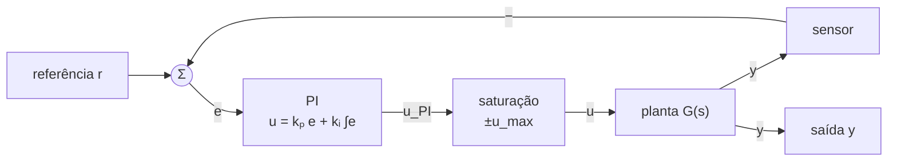
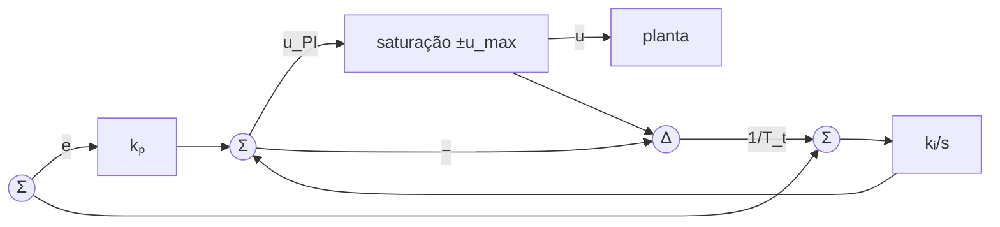
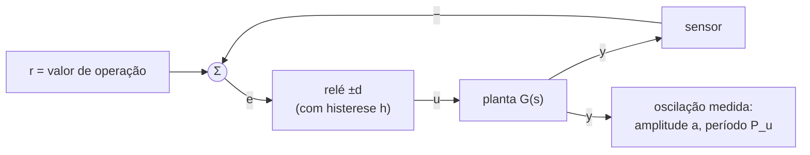

# Módulo 04 — Análise de Não Linearidades em Malhas de Controle (Teoria)

> Texto teórico dos tópicos 4.1 a 4.3 — **módulo autônomo** que cobre a Unidade III do PPC (análise de não linearidades em malhas de controle: zona morta, histerese, saturação).
> Convenções do curso (Módulos 01–03): sistemas **SISO**; estabilidade = **BIBO**; malha padrão com realimentação unitária; $M_p = e^{-\zeta\pi/\sqrt{1-\zeta^2}}$; $t_s(5\,\%) = 3/\sigma$; $dB = 20\log_{10}|G|$; $\mathrm{PM} \approx 100\,\zeta$.
> **Novidades deste módulo:** as **não linearidades estáticas** clássicas (saturação, zona morta, histerese) e seus efeitos na malha; o **windup** do integrador e as estratégias de **anti-windup**; os **ciclos-limite**; o método da **função descritiva** $N(A)$; e o **experimento do relé** para sintonia de PID ($K_u = 4d/\pi a$) — a ponte entre este módulo e o projeto final.

---

## 4.1 Não Linearidades Estáticas e Seus Efeitos na Malha

### 4.1.1 Onde a teoria linear falha?

Até aqui, todo o curso viveu no mundo **linear**: superposição vale, função de transferência existe, resposta ao degrau escala com a amplitude da entrada, senoides entram e senoides saem (mesma frequência!). Esse mundo é uma **idealização** — excelente, mas idealização. Basta olhar para qualquer malha real:

- o **driver do motor** entrega no máximo $\pm 12$ V — por mais que o controlador "peça" 50 V (lembre-se do pico de controle de 836 V no projeto PD do Lab 14!);
- o **motor parado** só começa a girar quando a tensão vence o atrito estático — abaixo disso, nada acontece;
- o **termostato** do chuveiro liga a resistência em 38 °C e só desliga em 42 °C — nunca no meio do caminho.

Esses três exemplos são as três não linearidades deste tópico: **saturação**, **zona morta** e **histerese**. Elas aparecem em *toda* malha de controle real — e produzem fenômenos que a teoria linear **não consegue nem descrever**: oscilações permanentes que não crescem nem decaem (**ciclos-limite**), integradores que "enlouquecem" durante a saturação (**windup**), erros de regime que nenhum ganho elimina.

> 📌 **A verdade inconveniente:** não existe sistema físico linear. Existem sistemas que se **comportam quase linearmente** numa faixa de operação — e é por isso que tudo o que aprendemos funciona. Este módulo responde: *o que muda quando saímos dessa faixa, e como projetar levando isso em conta?*

### 4.1.2 Classificação das não linearidades

Organizando o zoológico:

1. **Estáticas (sem memória)** × **dinâmicas (com memória).** Nas estáticas, a saída depende apenas do valor *atual* da entrada (saturação, zona morta, relé ideal). Nas dinâmicas, depende também do *histórico* (histerese, folga mecânica).
2. **Inerentes (involuntárias)** × **intencionais.** As inerentes vêm de fábrica: saturação de atuadores e amplificadores, atrito, folgas. As intencionais são *projetadas*: o relé do controle liga-desliga, o limitador de segurança, a própria histerese do termostato (colocada de propósito para evitar chaveamento frenético).
3. **Suaves** × **rígidas (descontínuas).** As suaves admitem linearização por jacobiana (como o $c(x) = x^2$ que linearizamos informalmente no Módulo 01). As rígidas — saturação, zona morta, relé, histerese — **não têm derivada** nos pontos de quebra: para elas precisamos de ferramentas próprias (função descritiva, §4.3).

### 4.1.3 Saturação (limitador)

É a não linearidade **mais importante** da prática: todo atuador satura. A característica estática é linear de ganho $k$ até o nível $s$ e constante a partir daí:

$$u = \begin{cases} k\,e, & |e| \leq s \\ +u_{max}, & e > s \\ -u_{max}, & e < -s \end{cases} \qquad u_{max} = k\,s$$

**Leitura física:** dentro da faixa $|e| \leq s$, o sistema é linear e tudo o que aprendemos se aplica; fora dela, o atuador entrega **sempre o mesmo valor máximo**, não importa o tamanho do erro. Duas consequências imediatas:

1. **O ganho efetivo cai.** Para uma entrada grande, a "saída média" por unidade de entrada é menor que $k$ — formalizaremos isso com a função descritiva (§4.3): a saturação se comporta como um ganho que **diminui com a amplitude**.
2. **O desempenho degrada de forma não uniforme.** Degraus pequenos: resposta exatamente como projetada. Degraus grandes: resposta mais lenta (o atuador "com potência limitada" acelera a planta no seu máximo físico) e, se houver integrador no controlador, **sobressinal maior** — é o windup, tópico 4.2.

> 🔗 **Ligação com o Módulo 03:** no Lab 14, o PD projetado pela fórmula direta gerou pico de controle de 836 V (contra 3,9 V do avanço equivalente) para um degrau unitário. Nenhum atuador real entrega isso: na prática, **o sinal seria saturado** e a resposta real sairia bem pior que a simulada em linear. A lição de projeto: sempre verifique o sinal de controle e, se ele saturar, **inclua a saturação na simulação** antes de confiar nos números.

> ✏️ **Pense:** por que a saturação *não* viola a estabilidade BIBO por si só? (Ela limita a entrada da planta — entrada limitada em planta BIBO-estável gera saída limitada. O perigo não é a saturação sozinha, é a sua **interação** com o integrador: §4.2.)

### 4.1.4 Zona morta

A saída é **zero** enquanto $|e| \leq d$ e cresce linearmente a partir daí:

$$u = \begin{cases} 0, & |e| \leq d \\ k\,(e - d\,\mathrm{sinal}(e)), & |e| > d \end{cases}$$

**Onde aparece:** atrito estático (motores), folga mecânica (engrenagens), insensibilidade de sensores baratos, limiar de válvulas hidráulicas.

**Efeito na malha fechada:** qualquer erro menor que $d$ **não gera ação de controle** → a malha estaciona com **erro de regime não nulo**, que nenhum projeto de ganho elimina (o ganho alto só ajuda *depois* que o erro vence a zona morta). É a não linearidade que explica por que o eixo do robô "para a 2 mm do alvo". Remédios práticos: reduzir a folga fisicamente (manutenção, pré-carga), compensar o atrito por software (*feedforward* de atrito), ou usar ação integral — com cuidado, pois integrador + zona morta pode gerar **ciclo-limite** de baixa frequência.

### 4.1.5 Histerese e o relé

A **histerese** tem **memória**: a saída depende de *de onde a entrada veio*. No **relé com histerese** (figura 02, painel direito), a saída só comuta de $-d$ para $+d$ quando a entrada ultrapassa $+h$, e só volta quando cai abaixo de $-h$. O caso limite $h \to 0$ é o **relé ideal** (liga-desliga puro):

$$u = +d \;\; (e > 0), \qquad u = -d \;\; (e < 0)$$

**Onde aparece:** controles liga-desliga (*on-off*) — termostatos, pressostatos, controle de nível por boia, conversores *buck* em modo histerético. A histerese é quase sempre **intencional**: sem ela, o menor ruído na medição faria o relé chavear a milhares de hertz, destruindo contatores e válvulas.

**Efeito na malha fechada:** a saída da planta **oscila permanentemente** em torno da referência — é o comportamento "dente de serra" do ar-condicionado de janela. Formalmente: um **ciclo-limite** (§4.3), cuja amplitude e frequência conseguiremos **prever analiticamente** com a função descritiva.

### 4.1.6 O que muda na análise? Os três fenômenos novos

Com não linearidades na malha, a teoria linear perde suas ferramentas centrais:

- **não vale superposição** → não existe "a" função de transferência do sistema;
- a resposta **depende da amplitude** da entrada (degrau de 1 V: bem comportado; de 10 V: saturado, lento, oscilatório — mesma malha!);
- aparecem fenômenos sem equivalente linear:

| Fenômeno | O que é | Onde veremos |
|---|---|---|
| **Ciclo-limite** | oscilação permanente de amplitude e frequência fixas, que não cresce nem decai | §4.3 |
| **Windup** | carga excessiva acumulada pelo integrador durante a saturação → sobressinal e acomodação muito piores | §4.2 |
| **Dependência de condição inicial** | trajetórias diferentes de condições iniciais diferentes podem convergir para comportamentos diferentes | §4.3 |

> ⚠️ **Importante:** o projeto linear **continua sendo o ponto de partida**. Projetamos o controlador como se o sistema fosse linear (Módulos 02 e 03), e então **analisamos os efeitos das não linearidades** — e, quando necessário, acrescentamos proteções (anti-windup, limitadores de referência, filtragem). É exatamente o fluxo usado na indústria.

---

## 4.2 Windup do Integrador e Anti-Windup

### 4.2.1 O problema: integrador + saturação = acidente anunciado

Considere a malha mais comum da indústria: **PI + atuador saturado**.

Ação do integrador, em palavras: **"enquanto houver erro, continuo somando"**. É ela que garante erro de regime nulo (Módulo 01). Agora pense na sequência de um degrau de referência:

1. O erro é grande → o PI "pede" um $u$ enorme → a saturação entrega apenas $u_{max}$ (fisicamente, é tudo o que existe).
2. A planta acelera **no seu limite físico** — mais devagar do que o controlador imaginou.
3. Enquanto $y < r$, o erro segue positivo e o integrador **continua somando** — como se dissesse *"subiu menos do que eu pedi? então peço mais ainda!"*. A carga acumulada no integrador cresce **muito além** do necessário para o regime.
4. Quando $y$ finalmente cruza $r$, o erro zera — mas o integrador está **"cheio"**: o $u$ pedido continua enorme, e a planta continua acelerada. Resultado: **sobressinal muito maior** que o projetado, seguido de uma longa "descarga" do integrador até a acomodação.

Esse acúmulo patológico de carga no integrador durante a saturação é o **windup** ("enrolamento" — o integrador "enrola" como uma mola).

### 4.2.2 O mecanismo, com números (exemplo-âncora)

**Malha-âncora:** planta $G(s) = \dfrac{1}{10s + 1}$ (constante de tempo de 10 s — processo térmico típico), PI com $k_p = 2$ e $k_i = 0{,}5$ ($T_i = k_p/k_i = 4$ s), atuador com saturação em $\pm 1{,}3$, degrau unitário de referência. Três experimentos:

| Cenário | Sobressinal | $t_s$ (±5 %) | Leitura |
|---|---|---|---|
| PI ideal (sem saturação) | 11,5 % | 19,7 s | o projeto linear, para referência |
| PI com saturação ±1,3 | **23,2 %** | **39,3 s** | windup: sobressinal dobra, acomodação dobra |
| PI com saturação + **anti-windup** | 3,2 % | 13,4 s | melhor até que o "ideal"! |

O drama fica mais claro olhando o **sinal de controle**:

No painel esquerdo (sem proteção), a curva tracejada — o $u$ *pedido* pelo PI — dispara muito além de $u_{max}$: é o integrador se "enchendo" enquanto a saída real está presa no teto. Quando $y$ cruza a referência (por volta de $t \approx 17$ s), a carga acumulada empurra a planta para cima por mais de uma década de segundos — daí o sobressinal de 23 % e a acomodação de quase 40 s. No painel direito, com anti-windup, o pedido mal ultrapassa o teto: o integrador foi impedido de acumular.

> ✏️ **Pense:** por que a resposta com anti-windup ficou *melhor que a ideal sem saturação*? Porque "ideal sem saturação" é um caso diferente: lá o atuador entrega picos de $u \approx 2$ (acima de 1,3!) e a resposta herda o sobressinal de 11,5 % do projeto. Com saturação + proteção, o atuador entrega o **máximo físico possível** durante a subida e o integrador entra "na medida" — sobe mais rápido **e** quase sem sobressinal. A saturação não é só vilã: bem gerenciada, ela é simplesmente o limite físico sendo usado de forma ótima.

> ⚠️ **Windup não é só sobressinal.** Em malhas com planta de fase não mínima ou com integrador, o windup pode gerar **oscilações persistentes e até instabilidade**. Em processos térmicos e químicos, o sobressinal de windup pode significar produto fora de especificação — ou um acidente. O anti-windup é **obrigatório** em todo PID industrial (todo CLP comercial tem).

### 4.2.3 Anti-windup por *clamping* (congelamento condicional)

A estratégia mais simples: **proibir o integrador de piorar a saturação**. Regra:

$$\frac{d}{dt}\left(\int e\right) = \begin{cases} 0, & \text{se saturado **e** o erro empurra para mais fundo na saturação} \\ e, & \text{caso contrário} \end{cases}$$

Em palavras: se o atuador está saturado em $+u_{max}$ **e** o erro é positivo (que pediria *mais* ainda), **congela** o integrador; se o erro é negativo (que ajudaria a *sair* da saturação), deixa integrar normalmente. É o método usado no exemplo-âncora acima.

**Vantagens:** trivial de implementar (um `if` no código); nenhum parâmetro novo. **Custo:** a lógica depende de saber o nível de saturação (sempre conhecido: é o limite que o próprio software impõe).

### 4.2.4 Anti-windup por *back-calculation* (realimentação do excesso)

Estratégia clássica dos manuais de PID: mede-se a **diferença entre o pedido e o entregue**, $e_s = u - u_{PI}$, e realimenta-se essa diferença à entrada do integrador através de um ganho $1/T_t$:

$$\frac{d\,x_i}{dt} = e + \frac{1}{T_t}\,(u - u_{PI})$$

Quando não há saturação, $u = u_{PI}$ e o integrador funciona normalmente. Quando satura, o termo de realimentação **descarrega o integrador** até que $u_{PI}$ se aproxime do teto — o integrador fica "sempre pronto para sair da saturação". A constante $T_t$ (*tracking time constant*) rege a velocidade dessa descarga; regra prática usual:

$$\boxed{\;T_t \approx \sqrt{T_i\,T_d} \quad \text{(PID)} \qquad \text{ou} \qquad T_t \approx T_i \quad \text{(PI)}\;}$$

**Clamping × back-calculation:** o clamping é binário (congela/libera); a back-calculation é suave e permite ajustar a agressividade via $T_t$. Ambas são amplamente usadas; em PID digital, frequentemente se combina clamping com limitação do valor do integrador.

### 4.2.5 Observações práticas

1. **Sempre sature o sinal de controle dentro do controlador** (mesmo que o atuador sature "sozinho"): só assim o anti-windup consegue comparar pedido × entregue.
2. **Limites de referência ajudam:** um *rate limiter* na referência (a rampa do Lab 13!) evita que degraus grandes saturem o atuador por tempo demais.
3. **No PID digital (firmware do projeto final):** o anti-windup é 3 linhas de código — e a diferença entre um controlador que funciona e um que oscila na bancada.
4. **Windup também existe sem saturação física:** basta o software limitar o PWM/DAC. O mecanismo é idêntico.

---

## 4.3 Ciclos-Limite, Função Descritiva e o Experimento do Relé

### 4.3.1 Ciclos-limite: a oscilação que a teoria linear não explica

Num sistema linear, uma oscilação senoidal permanente exige polos **exatamente** sobre o eixo imaginário — um equilíbrio de ganho tão perfeito que qualquer perturbação o destrói (par "pendurado" no fio da navalha: o menor deslocamento faz a oscilação crescer ou morrer). Nos laboratórios, porém, vemos oscilações permanentes **robustas**: o termostato oscilando há anos, o robô "tremendo" em torno do alvo, a malha de nível chacoalhando. Isso é um **ciclo-limite**:

> **Definição.** Ciclo-limite é uma órbita fechada **isolada** no espaço de estados: trajetórias iniciadas perto dela (por dentro ou por fora) convergem para ela (ciclo **estável**) ou se afastam (ciclo **instável**).

Na figura, duas trajetórias — uma começando "grande" ($y(0) = 0{,}6$, vermelha, por fora) e outra "pequena" ($y(0) = 0{,}05$, azul, por dentro) — convergem para a **mesma** órbita fechada (preta). Nenhum sistema linear faz isso: em sistemas lineares, órbitas fechadas vêm em famílias contínuas (centros) e cada condição inicial fica na sua. O ciclo-limite isolado é **assinatura de não linearidade** — e no nosso caso ele nasce da combinação **relé + planta** (o relé fornece energia na medida certa: nem a mais — a oscilação cresceria — nem a menos — morreria).

As perguntas de engenharia são: **qual a amplitude? qual a frequência? é estável?** A função descritiva responde as três, aproximadamente, com conta de papel.

### 4.3.2 A ideia da função descritiva: um "ganho que depende da amplitude"

Suponha que a malha já está oscilando e que a entrada da não linearidade é aproximadamente senoidal: $e(t) = A\,\mathrm{sen}(\omega t)$. A saída de uma não linearidade alimentada por senoide **não é senoidal** (saturação → senoide "achatada"; relé → onda quadrada) — mas é **periódica**, e portanto tem série de Fourier:

$$u(t) = U_0 + \sum_{n=1}^{\infty} M_n\,\mathrm{sen}(n\omega t + \phi_n)$$

Aqui entra a **hipótese de filtragem**: a planta $G(s)$ — quase sempre **passa-baixas** — atenua fortemente os harmônicos $n \geq 2$ (que estão em frequências $2\omega, 3\omega, \dots$). Fechando a malha, o que "volta" à entrada da não linearidade é essencialmente o **primeiro harmônico**. Logo, para análise da oscilação, só o primeiro harmônico importa — e definimos a **função descritiva** como o ganho complexo entre a senoide de entrada e o primeiro harmônico da saída:

$$\boxed{\;N(A) = \frac{M_1\,\angle \phi_1}{A} = \frac{a_1 + j\,b_1}{A}\;}, \qquad a_1 = \frac{2}{T}\int_0^T u\,\mathrm{sen}(\omega t)\,dt, \;\; b_1 = \frac{2}{T}\int_0^T u\,\mathrm{cos}(\omega t)\,dt$$

**Leituras importantes:**

- $N(A)$ **depende da amplitude** $A$ — é a diferença crucial para o ganho linear (que é o mesmo para qualquer amplitude). É exatamente essa dependência que "segura" a oscilação numa amplitude fixa.
- Para não linearidades **estáticas sem memória** (saturação, zona morta, relé ideal), $N(A)$ é **real** (não há defasagem: o primeiro harmônico sai em fase com a entrada).
- Para não linearidades **com memória** (histerese, folga), $N(A)$ é **complexa**.
- A função descritiva é o equivalente não linear do $G(j\omega)$ — e o método todo é uma **generalização da análise harmônica** que fizemos no Módulo 03.

### 4.3.3 As funções descritivas clássicas (com deduções)

**Relé ideal** ($u = \pm d$). Com $e(t) = A\,\mathrm{sen}(\omega t)$, a saída é uma onda quadrada de amplitude $d$, em fase com a entrada. Por simetria, $b_1 = 0$ e:

$$a_1 = \frac{2}{T}\int_0^T u\,\mathrm{sen}(\omega t)\,dt = \frac{4}{T}\int_0^{T/2} d\,\mathrm{sen}(\omega t)\,dt = \frac{4d}{T}\cdot\frac{T}{\pi} = \frac{4d}{\pi}$$

$$\boxed{\;N(A) = \frac{4d}{\pi A} \quad \text{(relé ideal)}\;}$$

Note: ganho **decrescente com $A$** — quanto maior a oscilação, menor o "ganho efetivo" do relé. É o mecanismo estabilizador do ciclo-limite.

**Saturação** (ganho $k$, nível $s$). Para $A \leq s$, o sinal passa intacto: $N = k$. Para $A > s$, a senoide "acha" no teto: aplicando a definição à senoide recortada (integral em quatro trechos, usando o ângulo $\alpha = \mathrm{arcsen}(s/A)$ em que a entrada atinge o teto):

$$\boxed{\;N(A) = \frac{2k}{\pi}\left[\mathrm{arcsen}\!\left(\frac{s}{A}\right) + \frac{s}{A}\sqrt{1 - \left(\frac{s}{A}\right)^2}\,\right], \quad A > s\;}$$

Verificações saudáveis: $A \to s^+$ → $N \to k$ (continuidade ✓); $A \to \infty$ → $N \approx \dfrac{2k}{\pi}\cdot\dfrac{2s}{A} = \dfrac{4ks}{\pi A}$ → decai como $1/A$, como o relé ✓ (faz sentido: saturada "quase sempre", a saturação vira um relé de nível $ks$).

**Zona morta** (ganho $k$, largura $d$). Para $A \leq d$, nada passa: $N = 0$. Para $A > d$, conta análoga (a senoide só "liga" acima do limiar):

$$\boxed{\;N(A) = k - \frac{2k}{\pi}\left[\mathrm{arcsen}\!\left(\frac{d}{A}\right) + \frac{d}{A}\sqrt{1 - \left(\frac{d}{A}\right)^2}\,\right], \quad A > d\;}$$

crescendo de $0$ a $k$ conforme a amplitude vence a zona morta.

**Relé com histerese** (nível $d$, banda $h$). A memória atrasa a comutação em $\mathrm{arcsen}(h/A)$ — aparece **defasagem**:

$$\boxed{\;N(A) = \frac{4d}{\pi A}\;\angle\!\left(-\mathrm{arcsen}\frac{h}{A}\right), \quad A > h\;}$$

> 📖 **Para consultar:** Ogata, *Engenharia de Controle Moderno*, cap. "Análise de sistemas não lineares" (funções descritivas); Nise, cap. de tópicos avançados. As deduções completas das integrais estão nas notas de aula.

### 4.3.4 A condição de oscilação: balanço harmônico

Feche a malha: a não linearidade $N(A)$ em série com a planta $G(j\omega)$, realimentação unitária negativa. Para que exista uma oscilação **auto-sustentada** (sem entrada externa, $r = 0$), o sinal deve "dar a volta na malha e voltar igual a si mesmo" — mesmo módulo, mesma fase:

$$N(A)\,G(j\omega) = -1 \qquad\Longleftrightarrow\qquad \boxed{\;1 + N(A)\,G(j\omega) = 0\;}$$

É a **condição de balanço harmônico** — a versão não linear da condição de Barkhausen do Módulo 03 ($L(j\omega) = -1$ na fronteira de estabilidade). A solução $(A, \omega)$ dessa equação (duas equações reais — módulo e fase — duas incógnitas) **prevê a amplitude e a frequência do ciclo-limite**.

**Leitura gráfica** (o jeito engenhoso de resolver): reescreva como

$$G(j\omega) = -\frac{1}{N(A)}$$

e plote, no plano complexo, a curva de Nyquist de $G(j\omega)$ (parametrizada por $\omega$) e a curva de $-1/N(A)$ (parametrizada por $A$). **Cada interseção é um ciclo-limite candidato**: lê-se $\omega$ da primeira curva e $A$ da segunda.

Para o **relé ideal**: $-\dfrac{1}{N(A)} = -\dfrac{\pi A}{4d}$ — é o **semi-eixo real negativo inteiro**, percorrido da origem ($A = 0$) para $-\infty$ ($A \to \infty$). Procurar o ciclo-limite = procurar **onde o Nyquist cruza o eixo real negativo** — exatamente onde a fase de $G$ vale $-180°$, ou seja, **no $\omega_f$ do Módulo 03**! A função descritiva transforma o critério de estabilidade em frequência num preditor de oscilação.

### 4.3.5 Exemplo-âncora completo: previsão e confirmação do ciclo-limite

**Malha:** relé ideal $d = 1$ em série com $G(s) = \dfrac{1}{s(s+1)(s+2)}$, realimentação unitária, $r = 0$.

**Passo 1 — onde o Nyquist cruza o eixo real?** Calculamos $G(j\omega)$:

$$G(j\omega) = \frac{1}{j\omega\,(1 + j\omega)(2 + j\omega)} = \frac{1}{-3\omega^2 + j\omega(2 - \omega^2)}$$

A parte imaginária zera quando $2 - \omega^2 = 0$, ou seja, $\boxed{\omega = \sqrt{2} \approx 1{,}41\ \mathrm{rad/s}}$ (período $T = 2\pi/\sqrt{2} \approx 4{,}44$ s). Substituindo:

$$G(j\sqrt{2}) = \frac{1}{-3\cdot 2} = -\frac{1}{6}$$

**Passo 2 — balanço harmônico.** $N(A)\,G(j\sqrt{2}) = -1 \Rightarrow \dfrac{4}{\pi A}\cdot\left(-\dfrac{1}{6}\right) = -1 \Rightarrow \boxed{A = \dfrac{4}{6\pi} \approx 0{,}212}$.

**Passo 3 — leitura gráfica.** O Nyquist de $G(j\omega)$ cruza o semi-eixo real negativo (a curva $-1/N$ do relé) exatamente em $-1/6$:

**Passo 4 — confirmação por simulação.** Simulando a malha não linear (relé + planta em espaço de estados), a partir de $y(0) = 0{,}5$:

A oscilação decai da condição inicial e **estaciona** em amplitude $A \approx 0{,}220$ e $\omega \approx 1{,}38$ rad/s — contra $0{,}212$ e $1{,}41$ previstos. Erros de ~4 % e ~2 %: é a precisão típica do método (a hipótese de filtragem é boa, não exata — a saída do relé tem harmônicos que a planta não elimina por completo).

> 🔗 **Fecho genial com o Módulo 03:** reorganizando o balanço harmônico, $N(A) = 6$ é o **ganho que levaria a malha linear à fronteira de estabilidade** — e de fato, o critério de Routh para $1 + K\,G(s)$ dá $s^3 + 3s^2 + 2s + K$ estável apenas para $K < 6$ (Lab 12!). Ou seja: **$K_u = 4d/(\pi A) = 6$** — o ganho último de Ziegler-Nichols **sai do experimento do relé**. Guardem este número; voltamos a ele em §4.3.7.

### 4.3.6 Estabilidade do ciclo-limite (critério de Loeb)

Nem toda interseção corresponde a uma oscilação que se sustenta na prática — o ciclo pode ser **instável** (qualquer perturbação o destrói: ou a oscilação morre, ou migra para outra amplitude). O teste gráfico (Loeb) usa a mesma lógica do Nyquist encostando no $-1$:

> **Regra prática:** percorra a curva $-1/N(A)$ no sentido de $A$ **crescente**. Se no ponto de interseção o sentido de $A$ crescente vai da região **envolvida** pelo Nyquist para a **não envolvida** (do "instável" para o "estável"), o ciclo-limite é **estável**. Caso contrário, instável.

Intuição: uma perturbação que aumenta $A$ deve *diminuir* o ganho efetivo o suficiente para "devolver" a oscilação — e vice-versa. No exemplo-âncora: $A$ crescendo ao longo do eixo real negativo sai da região envolvida (à esquerda de $-1/6$, o Nyquist envolve o ponto — malha "instável", oscilação cresce) para a não envolvida (à direita — malha "estável", oscilação decai). Perturbações para mais ou para menos são corrigidas: **ciclo-limite estável**, confirmado pelo retrato de fase (§4.3.1), onde as trajetórias convergem por dentro e por fora.

### 4.3.7 O experimento do relé (Åström–Hägglund): medir $K_u$ e $P_u$ sem derrubar a planta

Lembre da sintonia de Ziegler-Nichols em malha fechada (método da sensibilidade última): aumentar o ganho P até a malha oscilar permanentemente, anotar o **ganho último** $K_u$ e o **período último** $P_u$. Problema industrial óbvio: **levar a planta à beira da instabilidade na marra** é perigoso — a oscilação pode crescer sem controle antes de você perceber.

O **experimento do relé** resolve elegantemente: troca-se o controlador por um **relé** de amplitude $d$ conhecida (às vezes com histerese, para imunidade a ruído):

A malha entra em ciclo-limite **sozinha e com amplitude controlada** (o relé limita a energia injetada: a oscilação não "explode"). Mede-se na saída a **amplitude** $a$ e o **período** $P_u$. Pelo balanço harmônico com o relé ideal:

$$N(a)\,|G(j\omega_u)| = 1 \;\Rightarrow\; \frac{4d}{\pi a}\cdot\frac{1}{K_u} = 1 \;\Rightarrow\; \boxed{\;K_u = \frac{4d}{\pi a}\;}$$

pois, no ponto de oscilação, $|G(j\omega_u)| = 1/K_u$ (definição do ganho último: o ganho que levaria a malha à fronteira). E o período medido **é** o $P_u$: $\omega_u = 2\pi/P_u$ é onde a fase de $G$ vale $-180°$.

> ⚠️ **Medindo direito:** espere o transiente morrer (2–3 ciclos), meça $a$ como **semi-amplitude** (pico a pico ÷ 2) e $P_u$ pela média de vários períodos (com histerese, as fórmulas têm pequena correção — ver exercícios). Lembre-se de que a saída não é senoidal perfeita: o pico pode "achatar".

### 4.3.8 Sintonia de Ziegler-Nichols a partir do relé

Com $K_u$ e $P_u$ medidos, aplica-se a tabela clássica de Ziegler-Nichols (malha fechada):

| Controlador | $k_p$ | $T_i$ | $T_d$ |
|---|---|---|---|
| P | $0{,}5\,K_u$ | — | — |
| PI | $0{,}45\,K_u$ | $P_u/1{,}2$ | — |
| PID | $0{,}6\,K_u$ | $P_u/2$ | $P_u/8$ |

**Exemplo-âncora numérico** (a mesma planta do ciclo-limite, $G = 1/[s(s+1)(s+2)]$, relé $d = 1$): medimos $a = 0{,}212$ (previsão) ou $a \approx 0{,}22$ (simulação) e $P_u = 4{,}44$ s:

$$K_u = \frac{4\cdot 1}{\pi\cdot 0{,}212} = 6{,}0 \qquad \text{(confere com Routh: } K < 6\text{)}$$

| Controlador | Parâmetros |
|---|---|
| P | $k_p = 3{,}0$ |
| PI | $k_p = 2{,}7$, $T_i = 3{,}70$ s |
| PID | $k_p = 3{,}6$, $T_i = 2{,}22$ s, $T_d = 0{,}555$ s |

> ⚠️ **O que esperar da sintonia ZN:** as regras de Ziegler-Nichols buscam **amortecimento de razão 1/4** (cada pico ≈ 25 % do anterior) — resposta rápida, mas com **sobressinal tipicamente grande** (30–60 % em plantas de ordem alta). Na prática, ZN é um **ponto de partida**: aplica-se, mede-se, e refina-se (geralmente reduzindo $k_p$ e/ou aumentando $T_i$). No projeto final, a sintonia do relé será exatamente esse pontapé inicial, refinado pelos métodos dos Módulos 02 e 03.

### 4.3.9 Limitações e cuidados do método da função descritiva

1. **É uma aproximação.** Baseada na hipótese de filtragem (planta passa-baixas "forte"). Quanto maior a ordem e o amortecimento da planta, melhor. Erros típicos: poucos % (nosso exemplo: 4 % na amplitude).
2. **Pode prever ciclos que não existem** (ou perder ciclos que existem) se a hipótese falhar — confirme sempre por simulação (Lab 16!).
3. **Não analisa transientes** — só o regime oscilatório.
4. **Entrada contínua ($r \neq 0$):** o método assume oscilação centrada em zero; com referência, a análise exige cuidados extras (viés). Para a prática de laboratório: use o relé em torno do **ponto de operação**.
5. **Existem ferramentas mais exatas** (análise no espaço de estados, métodos de Lyapunov, simulação direta) — a função descritiva continua campeã pelo custo-benefício: **conta de papel, resposta em minutos, precisão de engenharia**.

> 📖 **Para aprofundar:** Ogata, *Engenharia de Controle Moderno* (funções descritivas e ciclos-limite); Åström & Hägglund, *PID Controllers: Theory, Design and Tuning* (experimento do relé e auto-sintonia); Franklin, Powell & Workman, *Digital Control of Dynamic Systems* (anti-windup digital).

---

## Resumo do Módulo 04

| Não linearidade | $N(A)$ | Efeito dominante na malha |
|---|---|---|
| Saturação ($k$, nível $s$) | $\frac{2k}{\pi}\left[\mathrm{arcsen}\frac{s}{A} + \frac{s}{A}\sqrt{1-(s/A)^2}\right]$ ($A > s$) | resposta lenta + **windup** no integrador |
| Zona morta ($k$, largura $d$) | $k - \frac{2k}{\pi}\left[\mathrm{arcsen}\frac{d}{A} + \frac{d}{A}\sqrt{1-(d/A)^2}\right]$ ($A > d$) | erro de regime residual |
| Relé ideal ($\pm d$) | $\dfrac{4d}{\pi A}$ | ciclo-limite; **experimento do relé** |
| Relé com histerese ($d$, $h$) | $\dfrac{4d}{\pi A}\angle\!\left(-\mathrm{arcsen}\frac{h}{A}\right)$ ($A > h$) | ciclo-limite robusto a ruído |

**Fórmulas-chave:** balanço harmônico $1 + N(A)G(j\omega) = 0$; $K_u = \dfrac{4d}{\pi a}$; tabela ZN (P: $0{,}5K_u$; PI: $0{,}45K_u$, $P_u/1{,}2$; PID: $0{,}6K_u$, $P_u/2$, $P_u/8$); anti-windup por clamping ou back-calculation ($T_t \approx T_i$ ou $\sqrt{T_i T_d}$).

**Próximo passo:** exercícios resolvidos (`exercicios_resolvidos_modulo4.md`), Labs 15 e 16 (simulação das não linearidades, windup/anti-windup, ciclo-limite e o experimento do relé completo) e a Lista 4.
