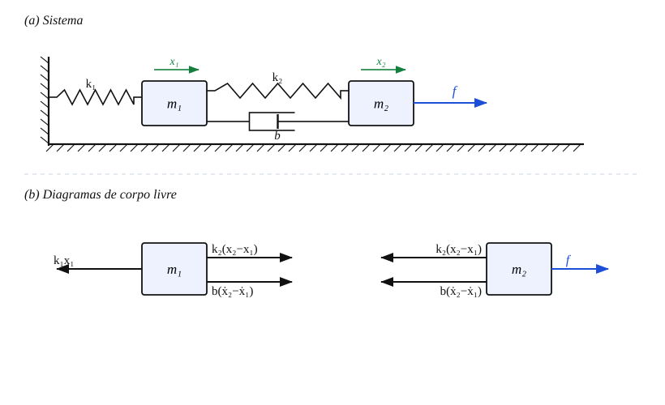
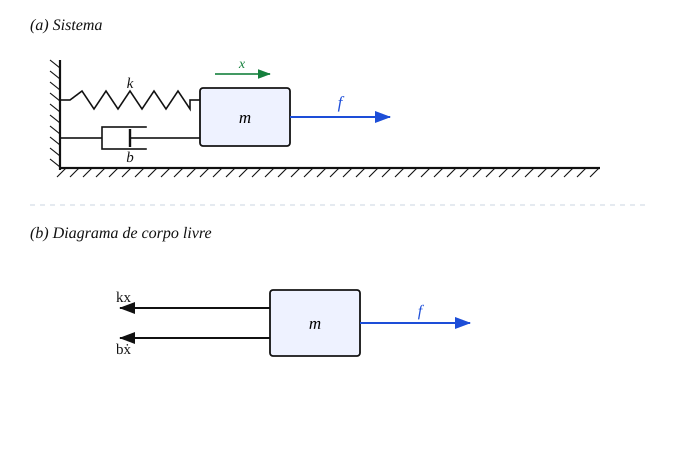

# Notas de aula — Unidade I (modelagem)

**Uso.** Desenvolvimento **passo a passo** dos exemplos e exercícios da
[`teoria_unidade1.md`](teoria_unidade1.md), pensado para você (i) praticar à mão antes da aula e
(ii) transcrever no quadro durante a aula. A apostila traz as versões condensadas; aqui está a
"conta completa", bem comentada.

> ## Como ler estas notas
>
> Cada passo tem **duas camadas**:
>
> - ✍️ **Escreva no quadro** — as linhas logo abaixo deste marcador são **exatamente** o que vai
>   para o quadro, na ordem em que aparecem. **Se você escrever apenas os blocos ✍️, o quadro
>   terá a dedução completa e limpa.**
> - 🗣️ **Fale** — o que dizer/explicar em voz alta enquanto escreve. **Não** vai para o quadro.
>
> Marcadores auxiliares: ⚠️ = armadilha comum do aluno · 💡 = intuição para aprofundar ·
> 📌 = gancho para outra seção/aula.

**Convenção de sinais (vale para toda a Seção 1).** Deslocamentos e velocidades são positivos na
**mesma direção** (por convenção, para a direita). Uma mola/amortecedor entre dois pontos exerce
força proporcional à **diferença** entre eles. As coordenadas são medidas a partir do
**equilíbrio estático** ⇒ o peso já foi cancelado pela pré-deformação das molas e **não** aparece
nas equações.

**Índice**

- Seção 1 — modelagem: [Exemplo 1.1](#exemplo-11--sistema-de-duas-massas) ·
  [Exemplo 1.2](#exemplo-12--rlc-série) ·
  [Exercício resolvido 1](#exercício-resolvido-1--do-sistema-físico-à-edo) ·
  [Exercício adicional 1.A](#exercício-adicional-1a--tanque-nível-de-líquido) ·
  [Exercício adicional 1.B](#exercício-adicional-1b--tanque-aquecido-térmico)
- Seção 2 — Laplace: [Exercício resolvido 2](#exercício-resolvido-2--resposta-ao-degrau-via-laplace)
- Seção 4 — 1ª/2ª ordem: [Exercício resolvido 3](#exercício-resolvido-3--caracterizando-um-sistema-de-2ª-ordem)
- Seção 5 — espaço de estados: [Exercício resolvido 4](#exercício-resolvido-4--o-motor-cc-do-kit)
- Seção 6 — identificação: [Exercício resolvido 5](#exercício-resolvido-5--identificação-pelos-dois-pontos)
- Seção 7 — resposta em frequência: [Exercício resolvido 6](#exercício-resolvido-6--do-ensaio-senoidal-ao-modelo)

---
---

# Seção 1 — Modelagem

## Exemplo 1.1 — sistema de duas massas

**Sistema (versão da apostila).** Duas massas $m_1$ e $m_2$ deslizam sem atrito. $m_1$ presa à
parede esquerda por mola $k_1$. Entre $m_1$ e $m_2$, **em paralelo**, mola $k_2$ e amortecedor
$b$. Força externa $f(t)$ atua em $m_2$. Saídas: posições $x_1(t)$ e $x_2(t)$.

🗣️ **Fale (abertura).** "Modelar é sempre a mesma receita: uma coordenada por massa, um diagrama
de corpo livre por massa, e a 2ª lei de Newton em cada um. O único ponto que exige cuidado é o
**sinal** das forças de acoplamento — vamos deduzi-los, nunca chutar."

⚠️ Antes de tudo, desenhe os **dois** diagramas de corpo livre (DCL). Sem os DCLs, os alunos
erram sinal.

**Figura — DCL do sistema de duas massas.** (a) esquema do sistema; (b) cada massa isolada com
as forças que agem sobre ela. Em azul, a força externa $f$; em preto, molas e amortecedor; em
verde, o sentido positivo das coordenadas $x_1$ e $x_2$. Note que a mola e o amortecedor centrais
aparecem **para a direita** em $m_1$ e **para a esquerda** (reação) em $m_2$ — é a leitura que
gera os sinais das equações (1) e (2).

### Passo 1 — Forças sobre a massa 1

🗣️ **Fale.** "Pergunte a si mesmo: o que empurra ou puxa $m_1$? São três coisas — a mola da
parede, a mola central e o amortecedor central."

- Mola da parede $k_1$: se $x_1>0$, ela reage puxando de volta ⇒ $-k_1x_1$.
- Mola central $k_2$: depende de $(x_2-x_1)$. Se $x_2>x_1$, ela está esticada e **puxa $m_1$ em
  direção a $m_2$** (sentido positivo) ⇒ $+k_2(x_2-x_1)$.
- Amortecedor $b$: mesma lógica, com velocidades ⇒ $+b(\dot x_2-\dot x_1)$.

✍️ **Escreva no quadro — equação (1):**

$$m_1\ddot x_1 = -k_1x_1 + k_2(x_2-x_1) + b(\dot x_2-\dot x_1)$$

### Passo 2 — Forças sobre a massa 2

🗣️ **Fale.** "Agora $m_2$. A força externa $f$ empurra. A mola e o amortecedor central aparecem
de novo, mas com o **sinal trocado** — é a 3ª lei de Newton: o que a mola faz em $m_1$, ela faz
igual e contrário em $m_2$."

- Força externa: $+f$.
- Mola central (reação): $-k_2(x_2-x_1)$.
- Amortecedor central (reação): $-b(\dot x_2-\dot x_1)$.

✍️ **Escreva no quadro — equação (2):**

$$m_2\ddot x_2 = f - k_2(x_2-x_1) - b(\dot x_2-\dot x_1)$$

⚠️ **Armadilha nº 1 do aluno:** repetir em $m_2$ o **mesmo** sinal usado em $m_1$. Insista: os
termos de acoplamento entram com sinais opostos nas duas massas. Teste rápido: se a expressão em
(1) e (2) for a mesma a menos do sinal, está certo.

### Passo 3 — Arrumar cada equação para a forma-padrão

🗣️ **Fale.** "Vamos só distribuir os produtos e juntar tudo do mesmo lado, agrupando por
variável. Nada de física aqui — é arrumação."

Distribuindo (1): $m_1\ddot x_1 = -k_1x_1 + k_2x_2 - k_2x_1 + b\dot x_2 - b\dot x_1$. Passando
tudo para a esquerda e agrupando:

✍️ **Escreva no quadro — equação (1′):**

$$m_1\ddot x_1 + b\dot x_1 + (k_1+k_2)x_1 - b\dot x_2 - k_2x_2 = 0$$

Distribuindo (2): $m_2\ddot x_2 = f - k_2x_2 + k_2x_1 - b\dot x_2 + b\dot x_1$. Passando os termos
de estado para a esquerda (e deixando $f$ à direita):

✍️ **Escreva no quadro — equação (2′):**

$$m_2\ddot x_2 - b\dot x_1 - k_2x_1 + b\dot x_2 + k_2x_2 = f$$

### Passo 4 — Normalizar (forma mônica)

🗣️ **Fale.** "Último movimento de arrumação: divido cada equação pela massa que multiplica a
aceleração, para o coeficiente de $\ddot x$ virar 1. É a forma que, na Seção 4, entrega
$\omega_n$ e $\zeta$ de bandeja."

✍️ **Escreva no quadro — forma mônica ($m_1$ na 1ª, $m_2$ na 2ª):**

$$\ddot x_1 + \frac{b}{m_1}\dot x_1 + \frac{k_1+k_2}{m_1}x_1 - \frac{b}{m_1}\dot x_2 - \frac{k_2}{m_1}x_2 = 0$$

$$\ddot x_2 - \frac{b}{m_2}\dot x_1 - \frac{k_2}{m_2}x_1 + \frac{b}{m_2}\dot x_2 + \frac{k_2}{m_2}x_2 = \frac{1}{m_2}f$$

⚠️ **Cuidado:** a 1ª equação divide por $m_1$; a 2ª por $m_2$ — massas diferentes. Só a força
externa vira $f/m_2$; o lado direito da 1ª continua $0$.

### Passo 5 — Leitura (só falar)

🗣️ **Fale.** "Três coisas para notar:"

1. **Acoplamento simétrico.** Em (1′), $m_1$ é puxada por $x_2$ pelos termos $-b\dot x_2-k_2x_2$;
   em (2′), $m_2$ é puxada por $x_1$ pelos termos espelhados $-b\dot x_1-k_2x_1$. Essa simetria é
   a 3ª lei de Newton embutida.
2. **Ordem.** Duas EDOs de 2ª ordem acopladas ⇒ sistema de **4ª ordem** (estados
   $x_1,\dot x_1,x_2,\dot x_2$). 📌 No §5 isso vira uma matriz $A$ de $4\times4$.
3. **Rigidez sentida.** $m_1$ "sente" $(k_1+k_2)$; $m_2$ sente só $k_2$. A parede só entra em (1′).

> 💡 **Intuição.** Pense nas duas massas como dois carrinhos ligados por um elástico (mola $k_2$)
> com um freio de óleo (amortecedor $b$). Bater em um carrinho sacode o outro **através** do
> elástico — por isso as equações se "conversam".

> 📌 **Se você projetar a figura do Ogata (fig-3-4-ogata):** lá a força é chamada **$u$** (não
> $f$) e há uma **terceira mola $k_3$** ligando $m_2$ à parede direita. Basta acrescentar
> $-k_3x_2$ no DCL de $m_2$; a linha (2′) do quadro passa a
> $m_2\ddot x_2 - b\dot x_1 - k_2x_1 + b\dot x_2 + (k_2+k_3)x_2 = u$. A linha (1′) não muda.

---

## Exemplo 1.2 — RLC série

**Circuito.** Fonte $v(t)$ em série com $L$, $R$ e $C$ (malha única). Corrente $i(t)$; carga
$q(t)$ no capacitor, com $i=\dot q$.

🗣️ **Fale (abertura).** "Vamos mostrar que este circuito obedece à **mesma matemática** do
carrinho massa–mola–amortecedor. É a grande sacada do curso: domínios diferentes, EDO com a
mesma cara."

### Passo 1 — Lei de Kirchhoff das tensões (LKT)

🗣️ **Fale.** "A soma das quedas de tensão na malha é igual à tensão da fonte."

✍️ **Escreva no quadro:**

$$v_L + v_R + v_C = v(t)$$

### Passo 2 — Substituir a lei de cada elemento

🗣️ **Fale.** "Troco cada tensão pela sua lei constitutiva. O capacitor é o chato: a tensão nele é
a **integral** da corrente." (Escreva a tabelinha no canto do quadro, se ajudar.)

- $v_L = L\,\dfrac{di}{dt}$ · $v_R = R\,i$ · $v_C = \dfrac{1}{C}\displaystyle\int_0^t i\,d\tau$

✍️ **Escreva no quadro:**

$$L\frac{di}{dt} + R\,i + \frac{1}{C}\int_0^t i\,d\tau = v(t)$$

⚠️ **Armadilha:** aluno esquece o $1/C$ ou troca integral por derivada no capacitor. Reforce:
no capacitor, **corrente é a derivada da carga**, então **tensão é a integral da corrente**.

### Passo 3 — Trocar para a carga $q$ (some com a integral)

🗣️ **Fale.** "Uso $i=\dot q$. Então $di/dt=\ddot q$ e a integral da corrente é a própria carga
$q$. A integral desaparece e sobra uma EDO limpa."

✍️ **Escreva no quadro — equação (3):**

$$L\ddot q + R\dot q + \frac{1}{C}q = v(t)$$

🗣️ **Fale (o momento-chave).** "Olhem para (3) e para a equação do carrinho $m\ddot x+b\dot
x+kx=f$. **É a mesma equação.** $L$ faz o papel da massa, $R$ do amortecedor, $1/C$ da rigidez.
Isso é a analogia força–tensão do §1.3."

### Passo 4 — Reescrever para a saída ser $v_C$

🗣️ **Fale.** "Na prática medimos a tensão no capacitor, não a carga. Uso $v_C=q/C$, logo
$q=Cv_C$, e substituo."

$q=Cv_C \Rightarrow \dot q=C\dot v_C \Rightarrow \ddot q=C\ddot v_C$. Em (3):
$L(C\ddot v_C)+R(C\dot v_C)+\tfrac1C(Cv_C)=v$, e $\tfrac1C\cdot C=1$.

✍️ **Escreva no quadro — equação (4):**

$$LC\,\ddot v_C + RC\,\dot v_C + v_C = v(t)$$

### Passo 5 — Normalizar (forma mônica) → $\omega_n$ e $\zeta$ (📌 prévia do §4)

🗣️ **Fale.** "Último passo: divido a equação (4) por $LC$ para o coeficiente de $\ddot v_C$
virar 1 — a forma mônica. Nessa forma leio a frequência natural e o amortecimento direto dos
componentes."

✍️ **Escreva no quadro — forma mônica:**

$$\ddot v_C + \frac{R}{L}\dot v_C + \frac{1}{LC}v_C = \frac{1}{LC}\,v$$

✍️ **Escreva no quadro (se for usar o §4):**

$$\omega_n=\frac{1}{\sqrt{LC}},\qquad \zeta=\frac{R}{2}\sqrt{\frac{C}{L}}$$

🗣️ **Fale.** "Quem controla a oscilação é o $R$: resistência pequena ⇒ $\zeta$ pequeno ⇒ circuito
'toca o sino' (oscila); resistência grande ⇒ amortecido. Guardem — voltamos a isso no §4."

---

## Exercício resolvido 1 — do sistema físico à EDO

**Enunciado.** Carrinho $m=1$ kg preso à parede por mola $k=5$ N/m e amortecedor $b=2$ N·s/m.
**Entrada:** força $f(t)$. **Saída:** posição $x(t)$. Obtenha a EDO e interprete cada termo.

🗣️ **Fale.** "Este é o Exemplo 1.1 com **uma** massa só e números. Serve para fixar a receita e
já vai ser nossa cobaia no §4 e no §5."

### Passo 1 — Lei e forças (DCL)

**Figura — DCL do carrinho.** (a) esquema; (b) o carrinho isolado. A força aplicada $f$ (azul)
puxa para a direita; a mola $kx$ e o amortecedor $b\dot x$ (preto) reagem para a esquerda,
contra o deslocamento e a velocidade positivos.

🗣️ **Fale.** "Newton: $m\ddot x$ = soma das forças. São três: a força aplicada, a mola que puxa
de volta e o amortecedor que resiste à velocidade."

- Aplicada: $+f$ · Mola: $-kx$ · Amortecedor: $-b\dot x$.

✍️ **Escreva no quadro:**

$$m\ddot x = f - kx - b\dot x$$

### Passo 2 — Substituir os números

✍️ **Escreva no quadro:**

$$1\cdot\ddot x = f - 5x - 2\dot x \;\Longrightarrow\; \ddot x + 2\dot x + 5x = f$$

🗣️ **Fale.** "Como $m=1$, essa EDO **já está na forma mônica** (coeficiente de $\ddot x$ igual a
1) — por isso já é uma forma padrão de 2ª ordem. Comparando com $\ddot y+2\zeta\omega_n\dot
y+\omega_n^2 y$, saem $\omega_n^2=5$ e $2\zeta\omega_n=2$ na hora (contas fechadas no Passo 6)."

### Passo 3 — Leitura física (falar; escrever os rótulos se quiser)

🗣️ **Fale.** "Cada termo tem um dono físico:"

- $\ddot x$ ← **inércia** (a massa; resiste a *mudar* de velocidade);
- $2\dot x$ ← **dissipação** (o amortecedor; o único termo que *gasta* energia);
- $5x$ ← **elástico** (a mola; guarda energia e quer voltar ao repouso).

> 💡 **Intuição.** "Inércia contra dissipação contra elasticidade" é a briga que decide **toda**
> resposta de 2ª ordem. No §4 esses três viram dois números: $\omega_n$ (quão rápido) e $\zeta$
> (quão oscilatório).

📌 Esta EDO reaparece **idêntica** no Exercício resolvido 3 (para achar $\omega_n,\zeta,M_p,t_s$)
e no Exemplo 5.1 (para virar espaço de estados). Vale deixar um cantinho do quadro preservado.

---

## Exercício adicional 1.A — tanque (nível de líquido)

> **Renomeado.** Na apostila este item vinha rotulado "tanque aquecido", mas o enunciado é de
> **nível de líquido** (restrição laminar, §1.4). Aqui está com o nome correto; a versão
> **térmica de verdade** é o [Exercício 1.B](#exercício-adicional-1b--tanque-aquecido-térmico),
> logo abaixo.

**Enunciado.** Tanque de seção $A=2$ m², recebe vazão $q_i$ e descarrega por restrição
**laminar** $R_v=0{,}5$ s/m². **Entrada:** $q_i$; **saída:** nível $h$. Ache $H(s)/Q_i(s)$ e
interprete $K$ e $\tau$.

🗣️ **Fale.** "Aqui muda o sabor: até agora tudo era 2ª ordem. O tanque é **1ª ordem** — e a 1ª
ordem vai ser o pão-com-manteiga da identificação (§6) e da sintonia de PID (Unidade IV)."

### Passo 1 — Balanço de massa

🗣️ **Fale.** "O que acumula no tanque é o que entra menos o que sai. Como a restrição é
laminar, o que sai é **proporcional** ao nível: $q_o=h/R_v$."

✍️ **Escreva no quadro — equação (5):**

$$A\dot h = q_i - q_o,\qquad q_o=\frac{h}{R_v}\;\Longrightarrow\; A\dot h + \frac{1}{R_v}h = q_i$$

🗣️ **Fale.** "Normalizo já no tempo para a forma padrão de 1ª ordem: divido pelo coeficiente de
$h$ (que é $1/R_v$). Aí $\tau$ e $K$ aparecem sem precisar nem ir para Laplace."

✍️ **Escreva no quadro — forma padrão de 1ª ordem:**

$$AR_v\,\dot h + h = R_v\,q_i \quad(\tau\dot y + y = Ku),\qquad \tau=AR_v,\;\; K=R_v$$

### Passo 2 — Laplace (condições iniciais nulas)

🗣️ **Fale.** "Transformo. $\dot h$ vira $sH$. Junto os $H$."

✍️ **Escreva no quadro:**

$$\left(As+\frac{1}{R_v}\right)H(s) = Q_i(s)$$

### Passo 3 — Isolar a FT e deixar na forma-padrão

🗣️ **Fale.** "Isolo $H/Q_i$ e multiplico em cima e embaixo por $R_v$ para bater com
$\dfrac{K}{\tau s+1}$."

✍️ **Escreva no quadro:**

$$\frac{H(s)}{Q_i(s)} = \frac{1}{As+\tfrac{1}{R_v}} = \frac{R_v}{AR_v\,s+1} = \frac{K}{\tau s+1},\qquad K=R_v,\;\; \tau=AR_v$$

### Passo 4 — Números

✍️ **Escreva no quadro:**

$$K = 0{,}5\ \tfrac{\text{s}}{\text{m}^2},\qquad \tau = 2\times0{,}5 = 1\ \text{s},\qquad \boxed{\dfrac{H(s)}{Q_i(s)}=\dfrac{0{,}5}{s+1}}$$

🗣️ **Fale.** "Confiram as unidades de $\tau$: $\text{m}^2\cdot\text{s/m}^2=\text{s}$. Bate."

### Passo 5 — Leitura

🗣️ **Fale.**
- **Ganho $K=R_v$:** dobrar a vazão de forma permanente ($\Delta q_i$) sobe o nível, em regime,
  $0{,}5\,\Delta q_i$ metros. O ganho estático **é a resistência** da válvula.
- **Constante de tempo $\tau=AR_v$:** é "capacitância × resistência", o análogo hidráulico do
  $RC$ elétrico. Acomoda em ~$4\tau=4$ s.

---

## Exercício adicional 1.B — tanque aquecido (térmico)

> **Item novo (não está na apostila).** É a versão **térmica** que faltava, construída a partir
> do §1.5. Mesma matemática do 1.A (1ª ordem), física diferente. Se preferir, dá para substituir
> o 1.A por este na aula, ou usar os dois lado a lado para mostrar a analogia.

**Enunciado.** Um corpo é aquecido por uma resistência elétrica que injeta potência $q_{in}$ [W]
e troca calor com o ambiente por convecção. Valores didáticos: capacitância térmica
$C_t = Mc = 200$ J/K e resistência térmica $R_t = 0{,}5$ K/W. **Entrada:** potência $q_{in}$;
**saída:** temperatura $\theta$ (em desvio $\Delta\theta$ do ambiente). Ache
$\Delta\Theta(s)/\Delta Q_{in}(s)$ e interprete $K$ e $\tau$.

🗣️ **Fale.** "Vou mostrar que trocar 'tanque de água' por 'corpo aquecido' **não muda a
matemática** — só troca o nome das grandezas. É o poder das analogias do §1.3/§1.5."

### Passo 1 — Balanço de energia

🗣️ **Fale.** "O que acumula de calor é o que entra (a resistência) menos o que escapa por
convecção. O que escapa é proporcional à diferença de temperatura para o ambiente: $\Delta\theta
/R_t$." (Papel idêntico ao $q_o=h/R_v$ do tanque de água.)

✍️ **Escreva no quadro:**

$$C_t\,\frac{d\Delta\theta}{dt} = \Delta q_{in} - \frac{1}{R_t}\Delta\theta \;\Longrightarrow\; C_t\,\dot{\Delta\theta} + \frac{1}{R_t}\Delta\theta = \Delta q_{in}$$

✍️ **Escreva no quadro — forma padrão de 1ª ordem:**

$$R_tC_t\,\dot{\Delta\theta} + \Delta\theta = R_t\,\Delta q_{in} \quad(\tau\dot y + y = Ku),\qquad \tau=R_tC_t,\;\; K=R_t$$

### Passo 2 — Laplace e FT

🗣️ **Fale.** "Transformo e isolo, exatamente como no tanque de água. Multiplico por $R_t$ para a
forma-padrão."

✍️ **Escreva no quadro:**

$$\frac{\Delta\Theta(s)}{\Delta Q_{in}(s)} = \frac{1}{C_t s+\tfrac{1}{R_t}} = \frac{R_t}{R_tC_t\,s+1} = \frac{K}{\tau s+1},\qquad K=R_t,\;\;\tau=R_tC_t$$

### Passo 3 — Números

✍️ **Escreva no quadro:**

$$K = 0{,}5\ \tfrac{\text{K}}{\text{W}},\qquad \tau = 0{,}5\times200 = 100\ \text{s},\qquad \boxed{\dfrac{\Delta\Theta(s)}{\Delta Q_{in}(s)}=\dfrac{0{,}5}{100\,s+1}}$$

### Passo 4 — Leitura e comparação com o 1.A

🗣️ **Fale.**
- **Ganho $K=R_t$:** 1 W a mais de forma permanente eleva a temperatura, em regime, $0{,}5$ K. O
  ganho estático **é a resistência térmica**.
- **Constante de tempo $\tau=R_tC_t$:** de novo "capacitância × resistência". Note a diferença de
  escala: aqui $\tau=100$ s (sistemas térmicos são **lentos**), contra $\tau=1$ s do tanque de
  água. Acomoda em ~$4\tau=400$ s.

> 💡 **A tabela que amarra tudo (falar/mostrar):** nível de líquido e térmico são o **mesmo
> circuito** $\dfrac{K}{\tau s+1}$, com $K=$ resistência e $\tau=$ resistência × capacitância.
> Muda só o dicionário: $A\leftrightarrow C_t$, $R_v\leftrightarrow R_t$,
> $q_i\leftrightarrow q_{in}$, $h\leftrightarrow\theta$.

> ⚠️ **Por que sistemas térmicos costumam ter tempo morto** (comentar): o calor/fluido leva um
> tempo para chegar ao sensor. 📌 Isso motiva o modelo **FOPDT** ($Ke^{-\theta s}/(\tau s+1)$) do
> §6 e é o exemplo industrial clássico de controle de temperatura.

---
---

# Seção 2 — Transformada de Laplace

## Exercício resolvido 2 — resposta ao degrau via Laplace

**Enunciado.** Planta de referência do curso $G(s)=\dfrac{5}{2s+1}$ (o motor CC do kit).
Calcule $y(t)$ para **degrau unitário**, o valor final, e $y(2\,\text{s})$.

🗣️ **Fale.** "Este é o fluxo que vamos repetir o curso inteiro: multiplico pela entrada em
Laplace, quebro em frações parciais, e volto para o tempo pela tabela."

### Passo 1 — Montar $Y(s)$

🗣️ **Fale.** "Degrau unitário é $1/s$. Então $Y=G\cdot 1/s$."

✍️ **Escreva no quadro:**

$$Y(s)=G(s)\cdot\frac{1}{s}=\frac{5}{s(2s+1)}$$

### Passo 2 — Frações parciais (Caso 1: polos reais distintos)

🗣️ **Fale.** "Escrevo como soma de duas frações simples e acho $A$ e $B$ pelo método da
cobertura (Heaviside): tapo o fator e avalio no polo."

✍️ **Escreva no quadro:**

$$\frac{5}{s(2s+1)}=\frac{A}{s}+\frac{B}{2s+1}$$
$$A=\left.\frac{5}{2s+1}\right|_{s=0}=5,\qquad B=\left.\frac{5}{s}\right|_{s=-1/2}=-10$$

⚠️ **Armadilha:** avaliar $B$ no polo errado. O polo do fator $(2s+1)$ é $s=-1/2$, não $s=-1$.

### Passo 3 — Ajustar o 2º termo e antitransformar

🗣️ **Fale.** "Para usar a tabela, deixo o denominador na forma $s+a$: divido por 2."

✍️ **Escreva no quadro:**

$$Y(s)=\frac{5}{s}-\frac{10}{2s+1}=\frac{5}{s}-\frac{5}{s+1/2}\;\Longrightarrow\;\boxed{y(t)=5\left(1-e^{-t/2}\right)}$$

### Passo 4 — Valor final e ponto em $t=2$ s

🗣️ **Fale.** "Confiro o valor final por dois caminhos: o Teorema do Valor Final e o
$t\to\infty$ na expressão. E calculo em $t=\tau=2$ s."

✍️ **Escreva no quadro:**

$$\lim_{s\to0}sY(s)=5\;\checkmark\qquad y(2)=5(1-e^{-1})=3{,}16$$

🗣️ **Fale (fecho importante).** "Repare: $t=2$ s é **uma constante de tempo** ($\tau=2$), e a
resposta chegou a $3{,}16$, que é **63,2 %** do valor final $5$. Guardem esse número — é a chave
da identificação no §6."

> 📌 **Prévia/complemento (Ex. 2.A, se quiser):** para o mesmo $G$, a resposta ao **impulso** é
> $y(t)=2{,}5\,e^{-t/2}$ (a derivada da resposta ao degrau) e à **rampa** é
> $y(t)=5(t-2+2e^{-t/2})$ — que segue a rampa com **atraso permanente** de 10 unidades. Moral: 1ª
> ordem pura **não segue rampa** em malha aberta ⇒ motiva o integrador na Unidade II.

---
---

# Seção 4 — Sistemas de 1ª e 2ª ordem

## Exercício resolvido 3 — caracterizando um sistema de 2ª ordem

**Enunciado.** Para o carrinho do Exercício 1 ($\ddot x+2\dot x+5x=f$): ache $\omega_n$, $\zeta$,
o ganho estático, classifique o amortecimento e estime $M_p$ e $t_s$ ao degrau.

🗣️ **Fale.** "Aqui **lemos** a resposta sem resolver a EDO: comparando com a forma-padrão, todos
os números de desempenho caem no colo."

### Passo 1 — Comparar com a forma-padrão

🗣️ **Fale.** "A forma-padrão do denominador é $s^2+2\zeta\omega_n s+\omega_n^2$. Comparo
coeficiente a coeficiente com $s^2+2s+5$."

✍️ **Escreva no quadro:**

$$s^2+2s+5 \;\leftrightarrow\; s^2+2\zeta\omega_n s+\omega_n^2$$
$$\omega_n=\sqrt5=2{,}24\ \tfrac{\text{rad}}{\text{s}},\qquad 2\zeta\omega_n=2\Rightarrow\zeta=\frac{1}{\sqrt5}=0{,}447$$

⚠️ **Armadilha:** achar $\zeta$ dividindo errado. Primeiro ache $\omega_n$ (da raiz de 5),
**depois** $\zeta=\dfrac{2}{2\omega_n}=\dfrac{1}{\omega_n}$.

### Passo 2 — Ganho estático e classificação

🗣️ **Fale.** "Ganho estático é $G(0)$: com $f$ constante, para onde $x$ vai. Como $0<\zeta<1$, é
subamortecido — vai oscilar antes de assentar."

✍️ **Escreva no quadro:**

$$G(0)=\frac{1}{5}=0{,}2\ \tfrac{\text{m}}{\text{N}};\qquad 0<\zeta<1\Rightarrow \textbf{subamortecido}$$

### Passo 3 — Sobressinal e tempo de acomodação

🗣️ **Fale.** "Uso as duas fórmulas-mestras: sobressinal a partir de $\zeta$, tempo de
acomodação a partir de $\zeta\omega_n$ (a parte real dos polos)."

✍️ **Escreva no quadro:**

$$M_p=e^{-\pi\zeta/\sqrt{1-\zeta^2}}=e^{-1{,}571}\approx 20{,}8\%$$
$$t_s\approx\frac{4}{\zeta\omega_n}=\frac{4}{1}=4\ \text{s}$$

### Passo 4 — Fechar pelos polos (coerência)

🗣️ **Fale.** "Confiro achando os polos direto: a parte real deles é quem manda no tempo de
acomodação."

✍️ **Escreva no quadro:**

$$s=-1\pm 2j\;\Rightarrow\;\text{envelope } e^{-t}\;\Rightarrow\; t_s\approx 4\ \text{s}\;\checkmark$$

> 💡 **Intuição.** $\zeta$ é o **ângulo** do polo com o eixo real ($\cos\theta=\zeta$): quanto mais
> "para cima" o polo, mais oscilatório. A **parte real** ($\zeta\omega_n$) é a taxa de decaimento
> ⇒ o tempo de acomodação. 📌 Essa geometria é o que abre a Unidade II (lugar das raízes).

---
---

# Seção 5 — Espaço de estados e o motor CC

## Exercício resolvido 4 — o motor CC do kit

**Enunciado.** Motoredutor do kit (valores didáticos): $R_a=2\ \Omega$, $L_a\approx0$,
$K_t=K_e=0{,}1$ (SI), $J=0{,}02$ kg·m², $b_m=0{,}005$ N·m·s. **Entrada:** tensão $v_a$;
**saída:** velocidade $\omega$. Obtenha o modelo.

🗣️ **Fale (abertura).** "Esta é **a** planta do curso. Quero que vocês saibam deduzir de memória.
São duas equações físicas — o circuito de armadura e a mecânica do eixo — coladas por dois
acoplamentos eletromecânicos."

### Passo 1 — As duas equações físicas + acoplamentos

🗣️ **Fale.** "Circuito de armadura por LKT; mecânica do eixo por Newton rotacional. O que liga os
dois mundos: o torque é proporcional à corrente ($T_m=K_ti_a$) e a força contraeletromotriz é
proporcional à velocidade ($e_b=K_e\omega$)."

✍️ **Escreva no quadro:**

$$v_a=R_a i_a+L_a\dot i_a+e_b,\qquad e_b=K_e\omega$$
$$J\dot\omega=T_m-b_m\omega,\qquad T_m=K_t i_a$$

### Passo 2 — Simplificar com $L_a\approx0$ (o modelo do curso)

🗣️ **Fale.** "A parte elétrica é muito mais rápida que a mecânica. Desprezando $L_a$, a corrente
'acompanha na hora' a tensão. Isolo $i_a$ do circuito e jogo na mecânica."

Do circuito com $L_a=0$: $i_a=\dfrac{v_a-K_e\omega}{R_a}$. Substituindo em $J\dot\omega=K_ti_a-b_m\omega$:

✍️ **Escreva no quadro:**

$$J\dot\omega=\frac{K_t}{R_a}v_a-\left(b_m+\frac{K_tK_e}{R_a}\right)\omega$$

🗣️ **Fale (leitura notável).** "Reparem no termo $K_tK_e/R_a$: a força contraeletromotriz **age
como atrito extra**. O motor se autofreia ao girar — é isso que o torna intrinsecamente estável."

### Passo 3 — Forma-padrão de 1ª ordem

🗣️ **Fale.** "Arrumo na forma $\dfrac{K_m}{\tau_m s+1}$. Os dois parâmetros saem direto."

✍️ **Escreva no quadro:**

$$\frac{\Omega(s)}{V_a(s)}=\frac{K_m}{\tau_m s+1},\qquad K_m=\frac{K_t}{R_ab_m+K_tK_e},\qquad \tau_m=\frac{R_aJ}{R_ab_m+K_tK_e}$$

### Passo 4 — Números

🗣️ **Fale.** "Calculo primeiro o denominador comum $R_ab_m+K_tK_e$, porque ele aparece nos dois."

✍️ **Escreva no quadro:**

$$R_ab_m+K_tK_e=2(0{,}005)+(0{,}1)(0{,}1)=0{,}01+0{,}01=0{,}02$$
$$K_m=\frac{0{,}1}{0{,}02}=5,\qquad \tau_m=\frac{2(0{,}02)}{0{,}02}=2\ \text{s}$$
$$\boxed{G(s)=\frac{5}{2s+1}}$$

🗣️ **Fale.** "É a mesma $G$ do Exercício 2 — fecha o ciclo. E no projeto final, o $K_m$ e o
$\tau_m$ do **seu** kit serão **identificados por ensaio** (§6), não calculados."

### Passo 5 — Espaço de estados (velocidade) e posição

🗣️ **Fale.** "Como é 1ª ordem, o estado é só $\omega$. E se a saída fosse a **posição**, é só
acrescentar um integrador, porque $\omega=\dot\theta$."

✍️ **Escreva no quadro:**

$$\dot\omega=-\frac{1}{\tau_m}\omega+\frac{K_m}{\tau_m}v_a\;\Rightarrow\; A=-0{,}5,\;B=2{,}5,\;C=1$$
$$\text{(posição)}\quad \frac{\Theta(s)}{V_a(s)}=\frac{K_m}{s(\tau_m s+1)}$$

> 📌 **No computador (Lab 01):** `ct.ss(A,B,C,D)`, `ct.ss2tf(...)`, `ct.step_response(...)`. Deixe
> como dever de casa reproduzir a $G(s)=5/(2s+1)$ pelos dois caminhos (EE e FT).

---
---

# Seção 6 — Identificação experimental

## Exercício resolvido 5 — identificação pelos dois pontos

**Enunciado.** Um ensaio de **degrau unitário** estabiliza em $y_\infty=3{,}0$. A resposta cruza
**28,3 %** da variação em $t_{28}=2{,}83$ s e **63,2 %** em $t_{63}=5{,}50$ s. Identifique o
modelo **FOPDT** $G(s)=\dfrac{Ke^{-\theta s}}{\tau s+1}$.

🗣️ **Fale (abertura).** "Até agora fomos da física para o modelo. Identificação é o caminho
**inverso**: da curva medida na bancada para o modelo. É exatamente o que vocês farão no projeto
final com o motor real."

### Passo 0 — (opcional) de onde vêm os "1,5", "28,3 %" e "63,2 %"

🗣️ **Fale.** "Se quiserem entender a mágica: na resposta FOPDT, a fração atingida é
$1-e^{-(t-\theta)/\tau}$. Escolheram-se dois pontos que dão contas limpas — $\tau/3$ e $\tau$ —
e a subtração isola $\tau$."

✍️ **Escreva no quadro (se for deduzir):**

$$1-e^{-1/3}=0{,}283\Rightarrow t_{28}-\theta=\tfrac{\tau}{3};\qquad 1-e^{-1}=0{,}632\Rightarrow t_{63}-\theta=\tau$$
$$\Rightarrow t_{63}-t_{28}=\tfrac{2}{3}\tau\;\Rightarrow\; \tau=1{,}5\,(t_{63}-t_{28})$$

### Passo 1 — Ganho

🗣️ **Fale.** "$K$ é a variação da saída dividida pela variação da entrada. Degrau unitário ⇒
denominador 1."

✍️ **Escreva no quadro:**

$$K=\frac{\Delta y}{\Delta u}=\frac{3{,}0}{1}=3$$

### Passo 2 — Constante de tempo e tempo morto

🗣️ **Fale.** "Aplico as duas fórmulas do método dos dois pontos."

✍️ **Escreva no quadro:**

$$\tau=1{,}5(t_{63}-t_{28})=1{,}5(5{,}50-2{,}83)=1{,}5\times2{,}67=4{,}0\ \text{s}$$
$$\theta=t_{63}-\tau=5{,}50-4{,}0=1{,}5\ \text{s}$$

### Passo 3 — Escrever o modelo

✍️ **Escreva no quadro:**

$$\boxed{G(s)=\frac{3\,e^{-1{,}5s}}{4s+1}}$$

🗣️ **Fale.** "É a 'planta B' dos Labs 02 e 09–11. E a regra de ouro: **sempre valide** — simule
o modelo com um degrau de **outra** amplitude e compare com um segundo ensaio. RMSE pequeno =
modelo confiável. O Lab 02 automatiza isso."

⚠️ **Armadilha:** medir os tempos a partir do instante errado. $t_{28}$ e $t_{63}$ são contados
**a partir do início do degrau**.

> 📌 **Variante sem tempo morto (Ex. 6.A):** se a resposta cruza 63,2 % em $0{,}5$ s **desde o
> início**, então $\theta\approx0$, $\tau=0{,}5$ s; com degrau de 2 V dando $\Delta\omega=10$
> rad/s, $K=10/2=5$. Modelo $G=\dfrac{5}{0{,}5s+1}$ — mesmo ganho do nominal, $\tau$ menor (o kit
> real tem menos inércia que o valor didático).

---
---

# Seção 7 — Resposta em frequência

## Exercício resolvido 6 — do ensaio senoidal ao modelo

**Enunciado.** Planta sabidamente de 1ª ordem, ganho estático 2. Excitada com senoide de
$\omega=3$ rad/s, a saída em regime tem ganho $0{,}632$ e **atraso de fase de $71{,}6°$**.
Identifique $G(s)$.

🗣️ **Fale (abertura).** "É outra forma de identificar: em vez de um degrau, mando **senoides** e
meço ganho e fase. Como $|G(j\omega)|$ e a fase são medíveis direto, a resposta em frequência
também identifica o modelo."

### Passo 1 — O ganho estático dá $K$

🗣️ **Fale.** "Em frequência baixíssima ($\omega\to0$) o ganho da 1ª ordem é o próprio $K$."

✍️ **Escreva no quadro:**

$$G(s)=\frac{K}{\tau s+1},\qquad K=2\ \ (\text{ganho em }\omega\to0)$$

### Passo 2 — A fase dá $\tau$

🗣️ **Fale.** "A fase da 1ª ordem é $\phi=-\arctan(\omega\tau)$. Uso a fase medida para achar
$\tau$."

✍️ **Escreva no quadro:**

$$\phi=-\arctan(\omega\tau)=-71{,}6°\;\Rightarrow\;\tan(71{,}6°)=\omega\tau$$
$$3=3\tau\;\Rightarrow\;\tau=1\ \text{s}$$

⚠️ **Armadilha:** esquecer que a fase é **negativa** (atraso) na 1ª ordem. O sinal de menos é
físico: a saída chega **depois** da entrada.

### Passo 3 — Verificar pelo ganho e escrever o modelo

🗣️ **Fale.** "Sempre confiro com a informação que ainda não usei: o ganho medido em $\omega=3$."

✍️ **Escreva no quadro:**

$$|G(j3)|=\frac{2}{\sqrt{1+9}}=0{,}632\;\checkmark\;\Rightarrow\;\boxed{G(s)=\frac{2}{s+1}}$$

🗣️ **Fale (fecho).** "De novo o $0{,}632$: em $\omega=1/\tau$ (a frequência de corte), o ganho
cai para $63{,}2\%$ do valor de baixa frequência — o ponto de $-3$ dB. É o mesmo número que
apareceu no tempo (§2 e §6), agora na frequência. O Lab 03 faz esse ensaio ponto a ponto, com
**detecção síncrona** para rejeitar ruído."

> 💡 **Amarração da Unidade I (falar).** Os três Exercícios 2, 5 e 6 contam a **mesma história por
> três janelas**: degrau (tempo), curva de reação (identificação) e senoide (frequência). E o
> número $63{,}2\%$ costura todas — é a assinatura da 1ª ordem.

---

## Apêndice — sequência sugerida no quadro (visão rápida)

Para planejar o espaço do quadro, esta é a espinha de cada item (só os blocos ✍️, em ordem):

- **Ex. 1.1:** (1) → (2) → (1′) → (2′) → **forma mônica** (÷$m_1$, ÷$m_2$).
- **Ex. 1.2:** LKT → forma integro-diferencial → (3) → (4) → **forma mônica** [→ $\omega_n,\zeta$].
- **Exerc. 1:** $m\ddot x=f-kx-b\dot x$ → $\ddot x+2\dot x+5x=f$ (já mônica).
- **1.A:** balanço (5) → **forma $\tau$** ($AR_v\dot h+h=R_vq_i$) → $(As+1/R_v)H=Q_i$ → FT → números.
- **1.B:** balanço térmico → **forma $\tau$** → FT → números.
- **Ex. 2:** $Y=5/[s(2s+1)]$ → frações parciais → $y(t)=5(1-e^{-t/2})$ → $y(2)=3{,}16$.
- **Ex. 3:** comparação → $\omega_n,\zeta$ → $G(0)$ → $M_p,t_s$ → polos.
- **Ex. 4:** 2 equações → elimina $i_a$ → forma-padrão → números → $5/(2s+1)$ → EE.
- **Ex. 5:** $K=3$ → $\tau=4$, $\theta=1{,}5$ → $3e^{-1{,}5s}/(4s+1)$.
- **Ex. 6:** $K=2$ → fase dá $\tau=1$ → verifica ganho → $2/(s+1)$.
